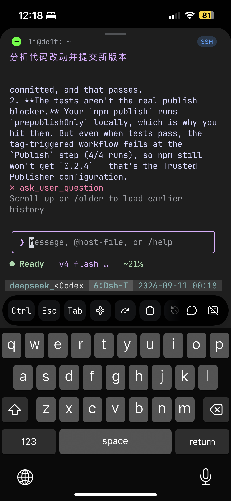

# DeepSeek Harness Terminal

English | [中文](README.zh.md)



> **dsht — Control DeepSeek Harness from any terminal, anywhere.**

## Summary

`dsht` is a lightweight DeepSeek Harness TUI client designed for remote use.

Its goal is to fit DeepSeek Harness naturally into the terminal and SSH workflows a developer already has: Harness keeps running on a remote workstation or server while you reconnect from a laptop, tablet, or phone to check status, send a message, steer a task, answer an approval, answer a question, cancel a turn, or switch sessions.

A typical setup:

```text
phone / tablet / laptop
        │
        │ SSH
        ▼
   jump host / bastion
        │
        │ SSH
        ▼
   development host
        │
        ├── dsht
        │     │
        │     ▼
        │   dsh web
        │     │
        │     ▼
        └── DeepSeek Harness
```

`dsht` **is not an SSH client**. It runs in an ordinary terminal, so it works directly inside SSH, nested SSH, ProxyJump/bastion, tmux, and similar remote terminal environments. Whenever your terminal can reach the host running `dsht`, you keep controlling the same DeepSeek Harness sessions.

Besides remote control, `dsht` tracks usage for cost control: it records token usage per request, separates uncached input, cache read, cache write, and output, and combines the model, the settlement time, peak/off-peak rates, and versioned price tables into a CNY estimate for the current session, today, and the last three calendar days.

Main features:

- **Remote-first**: built for SSH, nested SSH, bastion hosts, ProxyJump, and tmux.
- **Phone-friendly**: one working mobile SSH client is enough to keep controlling a remote Harness away from your desk.
- Workspace and session pickers, direct switching with `/ws` and `/resume`, and explicit session creation.
- Streaming replies, reasoning, compact tool names, success/failure status, and paged conversation history.
- Queued prompts, steering, turn cancellation, approvals, and free-text question answers.
- Cookie persistence per host, automatic reconnect, and snapshot replacement, so control survives a dropped connection.
- JSON or tab-separated workspace/session lists for scripts, plus a reusable HTTP client.
- **Cost-aware**: session, today, and three-day CNY estimates with versioned peak/off-peak prices and `/cost` summaries.

## Why use dsht?

### Built for remote control

DeepSeek Harness usually runs on a development workstation or server with more performance and a more complete environment, while the person is not always sitting at that machine.

`dsht` keeps the control interface in a plain terminal, so the remote server needs no desktop environment and a phone needs no full development setup. Leave Harness working on the development host and, when you need to look or intervene, enter that host over the SSH path you already have and run `dsht`.

The simplest form:

```text
laptop ───────── SSH ────────> development host ──> dsht
```

Through a jump host:

```text
phone ── SSH ──> jump host ── SSH ──> development host ──> dsht
```

This makes "control Harness from the phone in your hand" a practical workflow: no remote desktop, and no need to expose the Harness web service on the public internet.

> SSH tunnels, ProxyJump, bastion hosts, and access control stay the responsibility of your existing SSH environment; `dsht` focuses on terminal interaction with DeepSeek Harness.

### Keep controlling tasks from a phone

Mobile sessions are poor for long editing work but well suited to control and decisions.

After SSHing from a phone into the remote terminal running `dsht`, you can:

- watch running tasks and live output;
- read assistant replies, reasoning, and tool status;
- send a new prompt, automatically steering an active task;
- approve with `/allow` or reject with `/deny`;
- answer questions Harness asks;
- stop the current turn with `/cancel`;
- switch workspaces and sessions;
- search history;
- check the current task and recent cost with `/cost`.

Leaving your desk therefore does not mean losing control of a long-running Harness task.

### More than a log viewer

`dsht` is an interactive control surface for a running DeepSeek Harness, not a read-only log tool.

It can send input, handle approvals and questions, steer a running task, cancel a turn, switch sessions, and reconnect after the network returns. Execution state stays on the host; the client only presents and controls it through the terminal.

### Cost awareness

Long AI coding tasks keep consuming tokens, and a token total alone says little about what they cost.

`dsht` stores usage per request and combines it with the request settlement time, the model identity, and the matching price version. Its totals separate:

```text
uncached input
cache read
cache write
output
```

`/cost` shows:

```text
current session
today
today + the previous two calendar days
```

The status bar also keeps showing session / today cost (`~¥1.23/~¥5.00`), so cost changes surface while a task runs instead of only after the invoice arrives.

That gives `dsht` two roles at once:

1. **a remote terminal control surface for DeepSeek Harness**
2. **a cost monitor for the work as it happens**

## Contents

- [Why use dsht?](#why-use-dsht)
- [Start](#start)
- [Remote SSH workflows](#remote-ssh-workflows)
- [List workspaces and sessions](#list-workspaces-and-sessions)
- [Conversation controls](#conversation-controls)
- [Live status](#live-status)
- [Cost estimates](#cost-estimates)
- [Client API](#client-api)
- [Publishing to npm](#publishing-to-npm)
- [Development and limitations](#development-and-limitations)

## Start

Use Node.js 22.19 or newer and an existing `dsh web` server; the server is a separate prerequisite and is not launched by this client. The default host is the local `http://127.0.0.1:3080`:

```sh
npx @itookit/dsht
```

A token is needed only on the first run and after the saved cookie expires. Export it on its own, or export the complete URL printed by `dsh web` and let the client split off its `?token=` parameter:

```sh
export DSH_TOKEN=<token> && npx @itookit/dsht
export DSH_URL='http://127.0.0.1:3080/?token=<token>' && npx @itookit/dsht
```

`DSH_TOKEN` takes precedence when both are set, and `--url` overrides `DSH_URL` for one run. The token is never written to disk; only the resulting cookie is. Both exports above land in your shell history, so use `read -rs -p 'Host token: ' DSH_TOKEN` where that matters. Another host needs its own origin in `DSH_URL`.

`npx @itookit/dsht list workspaces --json` and `npx @itookit/dsht list sessions --json` print workspace and session lists for scripts, and `npm install -g @itookit/dsht` installs the `dsht` command. These registry commands require the package to be published.

From a source checkout, install the dependencies and run the TypeScript entry:

```sh
npm ci --ignore-scripts
npm start
```

Both paths read the same `DSH_URL` and `DSH_TOKEN` variables.

Select a workspace with ↑/↓ and Enter, then select a session or **New session**. **All sessions** also exposes sessions outside registered workspaces. **Add workspace** accepts an existing absolute directory on the host, which may differ from your local filesystem. Creating a session requires a selected workspace.

On first login, authentication exchanges the token at `GET /` and saves the cookie per HTTP origin. Later starts, including list commands, reuse that cookie without a token. The store uses `$XDG_STATE_HOME/dsht/auth`, or `~/.local/state/dsht/auth` when unset; `--auth-dir` or `DSHT_AUTH_DIR` overrides it. POSIX directories use 0700 and cookie files use 0600; Windows uses the account directory's inherited access controls. Launch tokens are never saved.

The host determines cookie expiration. An expired or rejected cookie requires a token again; a supplied token refreshes authentication automatically after HTTP 401. Network failures and HTTP 403 do not trigger token exchange. Corrupt or insecure cookie files fail explicitly. The base URL must be an origin without a path or extra query parameters, and the host must allow its hostname.

## Remote SSH workflows

`dsht` is at its best combined with existing SSH infrastructure. It requires neither a DeepSeek Harness exposed to the public internet nor a client device that can reach `dsh web` directly.

### SSH straight to the development host

When the development host accepts SSH directly:

```text
Laptop / Phone
      │
      │ SSH
      ▼
Development Host
      │
      ├── dsht
      └── dsh web
```

Log in to the remote host and run:

```sh
dsht
```

Or without a global install:

```sh
npx @itookit/dsht
```

### Through a jump host

When the development host is reachable only through a jump host:

```text
Phone
  │
  │ SSH
  ▼
Jump Host
  │
  │ SSH / ProxyJump
  ▼
Development Host
  │
  ├── dsht
  └── dsh web
```

With an existing OpenSSH `ProxyJump` configuration, SSH to the target development host as usual and run:

```sh
dsht
```

`dsht` does not need to understand that SSH path; from its point of view it simply runs in a terminal that can reach `dsh web`.

### With tmux

On a remote host, `dsht` can live in a tmux session so that a dropped network still leaves the same terminal environment behind:

```sh
tmux new -s dsht
dsht
```

Then, after logging in again:

```sh
tmux attach -t dsht
```

Even without tmux the Harness session state stays on the server, and a restarted `dsht` can select the same workspace and session again. The value of tmux is keeping the local terminal layout and the running TUI process.

### Phone access

Any mobile terminal that can use SSH is a usable entry point:

```text
Mobile SSH Client
       │
       ▼
   Jump Host
       │
       ▼
Development Host
       │
       ▼
      dsht
```

The experience depends on how well the mobile terminal supports ANSI, Unicode, arrow keys, and SGR mouse reports. Even with limited touch mouse support, the core operations remain available through the keyboard and slash commands.

## List workspaces and sessions

```sh
npx @itookit/dsht list workspaces --json
npx @itookit/dsht list sessions --json
npx @itookit/dsht list sessions --workspace WORKSPACE_ID --json
```

From a source checkout, run the same commands through npm or through the source entry; the direct entry avoids npm's script banners:

```sh
npm start -- list workspaces --json
npm start -- list sessions --json
node --import tsx src/cli/index.tsx list workspaces --json
node --import tsx src/cli/index.tsx list sessions --json
```

JSON output is `{ "items": [...] }`; omit `--json` for tab-separated output. Workspace filtering uses the host's `sessionIds` membership. The workspace list consumes and cancels the first `workspace/follow` baseline; it does not call a nonexistent `workspace/list` endpoint.

## Conversation controls

Enter submits a prompt: while the agent is Working it becomes steering for the next step; while idle it starts a new turn. Steering waits for the current step, including its tools, to finish and does not interrupt a running tool. Ctrl+C clears a non-empty draft first; otherwise it requests cancellation while the selected session is running and exits only when it is idle; repeated keys share an in-flight cancellation. Cancellation waits for a pending prompt admission, and failures keep the client open. Esc sends an explicit cancellation from the conversation even when the cached running flag is idle; open menus also cancel a known running agent while closing. Active history/search/cost loads, host commands, and exports are cancelled first. Page Up/Down scroll the retained transcript; `/older` loads an earlier page. Every exit path, including `/quit` and SIGTERM, stops the selected turn before the connection closes, so quitting does not leave the agent running; an idle session is left untouched. Cancellation leaves pending queue items intact.

`/copy`, Ctrl+S, or an unmodified left click in the normal chat view freezes the display and disables mouse reporting for native terminal selection. Esc, Ctrl+S, or Ctrl+C leaves copy mode and catches up with the latest output; leaving copy mode does not cancel the agent. Dialogs and pickers pause automatic background title and conversation updates; chat dialogs also pause status updates. Workspace selection, session selection, and host-path entry keep connection notices and the status bar live unless copy mode is active. The conversation remains above the composer; mouse wheel and PgUp/PgDn scroll its history without moving the selected option. In the help panel PgUp/PgDn changes help pages. Dialog clicks do not enter copy mode; Ctrl+S freezes the whole display and releases mouse capture for native selection. The Working clock also pauses while reading older history. Help/status/cost panels no longer expire on a timer. Background reception and memory reclamation continue; window resizing can redraw the screen.

The mouse wheel and Page Up/Down scroll conversation history; scrolling to the top automatically requests an older page. New output preserves a scrolled reading position; scrolling back down resumes following the newest output. Mouse reporting is enabled while the TUI is mounted and disabled on exit; the terminal must support SGR mouse reports. Esc or Ctrl+C cancels a history load or search before interrupting the remote agent.

In `/ws` and `/resume` pickers, select a workspace or session and press `d` or Delete with an empty composer to review removal. With a draft, `d` remains normal input; Backspace never opens removal. `/ws --delete <name or ID>` and `/resume --delete <title or ID>` open the same confirmation; `/resume --archive <title or ID>` is an alias for session archival. Before session removal the client refreshes `session/list`. A session explicitly marked `blank: true` and idle, with no known queued jobs or pending local prompt admission, is archived immediately without confirmation. This uses the host blank flag rather than the loaded history window or title. Other sessions still require confirmation: Cancel is selected by default, and Escape closes the dialog. Workspace removal calls `workspace/delete` and removes only its registration: directories and sessions remain. Session removal calls `workspace/archiveSession`, hiding the session from workspace lists and `/resume all` while retaining history; `/resume ID` can reopen it. This host API exposes archival rather than permanent session deletion. Running tasks continue. Archiving the selected session releases its transcript and layout caches; rejected operations retain the list and confirmation for retry.

`/search` matches literal text case-insensitively in conversation messages, including older pages; tool-only rows are excluded. Search scans up to 80 messages per request, discards each temporary page, and retains at most 200 short matches, including folded reasoning. A truncated result asks you to refine the query. Opening a match loads a separate page around its sequence; `/latest` releases that window. Esc or Ctrl+C cancels the search. A rare or absent term still requires scanning the full history over HTTP; there is no server-side full-text index for this command. `/history` lists your own prompts from the loaded pages. Record sequences are the numbers shown by these pickers. `/ssearch` and `/wsearch` call `session/search`, which searches current user/assistant message content and returns at most 20 sessions, snippets, and a truncation flag; it exposes neither a result cursor nor matching record sequences. Workspace filtering happens after that global limit, so a truncated workspace result can omit matches. The UI warns when results are incomplete; refine the query. Selecting a session loads its history and offers matching messages for the jump. These operations use HTTP and never scan the host configuration directory.

↑/↓ or Ctrl+P/N recalls previously submitted prompts and slash commands without sending them; Enter submits the recalled text. Moving past the newest entry restores the unsent draft. Editing recalled text starts a new draft. Recall keeps up to 200 entries and approximately 256 KiB of text for the selected session. Opening or restoring a session seeds recall from its already-loaded User messages; switching sessions releases the previous recall buffer. It does not fetch older pages or write a separate history file. Consecutive duplicates are merged, oversized entries are skipped, and question or approval answers are excluded. Question options and completion menus keep arrow navigation; workspace/session lists use arrows when the composer is empty, with Ctrl+P/N available for recall.

Within each User group, only the first assistant prose or reasoning message shows an Assistant heading. Later messages and live output reuse that heading across tool results and Context messages. A newly loaded history window starts its own visible group; message sequences, tool status, search, and reasoning expansion remain independent.

For mouse copying, click once to enter copy mode, then drag to select after the display freezes. Releasing the mouse keeps the display frozen until Esc, Ctrl+S, or Ctrl+C resumes it. Terminal-native Shift-drag may bypass application mouse reports; press Ctrl+S first in that case. In dialogs, press Ctrl+S to freeze the entire display and release mouse capture before native selection.

Tab completes the leading slash command, extending an ambiguous draft to the shared prefix. The single-line composer supports Readline-style editing. Words are whitespace-delimited; cursor movement and character deletion preserve composed Unicode characters. Multiline pasted text becomes one line with spaces. Ctrl+D on empty input does not exit; Ctrl+C clears a non-empty draft before it stops or exits. Other unhandled modifier shortcuts do not insert their control characters. Both BS and DEL terminal backspace encodings delete backward; the dedicated Delete key (CSI 3~) deletes forward.

| Key | Edit |
| --- | --- |
| ↑ / ↓, Ctrl+P / Ctrl+N | Recall older / newer submitted input |
| Ctrl+A / Ctrl+E, Home / End | Move to start / end |
| Ctrl+B / Ctrl+F, ← / → | Move one character |
| Alt+B / Alt+F, Ctrl+← / Ctrl+→ | Move one word |
| Ctrl+K / Ctrl+U | Delete from cursor to end / from start to cursor |
| Ctrl+W, Alt+Backspace | Delete the preceding word |
| Alt+D | Delete the following word |
| Ctrl+Y | Restore the most recently killed text at the cursor |
| Ctrl+H / Backspace, Ctrl+D / Delete | Delete the preceding / following character |

| Command | Action |
| --- | --- |
| `/ws` | Show all workspaces; choosing one opens its session list |
| `/ws TARGET` | Select a workspace by ID, exact name/path, or unique ID prefix |
| `/resume` | Show sessions in the current workspace; choose a workspace first if none is selected |
| `/resume TARGET` | Open a session by ID, exact title, or unique ID prefix across workspaces |
| `/resume all` | Show sessions from every workspace |
| `/model [provider model [effort]]` | Choose a model and its reasoning effort, or submit exact route IDs |
| `/new` | Create a session in the selected workspace |
| `/compact` | Compact older history while idle and show the host result |
| `/cancel` | Cancel the active turn; leave pending queue items intact |
| `/queue` | View pending input; arrows select, Enter / d / Delete removes |
| `/plan [off|message]` | Enter or leave the host plan mode |
| `/goal [objective|clear|edit text|pause|resume]` | View, set, edit, pause, resume, or clear the task goal |
| `/permission [preset]` | View or switch the host sandbox/approval preset |
| `/feedback TEXT` | Record feedback about the current session |
| `/export [local.zip]` | Download the session log ZIP to a new local file |
| `/export-html [local.html]` | Save the loaded conversation as offline HTML with diagrams and math |
| `/older` | Load older history |
| `/history [text]` | List your own prompts, optionally filtered; Enter jumps to the selected record |
| `/search <text>` | Search history page by page; choose a match to open its location |
| `/copy` | Freeze for terminal selection; Esc resumes |
| `/latest` | Return to live output and release the separate historical window |
| `/ssearch <text>` | Search host results within the selected workspace |
| `/wsearch <text>` | Search sessions across all workspaces visible to the host |
| `/allow`, `/deny` | Answer the displayed approval; allow applies once |
| `/status` | Expand or collapse full footer details |
| `/cost` | Toggle session/today/three-day estimates and refresh usage |
| `/think` | List reasoning with user prompt summaries; ↑/↓ and Enter jump to and expand a thought |
| `/think SEQ` | Toggle one loaded thought; `live` toggles the active attempt |
| `/help`, `/quit` | List every command with its description, or exit |

Slash commands work in both pickers and the conversation composer. Typing `/` displays matching commands, and `/help` lists commands with their one-line descriptions; PgUp/PgDn changes pages. The `/help`, `/cost`, and `/status` panels remain open until the next command or Esc; Esc leaves the draft in place. `/workspace` and `/workspaces` alias `/ws`; `/session` and `/sessions` alias `/resume`. Names may contain spaces; quotes around the complete target are optional. The unquoted target `all` is reserved for `/resume all`; use `/resume "all"` or an ID to open a session titled `all`. Ambiguous targets require a full ID. Switching a workspace opens its sessions and detaches the old transcript; switching sessions updates the workspace label. Neither operation cancels a remote agent.

Type `@` at the end of the draft to search files and directories in the selected session's working directory **on the host**. Use ↑/↓ to select and Tab or Enter to insert; selecting a directory continues completion inside it. Paths with spaces use `@"path with spaces"`. Escape closes the menu and requests cancellation when the agent is running; after closing it, Enter sends the literal draft, including an unmatched path. Lookup failures remain visible and do not submit the draft. Completion operates on the trailing reference, not the cursor position inside existing text.

A file reference sends only `@path` in a text block. Harness instructs the model to read the referenced file or list the directory when needed; the TUI does not read local files, upload bytes, or expand contents into the prompt. Referencing an image path does not attach image data. Local attachments, image uploads/previews, and `@` session references are not implemented.

Pending ordinary messages appear inside the composer, with up to two previews. `/queue` opens the full pending-input picker; ↑/↓ selects and Enter, `d`, or the dedicated Delete key removes an item through the host. Esc closes this picker without cancelling the task. A claimed item is no longer removable; the host reports that race instead of resubmitting it. The control stream owns the list, including reconnect replacement and removal when input is claimed; the client does not keep a second submission queue. Questions and approvals take precedence over queue navigation, and their answers never become steering. Slash commands keep their own execution semantics. Queue previews and deletion require the host `session/control` and `session/updateQueue` capabilities.

`/plan`, `/goal`, `/permission`, and `/feedback` invoke the host command registry directly. The loaded host plugins determine availability, accepted arguments, and busy restrictions. Results and errors are displayed locally; an error keeps the input. Feedback is excluded from local input recall. `/export` streams the authenticated session ZIP into a local file (a timestamped filename in the working directory by default); paths with spaces can be quoted. It never overwrites an existing file and removes an incomplete download on failure or cancellation.

`/compact` uses the host command endpoint rather than the prompt queue. The host requires an idle agent with no waking queued work; busy, unsupported, and failed commands display their reason and preserve the draft. A progress indicator remains visible while executing; Esc/Ctrl+C cancels the request. Compaction bypasses the ordinary 15-second RPC timeout and is never retried automatically. After an interrupted connection, check the session before retrying because the client cannot determine whether the host finished.

Below 62 terminal columns, active streaming reasoning defaults to one folded row. Wider terminals expand active reasoning and fold it on completion. `/think live` toggles the current reasoning; a new response restores the default.

Approvals offer 1. Allow once, 2. Deny, and 3. Stop turn. With an empty composer, use 1–3 or ↑/↓ to select, then Enter to confirm; no action is selected initially, Escape clears the highlight, and a replayed request starts unselected again. Existing drafts keep normal typing, and `/allow`, `/deny`, and `/cancel` remain available.

User questions show progress, numbered options, and descriptions. Selection lists, pending questions, approvals, and file completions share the composer border with the text input. Pending questions and approvals retain recent conversation history above the composer. The history viewport fits the remaining height, removes extra vertical margins while a dialog is open, and refreshes on explicit scrolling or viewport resizing. The visible option window adapts to terminal height and follows the highlighted choice. With an empty composer, ↑/↓ or 1–9 selects an option and Enter confirms; numbers only select and do not submit. For multi-select questions, Space or 1–9 toggles checkboxes, and Enter confirms the selection. Options beyond nine remain reachable with arrows. Choose Other answer to type numeric free text; ordinary text answers remain supported. Existing drafts keep normal typing, and Escape returns from Other to the options without cancelling the question. All questions are submitted together as structured selected labels and optional custom text; a failed submission preserves the answers for retry. Recognized question and approval events are retained by event ID for the connection, including replay before session selection; only the selected session displays them. Switching pickers does not decline those requests. Unrecognized waterfalls still delegate with `next`. The live host replays pending events after client reconnection; client restart does not preserve unsubmitted answer drafts. Normal TUI shutdown cancels a running turn. A cancelled/failed tool call or a host restart cannot restore the original wait from local UI state; send a new prompt requesting the questions again. Failed submissions retain their input; an interrupted HTTP response can leave delivery uncertain, so check the transcript before manually resending. The client never retries a mutation automatically.

The header stays above the scrollable conversation while the composer and status stay below it. The always-visible keyboard legend is removed; `/help` contains the full shortcuts and pickers retain their local navigation hints. The single-line header prioritizes the latest session title (falling back to the ID), with the workspace name after it on wider terminals; host and connection labels are omitted. Without a selected session, it shows the workspace name or All workspaces. A divider sits below the title; `/status` retains the complete session ID. The cancellation acknowledgement stays visible through incoming history until the host reports idle; acceptance does not mean a tool process has already exited.

## Markdown, diagrams and math

Message text renders GitHub-flavored Markdown: headings, emphasis, strikethrough, links, lists, tasks, quotes, code and tables. Tables align by terminal display width, wrap cell contents, and stack records vertically when columns would be too narrow. Code preserves indentation; links retain their destinations. Reasoning and tool summaries keep their existing plain-text presentation. Search retains the original Markdown source.

Closed `mermaid` fences render as Unicode diagrams for supported flowcharts, state, sequence, class and ER diagrams. Diagrams that exceed the available width, unsupported syntax and unfinished fences show source code. `$...$`, `$$...$$`, `\(...\)`, `\[...\]` and `math` / `latex` / `tex` / `mathjax` fences use MathJax's base and AMS TeX packages. The terminal shows Unicode symbols, grouped fractions, scripts and matrices; unsupported notation or invalid TeX retains its source. Terminal formulas approximate typeset mathematics.

`/export-html [local.html]` saves the currently loaded conversation and live tail with Mermaid SVG images and MathJax-generated MathML. Open the file in a browser for full mathematical layout; no network or scripts are required. Older or evicted messages are excluded, and tool rows remain summaries. The default filename is timestamped in the working directory; quoted paths are accepted, existing files are never overwritten, and cancellation removes incomplete output. `/export` remains the complete host-log ZIP download.

## Live status

The footer groups `◐ Working · 8s · Ctrl+C Stop` or `● Ready`, model and reasoning effort, session / today cost, a ten-cell context bar and percentage, and session turns / total tokens. Wide terminals reserve the activity column so model and metrics stay aligned when a run completes. Narrow terminals reclaim padding, remove the bar, shorten the model, and then omit lower-priority metrics while retaining the stop hint. `/status` shows the host URL, operation status, workspace path, full provider/model, pending model, usage buckets, turns, queues, jobs, and four-decimal costs. `!` flags a metrics or model catalog error, or incomplete cost coverage; details explain the cause. Running sessions use the last-used model; ready sessions use the next selection, with the host catalog default for new sessions. Model catalog changes refresh on host settings, credential, and adapter notifications.

Working time uses the retained `turn/start` timestamp. If that timestamp is unavailable, `~` after the compact elapsed time (`(observed)` in details) means time since this client observed the run; reconnecting can reset this fallback. The clock stops when the host reports idle. The status includes model generation, tool execution, and approval waits, not just streamed text. Offline status is explicitly marked as last known.

Turns come from the complete session's `sessionStats.turns` projection. Context occupancy is marked `~`: Harness combines provider usage with estimated surface changes and the latest route capacity. Token totals come from the complete session's `tokenUsage` projection, with separate uncached input, output, cache-read, and cache-write buckets; reasoning is already included in output. Totals update when the host publishes usage, not on every streamed character. Missing measurements display `unknown` or `?`. Control-stream baselines replace state on reconnect, and per-key watermarks prevent an older follow snapshot from overwriting newer metrics.

The default [Catppuccin Mocha](https://catppuccin.com/palette/) theme distinguishes `❯ User` (blue), `✦ Assistant` (green), reasoning (mauve), tools (sky), success (green), and errors (red). The compact status bar uses green for Ready, yellow for Working, red for offline, mauve for model/effort, sky for costs, and subdued gray for usage. Context occupancy changes from green to yellow at 80% and red at 95%; these are visual thresholds, not host compaction triggers. Groups are fitted before ANSI styling, preserving alignment and plain-terminal output. Semantic colors live in `src/ui/theme/index.ts`; the application accepts a theme independently of stored messages. Ink adapts ANSI output to terminal capabilities, and plain terminals retain the role markers. Tool calls show their name and description plus a `$` preview of the command's first line when it differs from the description. Without a description, the first command line, path, or query supplies the summary. Each line truncates by terminal display width; completion updates the original call from ⚙ to ✓ or ✗ by call ID, without a second result entry. Command previews retain two-space indentation. Results whose calls are outside the loaded window remain visible until their call page is loaded; nested result bodies stay hidden.

Reasoning streams in full while being generated, then folds when its block closes or answer/tool output begins. `/think` opens a newest-first list of reasoning summaries with the preceding loaded user prompt and an entry for the active attempt. Select with ↑/↓ and Enter to jump to the original message and expand it; `/think SEQ` folds or expands that message, and `/think live` controls the active attempt. The list stays open until selection, Esc, or another command. It initially uses loaded history; `Load older reasoning` fetches one earlier page on demand. If a prompt precedes the loaded window, the list says so until that page is loaded. Full reasoning remains available for search.

`/model` reads `session/modelCatalog` and offers the provider/model routes and reasoning efforts advertised by the host. Selection calls `session/selectModel` with `{ request: { sessionId, provider, model, reasoningEffort? } }`; omitting effort uses the adapter default. The host applies it to subsequent requests, logs the selection, and also attempts to save it as the deployment default. It does not replace an in-flight request. `modelSelection.next` and `lastUsed` remain the authority for the displayed model; failures retain the previous selection. Provider catalog failures are shown without hiding healthy providers. The header follows the web agent-preset label: `agentPreset` supplies the current ID and `agentPresets/list` supplies names and trust metadata. Built-in system presets display Standard mode, PTC mode, Minimal mode, or Creator mode. Custom presets retain their names; missing roster entries fall back to the ID. The optional roster loads only when needed and is reused for the connection. Plan is a separate feature and does not determine this mode label. Below 62 terminal columns, mode remains available in `/status` to leave room for the session title.

History separates semantic message blocks, prompt/reasoning summaries, view-only fold state, and a row index. Stream frames reuse committed offsets and materialize only the viewport. A per-session LRU holds at most 2,048 committed terminal rows; evicted rows are recreated when revisited. Finished legacy chunks and unused tool-result bodies are released, while the host retains the original log. The host log is the durable tier; the client is a reloadable memory tier. The live tail defaults to soft budgets of 2,000 records or 16 MiB of estimated semantic payload (`--history-records`, `--history-mb`). Eviction targets 75% of the budgets and releases old text, summaries, and layout caches. Switching sessions disposes the previous transcript. Scrolled reading and reasoning navigation protect the loaded window; `/latest` returns to live output and resumes reclamation. Offline history, unfinished streams, and a minimum recent tail are protected, so these limits are not a process RSS cap. A bounded runtime memory log is enabled by default at `<state>/memory.log`: one JSON line every 30 seconds with the process counters, the retained record and byte counts, the pin state and the ledger size, so growth can be told apart from V8's high-water mark. `--memory-log <path>` or `DSHT_MEMORY_LOG` changes the path, and `--no-memory-log` or `DSHT_MEMORY_LOG=off` disables it. First layout, width changes, and an expanded very large block still require wrapping that content. `npm run bench:history` measures local stream/layout cost at 500, 2,000, and 10,000 messages without model or network time.

## Cost estimates

`dsht` does not just show token counts: it turns Harness-visible per-request usage into a traceable CNY estimate. It separates uncached input, cache read, cache write, and output, and combines the model, the request settlement time, the price version, and the peak/off-peak window, so the cost of the current session and of the recent past stays visible while work is running.

> These figures are a high-precision estimate from Harness-visible usage and local price configuration, for cost monitoring and control. They are not a provider account bill, and the provider invoice remains authoritative.

`/cost` shows the selected session, today, and today plus the preceding two calendar days. Dates use Asia/Shanghai; the three-day view is not a rolling 72-hour window. The status bar shows session / today cost rounded to two decimals; the slash does not denote a budget. `~` marks an estimate; `*` marks a subtotal that is not exact, because a request carries no timestamp, no price covers it, or a calendar range cannot place it. Incomplete coverage is reported separately: charges cached by an earlier run count as complete, while an empty or failed scan raises the bar's `!` prefix and a reason in `/status`. Each host origin has a separate ledger. Totals cover HTTP-visible sessions and previously cached sessions; they are not account-wide provider bills.

The client reads complete histories in the background on connection, every 60 seconds, at turn completion, and when opening `/cost`. Idle sessions with unchanged host update timestamps are skipped. No model requests are made by billing. Esc or Ctrl+C cancels an explicit refresh. The ledger counts disjoint uncached input, cache read/write and output buckets; reasoning is already part of output. Retries count separately, replacement samples update their attempt, and fork-inherited history is excluded. A request without a settlement timestamp still contributes a floor amount, priced at the cheapest rate of its model family and reported as estimated. Inconsistent usage, and prices that no model or provider entry covers, remain unpriced; the model-name family decides Pro against Flash, while an unlisted provider is never billed from the official table. Every listed session is read independently, so one unreachable or rejected session is reported as a failure count instead of stopping the scan, and a subagent child is read under its durable parent address. Failed scans retain labelled partial cached totals.

The bundled CNY rates were checked against the [official pricing page](https://api-docs.deepseek.com/zh-cn/quick_start/pricing/) on 2026-09-10. Beijing weekday peak windows are 09:00–12:00 and 14:00–18:00; other times use half-price rates. Flash peak cache-miss-input/cache-hit-input/output rates are ¥2/¥0.04/¥8 per million tokens and Pro rates are ¥9/¥0.30/¥27; the current model name is `deepseek-flash`, and older Flash names keep those same rates. The provider has announced that from 2026-09-14T12:00+08:00 it serves `deepseek-v4-pro` from Flash and bills it at Flash rates, which the bundled entry records so that date does not overstate Pro usage. Separate cache writes use the uncached-input rate. An exact configured model price takes priority; otherwise `deepseek-official` names containing `pro` (case-insensitive) use Pro and all other names use Flash, including temporary model aliases. Other providers require explicit entries.

The default price validity starts at Beijing midnight on the verification date; this is a local estimate policy, not a claim about the official effective date. Earlier usage needs historical price entries. The recorded assistant settlement timestamp selects the rate; requests spanning a tariff boundary may differ from the invoice because the official page does not specify their attribution. Images use provider-reported tokens. A charge is decided once with the table loaded at that moment and the amount is then immutable: editing `prices.json` changes only requests decided afterwards, and a request no entry covered stays unpriced.

On first interactive launch, the client creates `~/.config/dsht/prices.json` (or `$XDG_CONFIG_HOME/dsht/prices.json`). `DSHT_CONFIG_DIR` overrides that directory. The JSON array contains price versions with `id`, `provider`, `model`, `currency: "CNY"`, `source`, inclusive `from`, optional exclusive `until`, `timezone`, weekday numbers (`0` Sunday), minute-of-day `windows`, and `peak`/`offPeak` rates named `input`, `cacheRead`, `cacheWrite`, `output`, per million tokens. To update prices, close the old interval with `until` and append a new version with a unique ID and matching `from`; overlapping intervals are rejected. Restart to load configuration changes. Price discovery is manual; the TUI does not scrape prices during startup.

Usage files live under `~/.local/state/dsht/cost/<origin-hash>/` (respecting `XDG_STATE_HOME`, or `DSHT_STATE_DIR` for the application state root). They contain only session IDs, timestamps, model identities, token counts, selected price versions and estimates. They exclude prompts, tool bodies, credentials and cookies. The price file is configuration and these usage files are state, so only the former belongs in a settings backup. Writes use private temporary files and atomic replacement; opening-cut filenames prevent older concurrent scans from displacing a newer cached cut. The cache survives restart and does not need access to the host configuration directory. It stores each request rather than a running total, including the price identity and amount that sealed it, and the skip bookkeeping lives in memory only, so the first scan after a restart re-reads every session and decides amounts for requests that accrued while the client was closed. A cache file from an older ledger generation is ignored and rebuilt rather than migrated.

## Client API

Installed packages export `Client` from `@itookit/dsht` and `login`/`CookieStore` from `@itookit/dsht/auth`, with TypeScript declarations. Source consumers can import from `src/transport/client.ts` with a TypeScript loader, or from `dist/index.js` after building. `authenticate(token)` exchanges credentials; `connect()` opens one multiplexed socket; `listWorkspaces()` and `listSessions(workspaceId?)` return promises of server rows. `call(endpoint, args, signal?)` preserves host errors as `RemoteError` with `code` and `details`. Always await `close()` in `finally`. Library consumers opt into persistence with `login(client, token, new CookieStore())` from `src/transport/auth.ts`; `Client.authenticate()` itself only retains credentials in memory.

Session and workspace command methods use `{ request: { ... } }` inside `args`; session listing uses `{ _request: {} }`. `$events/result` uses its named arguments directly. Follow snapshots replace retained state after reconnect; durable messages and transient assistant text remain separate. The reader accepts both `event` records and older `chunks` wrappers containing `chunkrow/text-chunks`, `chunkrow/reasoning-chunks`, or `chunkrow/tool-call-chunks`. Hosts without `assistantStream` expose live text through logged chunks; the TUI reconstructs only the unfinished attempt and preserves each packed record's starting sequence for pagination.

## Publishing to npm

This repository publishes one public package, `@itookit/dsht`, from the `mushuanli/dsht` repository. The scope is required because npm rejects the unscoped `dsht` as too similar to existing short names such as `dot` and `st`. `package.json` is the authority for the fields below.

| Field | Value |
| --- | --- |
| Name and version | `@itookit/dsht` `0.3.0` |
| Executable | `dsht`, or `npx @itookit/dsht` without installing |
| Library entries | `@itookit/dsht` and `@itookit/dsht/auth` |
| Author | lizlok@gmail.com |
| License | MIT, with the license text in `LICENSE` |
| Repository and issues | [mushuanli/dsht](https://github.com/mushuanli/dsht) |
| Node.js | 22.19 or newer |
| Registry access | public, under the `@itookit` scope |
| Published files | `dist/`, both READMEs, their pairing record, the screenshot, and the license |

Descriptions, keywords, and dependencies live in `package.json`. The following commands are maintainer actions; creating a local package does not publish it.

```sh
npm run test:package
npm login
npm publish --access public
```

`test:package` builds a tarball and runs its CLI through an isolated, offline npm-exec installation using the dependency cache populated by installation, and rejects any packed path outside the published set above. `prepublishOnly` checks types and tests; `prepack` compiles JavaScript and declarations. Source tests, recordings, and local authentication files are excluded.

`publishConfig.access` is `public`, which a scoped package needs to be installable without a paid plan; the flag is therefore part of the package rather than of the publish command. An account with two-factor authentication publishes with a live code, `npm publish --otp=<code>`; the code is checked at the final request, after the typecheck, suite, and build have already run.

Later releases run in `.github/workflows/publish.yml`, which publishes from a version tag with [trusted publishing](https://docs.npmjs.com/trusted-publishers) (OIDC) and provenance, so no publish token is stored. Configure it once at `npmjs.com` → `@itookit/dsht` → Settings → Trusted Publisher → GitHub Actions with organization or user `mushuanli`, repository `dsht`, workflow filename `publish.yml`, and allowed action `npm publish`. Trusted publishing cannot create a package, so the earliest versions were published by hand; a later release pushes the matching tag, for example `npm version 0.2.3 && git push --follow-tags`.

The workflow packs without publishing when started manually, and refuses a tag that disagrees with `package.json`. See the official [scoped publishing guide](https://docs.npmjs.com/creating-and-publishing-scoped-public-packages/) and [npx documentation](https://docs.npmjs.com/cli/npm-exec/). Registry publication is not part of the local validation performed for this repository.

## Development and limitations

```sh
npm test
npm run test:terminal
npm run build
npm run bench:input
node dist/cli/index.js --help
```

Tests use isolated HTTP/WebSocket hosts, drive the real Ink picker and composer, run the CLI in subprocesses, and project copied Harness v2 workspace-edit and v0 packed-chunk recordings. The repository needs no model credentials for these checks. The recording and expected transcript live under `tests/`; they do not depend on a parent checkout. Live model-provider behavior is not covered by these tests.

Source is organised by business domain under `src/`: `transport/` owns the host wire protocol and authentication, `session/` the transcript, history and interactions, `cost/` the immutable billing ledger, `catalog/` models and presets, `controller/` the application facade, `ui/` everything React and Ink, `storage/` every filesystem operation, and `cli/` the composition root. Cross-domain imports go through each module's `index.ts`; `tests/architecture/dependencies.test.ts` rejects a forbidden direction.

`npm test` renders frames without styling, because the assertions and the recorded expectations in `tests/expected/` describe text. A test runner started from a terminal exports `FORCE_COLOR=1` to each test file, which makes Ink interleave SGR escapes between a prompt and its text; `npm run test:terminal` reproduces that environment on any host, and `prepublishOnly` runs it so a publish from a terminal validates what a terminal actually renders. Theme tests render separate truecolor and plain subprocesses with terminal and CI color detection isolated from the parent environment.

Typing reuses history projection and wrapping until the transcript revision or terminal width changes; host updates and older pages invalidate that reuse. `bench:input` measures local input-to-render work with 20 and 500 synthetic messages, 30 measured keystrokes after warmup, and history projection read counts. It excludes network/model time and is a diagnostic, not a machine-independent latency threshold.

The interface presents plain text, reasoning, tool calls, and tool results. Rich plugin cards, file upload, subagent navigation, and editing queued message text are not implemented. Pending-message deletion is supported through `/queue`. Reconnect uses bounded exponential backoff with jitter and replaces snapshots; list commands fail directly instead of retrying. Updating pre-stable host APIs requires updating the local wire adapter and tests.
