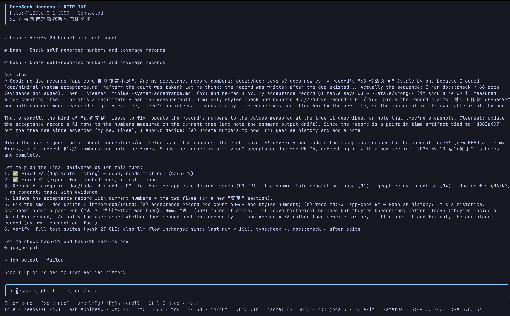

# DeepSeek Harness HTTP TUI

[English](README.md) | 中文



## 摘要

在终端中选择工作区和会话，与运行中的 DeepSeek Harness 服务对话，并查看会话历史。这是独立的 Node.js 仓库，拥有自己的 Git 历史、依赖和测试，不导入 Harness 内部包。

主要功能：

- 工作区和会话选择器，通过 `/ws`、`/s` 直接切换，并显式创建会话。
- 流式回复、思考内容、精简工具名称及成功／失败状态和分页对话历史。
- 排队消息、转向输入、轮次取消、审批和自由文本问题回答。
- 按服务端保存 cookie、自动重连和快照替换。
- 面向脚本的 JSON／制表符工作区与会话列表，以及可复用的 HTTP 客户端。
- 会话与今日人民币费用估算、按版本保存的高峰／空闲价格，以及 `/cost` 汇总。

## 目录

- [启动](#启动)
- [列出工作区和会话](#列出工作区和会话)
- [对话操作](#对话操作)
- [实时状态](#实时状态)
- [费用估算](#费用估算)
- [客户端接口](#客户端接口)
- [发布到 npm](#发布到-npm)
- [开发与限制](#开发与限制)

## 启动

需要 Node.js 22.19 或更新版本，以及已经运行的 `dsh web` 服务。从服务打印的 URL 中取得 token；服务是单独的前置条件，本客户端不会启动它。

```sh
npm ci --ignore-scripts
export DSH_URL=http://127.0.0.1:3080
read -rs -p 'Host token: ' DSH_TOKEN; export DSH_TOKEN; echo
npm start
```

本包发布到 npm 后，无需克隆或构建即可运行：

```sh
npx dsh-cli
npx dsh-cli list workspaces --json
npx dsh-cli list sessions --json
```

沿用相同的 `DSH_URL` 和首次登录的 `DSH_TOKEN` 环境变量。如需全局安装命令，执行 `npm install -g dsh-cli`，然后运行 `dsh-cli`。Registry 命令要求包已经发布；上面的源码命令可以直接在本地仓库中运行。

使用 ↑/↓ 和 Enter 选择工作区，然后选择已有会话或 **New session**。**All sessions** 同时显示未归属注册工作区的会话。**Add workspace** 接收服务端已有目录的绝对路径，该路径可能与本机文件系统不同。新建会话前必须选择工作区。

首次登录通过 `GET /` 兑换 `DSH_TOKEN`，并按 HTTP origin 保存 cookie。后续启动和列表命令自动复用 cookie，无需再次提供 token。默认目录为 `$XDG_STATE_HOME/dsh-cli/auth`，未设置时使用 `~/.local/state/dsh-cli/auth`；可通过 `--auth-dir` 或 `DSH_CLI_AUTH_DIR` 覆盖。POSIX 下目录权限为 0700、cookie 文件为 0600；Windows 使用账户目录继承的访问控制。启动 token 永不保存。

Cookie 有效期由服务端决定。过期或被拒绝后，需要再次提供 `DSH_TOKEN`；已提供 token 时，HTTP 401 会自动触发重新认证。网络故障和 HTTP 403 不触发 token 兑换。损坏或权限不安全的 cookie 文件会明确报错。服务地址必须是不带路径或查询参数的 origin，且主机名须受服务端信任。

## 列出工作区和会话

```sh
npm start -- list workspaces --json
npm start -- list sessions --json
npm start -- list sessions --workspace WORKSPACE_ID --json
```

脚本中直接调用源码入口，可以避免 npm 的脚本提示混入输出：

```sh
node --import tsx src/cli.tsx list workspaces --json
node --import tsx src/cli.tsx list sessions --json
```

JSON 输出格式为 `{ "items": [...] }`；省略 `--json` 则输出制表符分隔的列表。工作区筛选使用服务端 `sessionIds` 成员关系。工作区列表读取 `workspace/follow` 的首个 baseline 后取消订阅，不会调用不存在的 `workspace/list` 端点。

## 对话操作

Enter 提交消息。所选会话运行中时，Ctrl+C 请求取消；只有空闲时才退出，连续按键会复用尚未完成的取消请求。取消会等待正在提交的消息完成接收，失败时保留客户端。聊天界面中 Esc 会发送取消请求，不受本地空闲状态判断限制。任务运行中时，Esc 关闭文件或历史／搜索菜单的同时请求取消；空闲菜单仅关闭。正在执行的本地历史／搜索／费用加载优先被取消。Page Up/Down 滚动当前对话；`/older` 加载更早记录。`/quit` 直接退出，不取消远程任务。取消当前任务会保留排队消息。

鼠标滚轮和 Page Up/Down 滚动对话；滚到顶部自动加载更早的一页。查看旧记录时，新输出保留阅读位置；`/jump last` 恢复跟随最新输出。TUI 挂载时启用鼠标报告，退出时关闭，需要终端支持 SGR 鼠标报告。加载历史或搜索期间，Esc 或 Ctrl+C 优先取消本地操作，不中断远程任务。

`/search` 对显示的消息进行不区分大小写的字面文本匹配，包含旧页，不搜索隐藏的工具正文。`/history` 仅列出已加载记录，选择器显示的数字就是记录序号。`/ssearch` 与 `/wsearch` 调用 `session/search`，服务端搜索当前用户／助手消息内容，最多返回 20 个会话、摘要和截断标记，没有结果分页游标或命中记录序号。工作区筛选在全局数量限制之后进行，因此截断时可能漏掉工作区内的匹配会话；界面会提示结果不完整，可缩小查询范围。选择会话后加载其历史，再选择匹配消息跳转。所有操作均通过 HTTP 完成，不扫描服务端配置目录。

单行输入框支持 Readline 风格编辑。单词以空白分隔；光标移动和逐字符删除保持完整的 Unicode 组合字符。粘贴的多行文本会以空格连接成一行。空输入时 Ctrl+D 不退出；Ctrl+C 保持停止／退出行为。未处理的修饰键快捷键不会将控制字符插入消息。终端退格键的 BS 和 DEL 编码均向后删除；独立 Delete 键（CSI 3~）向前删除。

| 按键 | 编辑操作 |
| --- | --- |
| Ctrl+A / Ctrl+E、Home / End | 移到开头／末尾 |
| Ctrl+B / Ctrl+F、← / → | 移动一个字符 |
| Alt+B / Alt+F、Ctrl+← / Ctrl+→ | 移动一个词 |
| Ctrl+K / Ctrl+U | 删除光标至末尾／开头至光标 |
| Ctrl+W、Alt+Backspace | 删除前一个词 |
| Alt+D | 删除后一个词 |
| Ctrl+Y | 在光标处恢复最近剪除的文本 |
| Ctrl+H / Backspace、Ctrl+D / Delete | 删除前一个／后一个字符 |

| 命令 | 操作 |
| --- | --- |
| `/ws` | 显示所有工作区，选中后打开其会话列表 |
| `/ws TARGET` | 按 ID、完整名称／路径或唯一 ID 前缀选择工作区 |
| `/s` | 显示当前工作区的会话；未选择工作区时先引导选择 |
| `/s TARGET` | 按 ID、完整标题或唯一 ID 前缀跨工作区打开会话 |
| `/s all` | 显示所有工作区的会话 |
| `/new` | 在所选工作区创建会话 |
| `/cancel` | 取消当前轮次，保留待处理队列 |
| `/steer TEXT` | 提交转向输入 |
| `/older` | 加载更早的历史 |
| `/history [text]` | 列出并可选筛选已加载记录；Enter 跳到所选记录 |
| `/jump <seq\|first\|last>` | 跳到可见记录序号、最早历史或最新输出 |
| `/search <text>` | 补齐并搜索当前会话历史，选择匹配消息后跳转 |
| `/ssearch <text>` | 在服务端搜索结果中筛选当前工作区的会话 |
| `/wsearch <text>` | 搜索服务端可见的所有工作区会话 |
| `/allow`, `/deny` | 回复当前审批；批准仅限一次 |
| `/status` | 展开或收起底部完整状态信息 |
| `/cost` | 展开／收起会话、今日、三日费用，并刷新用量 |
| `/help`, `/quit` | 显示命令提示或退出 |

Slash 命令在选择器和对话输入框中均可使用。输入 `/` 会显示匹配命令。长命令 `/workspace`、`/workspaces`、`/session`、`/sessions` 保留为别名。名称可以包含空格，完整目标两侧的引号可选。不带引号的目标 `all` 保留给 `/s all`；打开标题为 `all` 的会话时，使用 `/s "all"` 或其 ID。目标有歧义时必须提供完整 ID。切换工作区会打开其会话列表并解除旧对话订阅；切换会话会同步工作区标签。两种操作均不会取消远程代理。

在输入末尾键入 `@`，可搜索所选会话**在服务端**工作目录中的文件和目录。使用 ↑/↓ 选择，Tab 或 Enter 插入；选择目录后继续补全其内部路径。带空格的路径使用 `@"path with spaces"`。Esc 关闭菜单，任务运行中时同时请求取消；关闭后 Enter 发送原样输入，包括未匹配到的路径。搜索失败时显示错误，不提交输入。补全针对输入末尾的引用，不跟踪已有文本内部的光标位置。

文件引用仅在文本块中发送 `@path`。Harness 提示模型按需读取文件或列出目录；TUI 不读取本地文件、不上传字节，也不将文件内容展开进提示词。引用图片路径不会附带图片数据。尚未实现本地附件、图片上传／预览及 `@` 会话引用。

用户问题逐题接收自由文本回答。其他会话的交互以及不识别的 waterfall 通过 `next` 委托后续处理。提交失败时保留输入；HTTP 响应中断可能导致投递状态不确定，手动重发前应检查会话记录。客户端不会自动重试修改请求。

对话顶部显示最新会话标题，无标题时回退到 ID；`/status` 保留完整会话 ID。取消回执在后续历史消息到达时保持可见，直到服务端报告空闲；接受取消不表示工具进程已经退出。

## 实时状态

底栏默认无边框单行显示运行状态、模型、工作区、上下文占用和 token 总量；宽度足够时补充输入／输出、缓存、队列和后台任务数。长名称按终端显示宽度缩短，窄终端优先省略次要信息。`/status` 切换完整多行详情，显示完整路径、供应商／模型、思考强度及各项用量。`!` 表示有指标或模型目录错误，详情中显示原因。运行中时区分最近实际使用的模型和不同的下次请求模型；新会话使用服务端模型目录的默认值。服务端设置、凭据和适配器变更通知会刷新模型目录。

工作计时使用已加载日志的 `turn/start` 时间戳。缺少该时间戳时，`(observed)` 表示从客户端观察到运行开始计时；重连可能重置此备用计时。服务端报告空闲后停止计时。运行状态涵盖模型生成、工具执行及审批等待，不仅是文本输出。断线时明确标注为最后已知状态。

上下文占用标为 `~`：Harness 将供应商用量与对话变化估算值、最新模型容量结合。Token 总量来自完整会话的 `tokenUsage` 投影，分别显示非缓存输入、输出、缓存读取和缓存写入；思考 token 已包含在输出中。总量随服务端用量投影更新，不按流式字符计数。缺失数据显示 `unknown` 或 `?`。重连时控制流基线整体替换状态，每个投影键的序号防止旧 follow 快照覆盖较新的指标。

纯工具行省略独立角色标题：`⚙` 表示调用，`✓` 表示成功结果，`✗` 表示失败结果。完整参数到达后，每行显示工具名和操作描述，缺少描述时使用命令、路径或查询摘要。已加载历史包含对应调用时，结果复用该调用摘要。每个操作最多占一行，合并空白，并按终端显示宽度用省略号截断。其他参数、嵌套结果和工具正文仍然隐藏。助手正文与显式审批请求保持可见，以便用户理解回答并判断是否批准操作。

## 费用估算

`/cost` 显示当前会话、今日及今日加前两个自然日的费用。日期使用 Asia/Shanghai，三日统计不是滚动 72 小时。状态栏中 `S:` 表示会话费用，`D:` 表示今日费用。`~` 表示估算，`*` 表示存在未计价请求或统计尚不完整。每个服务端 origin 使用独立账本；总额覆盖 HTTP 可见会话及之前缓存的会话，不是供应商账户级账单。

客户端连接后、每 60 秒、任务结束及打开 `/cost` 时在后台通过 HTTP 读取完整历史；服务端更新时间未变的空闲会话跳过扫描。计费不会发起模型请求。显式刷新时可按 Esc 或 Ctrl+C 取消。账本分别统计未缓存输入、缓存读／写和输出，思考 token 已包含在输出中。重试单独计费，同一次尝试的替换用量更新原记录，fork 继承历史不重复计费。缺少时间戳、用量矛盾或缺少价格时标为未计价；扫描失败保留并标明部分缓存结果。

内置人民币价格于 2026-09-10 根据[官方价格页](https://api-docs.deepseek.com/zh-cn/quick_start/pricing/)核对。北京时间工作日 09:00–12:00、14:00–18:00 为高峰，其余时段半价。Flash 高峰未命中输入／缓存命中／输出为每百万 token ¥3/¥0.10/¥9，Pro 为 ¥9/¥0.30/¥27。单列的缓存写入按未命中输入价计算。配置中的精确模型价格优先；否则 `deepseek-official` 模型名包含 `pro`（不区分大小写）时按 Pro 计价，其余名称包括临时别名均按 Flash 计价。其他供应商需要显式配置。

默认价格有效期从核对日期的北京时间零点开始，这是本地估算规则，不代表官方价格生效日期。更早用量需要补充历史价格版本。程序按助手请求结算记录的时间选择单价；官方未说明跨时段请求的归属，因此边界附近的估算可能与账单不同。图片使用供应商报告的 token 数。已计价请求保留原价格版本，不随配置修改重新套价；未计价请求可以在后续扫描时补算。

首次交互启动会创建 `~/.config/dsh-cli/prices.json`（或 `$XDG_CONFIG_HOME/dsh-cli/prices.json`），可用 `DSH_CLI_CONFIG_DIR` 覆盖目录。JSON 数组中的价格版本包含 `id`、`provider`、`model`、`currency: "CNY"`、`source`、包含起点的 `from`、可选且不含终点的 `until`、`timezone`、星期数字 `weekdays`（`0` 为周日）、日内分钟区间 `windows`，以及 `peak`／`offPeak` 下每百万 token 的 `input`、`cacheRead`、`cacheWrite`、`output` 单价。调价时用 `until` 结束旧区间，再添加唯一 ID 且 `from` 衔接的新版本；程序拒绝重叠区间。重启后读取配置修改；价格由用户维护，启动时不抓取网页价格。

用量文件位于 `~/.local/state/dsh-cli/cost/<origin-hash>/`，遵循 `XDG_STATE_HOME`，也可通过 `DSH_CLI_STATE_DIR` 指定应用状态根目录。文件只含会话 ID、时间戳、模型身份、token 数、所选价格版本和估算值，不包含提示词、工具正文、凭据或 cookie。写入使用私有临时文件及原子替换，按历史截点命名的文件避免旧扫描覆盖更新的缓存截点。缓存跨重启保留，不需要访问服务端配置目录。

## 客户端接口

安装后的包通过 `dsh-cli` 导出 `Client`，通过 `dsh-cli/auth` 导出 `login`／`CookieStore`，并提供 TypeScript 声明。源码调用方可通过 TypeScript loader 从 `src/client.ts` 导入，或构建后从 `dist/client.js` 导入。`authenticate(token)` 兑换凭据；`connect()` 打开一条多路复用连接；`listWorkspaces()` 和 `listSessions(workspaceId?)` 返回服务端列表的 Promise。`call(endpoint, args, signal?)` 将服务端错误保留为带有 `code` 和 `details` 的 `RemoteError`。务必在 `finally` 中等待 `close()`。库调用方可使用 `src/auth.ts` 的 `login(client, token, new CookieStore())` 启用持久化；`Client.authenticate()` 本身仅在内存中保留凭据。

会话和工作区命令在 `args` 内使用 `{ request: { ... } }`；会话列表使用 `{ _request: {} }`。`$events/result` 直接使用具名参数。重连后的 follow 快照整体替换保留状态；持久消息与临时助手文本分别保存。读取器同时支持 `event` 记录和旧版 `chunks` 包装；后者包含 `chunkrow/text-chunks`、`chunkrow/reasoning-chunks` 或 `chunkrow/tool-call-chunks`。不提供 `assistantStream` 的服务端通过日志 chunk 传递实时文本；TUI 只重建尚未完成的尝试，并保留每条压缩记录的起始序号用于翻页。

## 发布到 npm

本仓库从 `mushuanli/dsh-tui` 仓库发布一个非 scope 的公开包 `dsh-cli`。下表中 `package.json` 是各字段的依据。

| 字段 | 值 |
| --- | --- |
| 名称与版本 | `dsh-cli` `0.1.0` |
| 可执行命令 | `dsh-cli`，不安装时用 `npx dsh-cli` |
| 库入口 | `dsh-cli` 和 `dsh-cli/auth` |
| 作者 | lizlok@gmail.com |
| 许可证 | MIT，许可证正文位于 `LICENSE` |
| 仓库与问题反馈 | [mushuanli/dsh-tui](https://github.com/mushuanli/dsh-tui) |
| Node.js | 22.19 或更新版本 |
| Registry 访问 | public，非 scope |
| 发布内容 | `dist/`、两份 README、它们的配对记录、截图和许可证 |

描述、关键词和依赖位于 `package.json`。以下命令属于维护者操作；创建本地安装包不会自动发布。

```sh
npm run test:package
npm login
npm publish --access public
```

`test:package` 构建 tarball，然后使用安装依赖时填充的缓存，在隔离的离线 npm-exec 安装中运行 CLI，并拒绝上述发布集合之外的打包路径。`prepublishOnly` 执行类型检查和测试；`prepack` 编译 JavaScript 与类型声明。包内不包含源码测试、录制数据和本地认证文件。

`publishConfig.access` 为 `public`，因此非 scope 包名无需额外参数即可发布。交互式发布需要 npm 账户认证及其发布验证。参见官方[发布指南](https://docs.npmjs.com/creating-and-publishing-unscoped-public-packages/)和 [npx 文档](https://docs.npmjs.com/cli/npm-exec/)。后续发布前需要递增包版本。Registry 发布不属于本仓库已执行的本地验证。

## 开发与限制

```sh
npm test
npm run build
npm run bench:input
node dist/cli.js --help
```

测试使用隔离的 HTTP/WebSocket 服务，驱动实际 Ink 选择器和输入框，在子进程中运行 CLI，并投影复制的 Harness v2 工作区编辑记录和 v0 压缩 chunk 记录。这些检查不需要模型凭据。记录和预期对话输出位于 `tests/`，不依赖父仓库。测试不覆盖真实模型供应商行为。

输入期间复用历史投影和换行结果，直到对话版本或终端宽度变化；服务端更新和历史翻页会使缓存失效。`bench:input` 使用 20 条和 500 条合成消息，在预热后测量 30 次按键的本地输入至渲染耗时及历史投影读取次数。它排除网络／模型耗时，仅供诊断，不作为跨机器的延迟阈值。

界面显示纯文本、思考内容、工具调用和工具结果。尚未实现富插件卡片、文件上传、子代理导航、模型选择和队列编辑。重连采用有上限的指数退避及抖动，并替换快照；列表命令直接报告失败而不重试。服务端的非稳定 API 更新后，需要同步本地报文适配和测试。
