# dsht TUI 架构设计、接口与事件流

本文档记录 `tui/` 目录（npm 包 `@itookit/dsht`，可执行文件 `dsht`）的架构设计、对外接口、内部事件流，以及项目协作与维护所需的事实。

**事实基线**：`tui/` 目录内容，模块化重构与后续改动的提交序列 `e3a921e`…`e1b115a`（2026-09-11，见 7.8），`package.json` 版本 `0.3.0`。所有结论均从 `tui/src`、`tui/tests`、`tui/README.md` 与 `tui/.agents/notes/implemented/` 读出，未使用其他来源。
**图形约定**：结构图使用 Mermaid C4（`C4Context` / `C4Container` / `C4Component`），流程使用 `C4Dynamic`；仅在 C4 无法表达报文先后顺序时补充 `sequenceDiagram`。
**维护要求**：`src/` 的模块划分、导出符号、宿主端点或帧结构、本地文件路径与格式、命令行选项或 slash 命令发生变化时，同步更新本文件对应小节。

## 目录

- [1. 项目概览](#1-项目概览)
- [2. 架构设计](#2-架构设计)
- [3. 接口](#3-接口)
- [4. 事件流](#4-事件流)
- [5. 数据存储](#5-数据存储)
- [6. 成本模型](#6-成本模型)
- [7. 项目协作与维护](#7-项目协作与维护)
- [附录 A 源码索引](#附录-a-源码索引)
- [附录 B 术语与不变量](#附录-b-术语与不变量)

## 1. 项目概览

### 1.1 定位

`dsht` 是 DeepSeek Harness 的**独立远程终端客户端**。它面向已经在使用 SSH 的开发者：Harness 持续运行在开发主机或服务器上，用户从笔记本、平板或手机 SSH 进入该主机后运行 `dsht`，即可查看状态、发送消息、转向运行中的任务、回答审批与提问、取消回合、切换会话与工作区。

`dsht` 不是 SSH 客户端，也不启动 Harness。宿主 `dsh web` 是必须先存在的外部服务；`dsht` 只通过 HTTP 与 WebSocket 访问它。设计上刻意**不导入任何 Harness 包**，因此安装与启动不依赖 Harness 的 Cordis 组合，代价是必须跟随宿主尚未稳定的 wire 协议演进。

除远程控制外，`dsht` 还承担成本监控角色：它按请求记录 token 用量，区分未缓存输入、缓存读取、缓存写入与输出，并结合模型、结算时间、峰谷时段与版本化价格表，给出会话、当天与最近三个自然日的 CNY 估算。

### 1.2 包与仓库事实

| 项 | 值 |
| --- | --- |
| 包名 / 版本 | `@itookit/dsht` `0.3.0` |
| 可执行文件 | `dsht`（`dist/cli/index.js`），可直接 `npx @itookit/dsht` |
| 模块格式 / 引擎 | ESM（`"type": "module"`），Node.js `>=22.19` |
| 库入口 | `.` → `dist/index.js`；`./auth` → `dist/transport/auth.js`；均带 `.d.ts` |
| 运行时依赖 | `ink` ^6.8、`react` ^19.2、`slice-ansi` ^8、`wrap-ansi` ^9、`ws` ^8.21 |
| 开发依赖 | `@types/node`、`@types/react`、`@types/ws`、`ink-testing-library`、`tsx`、`typescript` |
| 许可 / 作者 | MIT，`lizlok@gmail.com` |
| 仓库 | `git@github.com:mushuanli/dsht.git`，分支 `main` |
| 源码规模 | `src/` 57 个模块（8 个业务域 + 共享契约），约 5,980 行；`tests/` 24 个测试文件；165 项测试 |

`tui/` 是父仓库 `deepseek-harness` 中的**独立嵌套仓库**（在父仓库中未跟踪），拥有自己的 `package.json`、`tsconfig.json`、CI 工作流与 Agent Notes，不参与父仓库的 pnpm workspace 与文档门禁。

### 1.3 运行前提

1. 已存在可访问的 `dsh web` 宿主，默认 `http://127.0.0.1:3080`。
2. 首次登录需要启动令牌：`DSH_TOKEN`，或把 `dsh web` 打印的含 `?token=` 的 URL 原样导出为 `DSH_URL`。
3. 交互模式要求 `stdin` 与 `stdout` 都是 TTY；否则必须使用 `list` 子命令。

## 2. 架构设计

### 2.1 系统上下文（C4Context）

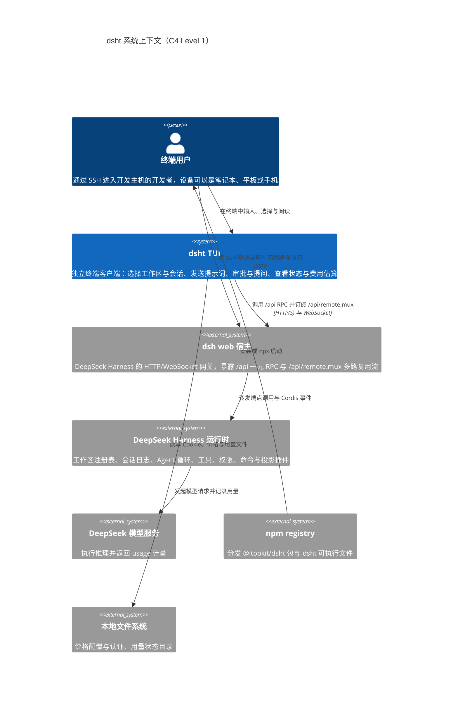

要点：`dsht` 与 Harness 之间**没有直接耦合**，所有交互都终止于 `dsh web` 网关；SSH、跳板机、ProxyJump、tmux 属于用户既有环境，`dsht` 不做假设也不做管理。

### 2.2 容器视图（C4Container）

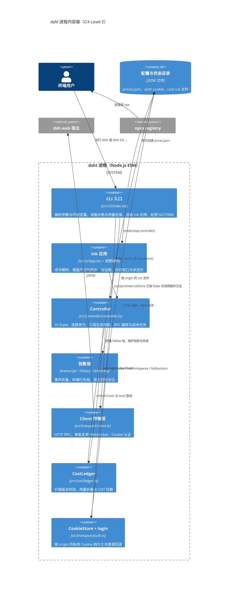

进程只有一个，没有后台守护进程：`Controller.run()` 是一个可重连的循环，`Client` 每次世代重建一条物理 WebSocket。`dist/` 只是 `tsc` 的产物，权威源码是 `src/`。

### 2.3 组件视图（C4Component）

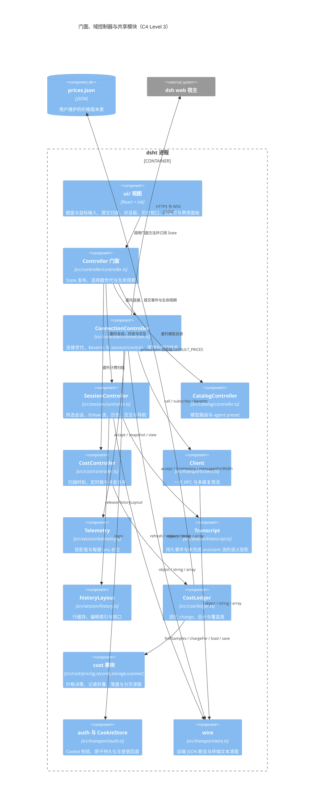

域内模块只依赖 `transport/`、Node 标准库与 `ws`；`session/`、`cost/`、`catalog/` 与 `controller/` 都不引用 React 或 Ink，只有 `ui/` 引用。完整规则与机械检查见 2.4。

### 2.4 模块分层与依赖规则

目录即架构边界：每个业务域一个目录，跨域导入只允许沿依赖方向，并且必须走目标域的 `index.ts`。

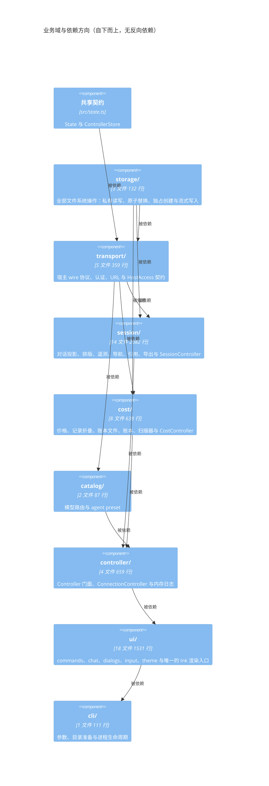

| 域 | 允许导入 | 约束 |
| --- | --- | --- |
| `storage/` | `storage` | 唯一允许导入 `node:fs` / `node:fs/promises` 的域；不导入任何其他业务域 |
| `transport/` | `transport`、`storage` | 不包含业务规则 |
| `session/` | `transport`、`session`、`state.ts`、`storage` | 纯 TypeScript，不含 React |
| `cost/` | `transport`、`cost`、`storage` | 不依赖 session 投影，也不依赖 ui；React 与 Ink 不进入该域 |
| `catalog/` | `transport`、`catalog`、`state.ts` | 独立的模型元数据域 |
| `controller/` | `transport`、`session`、`cost`、`catalog`、`controller`、`state.ts`、`storage` | 应用门面、连接世代与内存日志 |
| `ui/` | `transport`（不含 `client.ts`）、`session`、`cost`、`catalog`、`controller`、`ui`、`state.ts` | 唯一允许 React 与 Ink 的域；不得直接调用传输层 client |
| `cli/` | 全部 | 组装入口，只通过 `ui/mount.tsx` 渲染 |
| `state.ts` | `transport`、`session` | 共享状态契约 |
| `index.ts` | `transport` | 公开库门面 |

这些规则由 `tests/architecture/dependencies.test.ts` 机械检查：它遍历 `src/` 的全部模块、解析导入说明符，拒绝 `storage/` 之外的任何 `node:fs` 导入，并附带合成用例证明每个禁止方向都会被拒绝。

### 2.5 状态与渲染模型

渲染链路存在**四层表示**，任意两层都不允许互相污染：

1. **宿主事件层**：`session/follow` 的 `snapshot` / `event` / `chunks` / `assistant-stream` 帧，以及 `session/control` 的 `baseline` / `projection` / `queue` / `jobs` 帧。
2. **语义消息层**（`Transcript`）：只保留可显示事件（`user/message`、`assistant/message`、`tool/result`）的裁剪副本；未完成的 assistant 流保存在独立的 `blocks` 中，永不写入持久历史。
3. **投影视图层**（`historyLayout` / `LayoutIndex`）：把语义消息按当前终端宽度包装成行，缓存每段的行数与起始偏移，只物化可见视口；最多缓存 2,048 行且单条消息不超过 256 KiB。文本部分先经 `markdown.ts` 解析成纯文本行加局部样式区间（表格按终端列宽分配、Mermaid 闭图渲染为字符网格、TeX 经 MathJax 编译为 Unicode 公式），样式由 Ink 在排版后应用，因此行几何与索引保持一致。未完成的实时部分按稳定 `key` 增量换行：文本只会增长，因此最后一个非空行之前的行不再重排，每帧只重排该行残余与新到的增量。
4. **渲染层**（Ink）：仅可见行成为 React 节点，远端文本先经 `safeText` 清洗再着色。

`Controller` 是唯一的状态发布者：`State` 通过 `update(patch)` 整体替换并递增 `version`，React 18 的 `useSyncExternalStore(controller.subscribe, controller.snapshot)` 读取它。`State` 与 `ControllerStore` 契约位于 `src/state.ts`，由 `ConnectionController`、`SessionController`、`CatalogController` 与 `CostController` 共同写入；`pending`（待答问题/审批）由 `SessionController` 的 `interactions` 映射在每次 `update` 时按当前会话推导，因此**可见对话框与帧到达顺序无关**。选择器世代同样由 store 持有，会话与 catalog 域据此丢弃跨越切换的在途响应。

阅读时冻结的机制：`Frozen` 是一个按 `frozen && identity` 比较的 `memo` 包装。`displayPaused = copyMode || dialogOpen` 冻结标题与对话；状态另用 `statusPaused = copyMode || (screen === 'chat' && dialogOpen)`，因此工作区选择、会话选择与主机路径输入界面的连接提示和状态栏保持实时，只有 chat 对话框与历史回看（`statusFrozen`）暂停它们。启动选择器若沿用对话的冻结条件，会话标识不变会让连接前的 `Offline`／`Connecting…` 画面一直保留。复制模式（`/copy`、Ctrl+S 或对话框外无修饰左键）额外关闭鼠标上报，恢复终端原生选区；后台接收与内存回收继续进行，仅窗口尺寸变化是明确的重绘例外。

### 2.6 关键架构决策

| 决策 | 内容 | 理由 |
| --- | --- | --- |
| 独立客户端 | 不导入任何 Harness 包，只依赖 `dsh web` wire 协议 | 安装与启动不绑定 Cordis 组合；代价是跟随预稳定协议 |
| 单一复用 WebSocket | 所有流共用 `/api/remote.mux`，以 `streamId` 多路复用 | 一个物理连接、一处生命周期、便于整体关闭 |
| 宿主是持久层的唯一所有者 | 客户端只保存可重载的内存副本；工具结果正文只在宿主日志中 | 不产生第二份真相，切换会话可整段释放 |
| 投影与渲染分离 | 语义块、折叠状态、行索引、着色互不写入 | 折叠变化不修改内容，搜索与 `/think` 始终可用完整文本 |
| 实时尾部增量换行 | 每个布局按实时部分的稳定 `key` 保存已定稿行与最后一行残余来源，只重排残余与新增量 | 逐帧整段换行的时间随累计长度乘帧数增长，而历史行不可能因新增文本重排 |
| 不自动重试写操作 | 所有 `session/*`、`workspace/*`、`commands/execute` 只尝试一次 | 丢失的响应无法判定宿主是否已执行，重试可能重复投递 |
| 世代化重连 | 每次断线重建 `Telemetry`、清空 `runningUpdates` 与 `interactions`，以新基线替换 | 宿主基线是重连后的权威状态，旧世代数据不得回灌 |
| 未知 waterfall 必须委托 | 未识别的 `waterfall` 事件一律用 `{kind:'next'}` 回应 | 否则会阻塞宿主的 Cordis 事件链 |
| 成本按请求计价 | 折叠持久用量事件而非对遥测基线做差 | 基线差会丢失重试、fork 继承与峰谷归属 |
| 账本不可重算 | charge 首次计价即固化 `priceId` 与 `amount`；只有缺用量的样本保持开放 | 历史金额是事实，修改 `prices.json` 只影响其后计价的请求 |
| Controller 是门面 | 门面只负责状态发布、选择器世代与生命周期，实现分布在四个域控制器 | 防止再次长出 God Object，同时保留 UI 与测试沿用的公开 API |
| 目录即边界 | 每个业务域一个目录，跨域导入走 `index.ts` | 目录表达架构，依赖方向可被机械检查 |
| 公开 API 与布局解耦 | `src/index.ts` 是唯一库门面，`exports` 指向编译产物 | 内部目录调整不改变 `@itookit/dsht` 的导入路径 |

## 3. 接口

### 3.1 宿主 wire 协议

`dsht` 消费的是 `dsh web` 网关的公开 HTTP/WebSocket 协议。协议由父仓库 `packages/api/gateway/src/stream-protocol.ts` 定义；本节只记录 `dsht` 实际使用并校验的部分。

#### 3.1.1 认证

- 请求：`GET /?token=<token>`，`redirect: 'manual'`。
- 期望：`303`，并带 `Set-Cookie: dsh-auth-<...>=<value>; ...; Max-Age=<n>`（或 `Expires`）。
- 客户端只接受以 `dsh-auth-` 开头的候选 Cookie，正则校验为 `/^dsh-auth-[\w-]+=[A-Za-z0-9._-]+$/`。
- 服务端决定过期时间；`Max-Age` 优先于 `Expires`。启动令牌永不落盘，只有 Cookie 可能落盘。
- 401 触发令牌回退；403 与网络错误不触发。

#### 3.1.2 一元 RPC

```text
POST /api/<namespace>/<method>
content-type: application/json
cookie: dsh-auth-...

{ "type": "client-request", "rpcId": "<uuid>", "method": "<namespace>/<method>", "payload": { "args": { ... } } }
```

响应体：

```text
{ "type": "server-response", "rpcId": "<same uuid>",
  "result": { "ok": true,  "value": <json> } }
{ "type": "server-response", "rpcId": "<same uuid>",
  "result": { "ok": false, "error": { "code": "<string>", "message": "<string>", "details": <json|absent> } } }
```

客户端契约：

- HTTP 非 2xx → `HttpError(status, endpoint)`；`result.ok === false` → `RemoteError(code, message, details)`；`rpcId` 或 `type` 不匹配 → 普通 `Error("RPC response identity mismatch")`。
- 端点名必须匹配 `/^[\w$-]+\/[\w$-]+$/`，恰好一个斜杠。
- 默认 15,000 ms 超时；`timeoutMs = null` 表示不设普通期限（仅 `/compact` 等长任务使用）。
- 写操作**从不自动重试**。

#### 3.1.3 多路复用流

```text
WS /api/remote.mux            （https 时为 wss）
cookie: dsh-auth-...
```

客户端 → 服务端：

```text
{ "type": "open",   "streamId": "<uuid>", "endpoint": "<namespace>/<method>", "payload": { "args": { ... } } }
{ "type": "cancel", "streamId": "<uuid>" }
```

服务端 → 客户端：

```text
{ "type": "item",  "streamId": "<uuid>", "value": <json> }
{ "type": "end",   "streamId": "<uuid>" }
{ "type": "error", "streamId": "<uuid>", "error": { "code": "...", "message": "...", "details": { ... } } }
```

客户端契约：

- 二进制帧视为协议错误并终止 socket。
- `item` 回调抛出异常时，客户端删除该监听、发送 `cancel` 并以该异常结束订阅。
- socket `error` / `close` 结束时，`fail(error)` 会结束所有在册订阅。
- 每个订阅在 `subscribe` 时分配新的 `streamId`；`cancel()` 幂等，仅在仍在册时发送 `cancel`。

#### 3.1.4 归档下载

```text
GET /api/session.export?sessionId=<id>
cookie: dsh-auth-...
```

- 非 2xx → `HttpError(status, 'Session log export')`。
- 不设普通 RPC 截止时间；由调用方 `AbortSignal`、客户端关闭共同取消。
- 客户端把响应体交给 `saveSessionLog`，以 `wx` 独占创建本地文件，失败或取消时删除未完成文件。

#### 3.1.5 端点清单

| 端点 | 传输 | 参数 | 用途 |
| --- | --- | --- | --- |
| `$events` | 流 | `{}` | 网关转发的 Cordis 事件：`ready` / `waterfall` / `cancel` / `emit` |
| `$events/result` | RPC | `{ clientId, eventId, outcome }`（具名参数，非 `request` 包装） | 回应 waterfall 或显式回答 |
| `workspace/follow` | 流 | `{}` | 消费首个 `baseline` 以取得工作区列表与 `archivedSessionIds` |
| `workspace/create` | RPC | `{ request: { path } }` | 注册宿主目录 |
| `workspace/delete` | RPC | `{ request: { workspaceId } }` | 仅移除注册，不删目录与会话 |
| `workspace/archiveSession` | RPC | `{ request: { sessionId } }` | 归档会话并返回新的 `archivedSessionIds` |
| `session/list` | RPC | `{ _request: {} }` | 全部 HTTP 可见会话 |
| `session/create` | RPC | `{ request: { workspaceId } }` | 显式新建会话 |
| `session/follow` | 流 | `{ request: { address, maxMessages: 80, assistantStream: true } }` | 会话快照、持久增量与助手流 |
| `session/page` | RPC | `{ request: { address, throughSeq, beforeSeq, maxMessages: 80 } }` | 向更早历史分页 |
| `session/control` | 流 | `{}` | 投影、队列与活动任务的世代基线 |
| `session/search` | RPC | `{ request: { query } }` | 宿主侧会话搜索（最多 20 条，带截断标志） |
| `session/prompt` | RPC | `{ request: { sessionId, requestId, mode, content, clientTimeZone } }` | 投递用户输入 |
| `session/cancel` | RPC | `{ request: { sessionId } }` | 取消当前回合 |
| `session/updateQueue` | RPC | `{ request: { sessionId, itemId, action: { kind: 'remove' } } }` | 删除仍未被领取的排队输入 |
| `session/modelCatalog` | RPC | `{}` | 可选路由、推理档位与默认模型 |
| `session/selectModel` | RPC | `{ request: { sessionId, provider, model, reasoningEffort? } }` | 选择下一请求模型 |
| `commands/execute` | RPC（无期限） | `{ agentId, line, submittedAttachments: [] }` | 直接执行宿主命令（`/compact`、`/plan` 等） |
| `fileReferences/list` | RPC | `{ agentId, query }` | 宿主工作目录下的路径候选 |
| `agentPresets/list` | RPC | `{}` | preset 名称与 trust 元数据 |

`address` 有两种形态：普通会话 `{ kind: 'session', sessionId }`；子代理会话 `{ kind: 'subagent', parentSessionId, childSessionId, mode: 'continuable' | 'one-shot' }`。子代理的投递模式在 `session/list` 行中缺失，因此成本扫描先试 `continuable`，仅当返回 `RemoteError.code === 'subagent/unauthorized'` 时才重试 `one-shot`。

#### 3.1.6 帧结构（客户端实际消费的字段）

`session/follow`：

```text
{ type: 'snapshot', cursor: <int>, hasMore: <bool>, header: { isSeeded?: true },
  records: [ { type: 'event', event: {...} } | { type: 'chunks', event: {...} } ],
  projections: <json>, assistantStream: { revision: <int>, activeAttempt?: {
      attemptId, nextIndex, stream: [ {type:'chunk',chunk} | {type:'text-chunks'|'reasoning-chunks',index,texts} | {type:'tool-call-chunks',index,id,name,args} ] } } }
{ type: 'event',  event: { seq, type, surfaceOp, time, data } }
{ type: 'chunks', event: { seq, type: 'chunkrow/text-chunks' | 'chunkrow/reasoning-chunks' | 'chunkrow/tool-call-chunks', data } }
{ type: 'assistant-stream', frame: { revision, type: 'start' | 'chunk' | 'end', attemptId, index, chunk } }
```

客户端**拒绝流缺口**：`assistant-stream.revision` 必须等于本地 `revision + 1`；`chunk` 帧的 `attemptId` 与 `index` 必须与本地期望一致，否则抛出并交由 `generationFailed` 触发重连。

`session/control`：

```text
{ type: 'baseline', value: { projections: { <sessionId>: { asOfSeq, values } }, queues: { <sessionId>: [ ... ] }, jobs: { <sessionId>: [ ... ] } } }
{ type: 'projection', sessionId, key, seq, value }
{ type: 'queue', sessionId, items }
{ type: 'jobs',  sessionId, items }
```

投影采用**每键水位**：`seq < (revisions.get(key) ?? baseline)` 的更新被丢弃；`Telemetry` 只保留 `title`、`modelSelection`、`contextPressure`、`tokenUsage`、`sessionStats`、`agentPreset` 六个键。baseline 之前的任何非 baseline 帧都是错误。

`$events`：

```text
{ type: 'ready',     clientId, host: { home } }
{ type: 'waterfall', event, eventId, agentId, request }
{ type: 'cancel',    eventId }
{ type: 'emit',      event, args }
```

`dsht` 特别关注的 `emit` 事件：`api-session/status`（`args = [sessionId, running]`）、`api-session/error`、`llm/adapters-updated`、`settings/document-updated`、`credentials/reference-updated`。后三类触发模型目录刷新。

### 3.2 TUI 模块接口

#### 3.2.1 `Client`（`src/transport/client.ts`，库入口 `.`）

```ts
class HttpError extends Error { readonly status: number }
class RemoteError extends Error { readonly code: string; readonly details: Json | undefined }
interface Subscription { cancel(): void }

class Client {
  readonly base: URL
  archivedSessionIds: ReadonlySet<string>
  constructor(base: string, timeoutMs?: number)          // 默认 15_000；base 必须是纯 origin
  authenticate(token: string): Promise<void>              // 仅内存保留凭据
  restoreCookie(cookie: string): void
  get persistentCookie(): { cookie: string; expiresAt: number } | undefined
  sessionLog(sessionId: string, signal: AbortSignal): Promise<Response>
  call(endpoint: string, args?: ObjectValue, signal?: AbortSignal,
       timeoutMs?: number | null): Promise<Json | undefined>
  connect(): Promise<void>                                 // 重复调用抛错
  subscribe(endpoint: string, args: ObjectValue, listener: Listener): Subscription
  listWorkspaces(): Promise<ObjectValue[]>                 // 消费并取消首个 baseline
  listSessions(workspaceId?: string): Promise<ObjectValue[]>
  close(): Promise<void>
}
```

`Listener` 为 `{ item(value: Json | undefined): void; end(error?: Error): void }`。构造器拒绝带路径、查询、hash 或内嵌凭据的 URL。

#### 3.2.2 `Controller` 门面（`src/controller/controller.ts`）

```ts
interface State { /* 定义在 src/state.ts */ }
interface ControllerStore {
  readonly state: State
  update(patch: Partial<State>): void
  selection(): number
  bumpSelection(): void
}
class Controller implements ControllerStore, ConnectionListener {
  readonly state: State
  readonly connection: ConnectionController
  readonly session: SessionController
  readonly catalog: CatalogController
  readonly cost: CostController | undefined
  readonly base: string
  readonly costs?: CostLedger
  readonly historyLimits: HistoryLimits
  constructor(base, token, initialSession?, makeClient?, authenticate?, costs?, historyLimits?)
  subscribe / snapshot / update / selection / bumpSelection
  start() / stop() / shutdown() / perform(operation)
  running / sessionName / sessionMode / workingSince / visibleSessions / telemetry / costs
  loadPresetNames / modelCatalog / selectModel / refreshCosts
  interrupt / pinHistory / showPicker / removalTarget / removeTarget
  pickWorkspace / switchWorkspace / switchSession / enterPath / createWorkspace / createSession
  selectSession / waitForHistory / searchSessions / references / command / removeQueued / exportLog
  prompt / cancelTurn / older / searchHistory / historyAt / historyThrough / answer / approve
}
```

构造函数参数与重构前完全一致，UI 与测试的调用方式因此未变；门面自身只实现状态发布、选择器世代与生命周期，其余方法逐条委托到四个域控制器。

| 域控制器 | 文件 | 职责 |
| --- | --- | --- |
| `ConnectionController` | `src/controller/connection.ts` | Client 生命周期、认证、连接世代、退避重连、`$events` 与 `session/control` 订阅、遥测世代、运行状态与观察起点缓存 |
| `SessionController` | `src/session/controller.ts` | 所选会话、follow 流、transcript、历史分页与搜索、输入投递、取消、审批与提问、工作区与会话导航、归档、导出、`@` 引用 |
| `CatalogController` | `src/catalog/controller.ts` | `session/modelCatalog`、`session/selectModel`、`agentPresets/list` 与目录刷新 |
| `CostController` | `src/cost/controller.ts` | 启动扫描、60 秒定时、回合结束刷新、`/cost` 刷新与并发合并 |

域控制器之间的契约是显式的：`HostAccess`（`src/transport/host.ts`）给出 `client/require/online/signal`，`ConnectionView`（`src/session/connection-view.ts`）给出 `telemetryView/runningFor/observedAt/observe/fail/reply`，`CostHost`（`src/cost/controller.ts`）给出扫描所需的宿主访问与状态发布。`interrupt()` 仍会合并并发调用：`interruptTask` 存在时直接复用；返回 `true` 表示可以退出（仅在空闲、无 admission、无排队输入且不忙时）。

#### 3.2.3 `Transcript`（`src/session/transcript.ts`）

```ts
interface MessagePart { kind: 'text' | 'reasoning' | 'tool' | 'success' | 'error'; text: string; closed?: boolean; key?: string }
interface Message { seq: number; role: string; text: string; parts: MessagePart[]; compact?: boolean; folded?: string }
interface ThoughtEntry { seq: number; promptSeq?: number; prompt: string; preview: string }

class Transcript {
  version: number; cursor: number; hasMore: boolean; ready: boolean; memoryRevision: number
  accept(value: unknown): void                 // snapshot / event / chunks / assistant-stream
  addPage(value: unknown): void                // 更早页面，不替换实时尾部
  trimHistory(limits: HistoryLimits): number   // 返回删除条数
  dispose(): void
  get readThrough(): number
  get retainedBytes(): number
  get retainedRecordCount(): number
  get beforeSeq(): number | undefined
  get activeTurnStartedAt(): number | undefined
  get thoughts(): ThoughtEntry[]
  get latestPrompt(): string
  get messages(): Message[]
  messagesForWidth(width: number): Message[]
  get liveText(): string
  liveTextForWidth(width: number): string
  liveParts(width: number): MessagePart[]
  get liveAttemptKey(): string | undefined
  get hasLiveContent(): boolean
  get liveToolOnly(): boolean
}
```

`accept` 只接受 `snapshot`、`event`、`chunks`、`assistant-stream`；其余帧类型抛 `Unknown session follow frame`。

#### 3.2.4 `Telemetry`（`src/session/telemetry.ts`）

```ts
interface QueuedInput { id: string; placement: 'queued' | 'steering' | 'context'; text: string }
class Telemetry {
  ready: boolean
  constructor(retainedKeys?: ReadonlySet<string>)
  accept(value: unknown): void                       // baseline / projection / queue / jobs
  snapshot(id: string, value: unknown): void         // 合并 follow 快照中的 projections
  view(id?: string): { values: ObjectValue; queued?: number; jobs?: number }
  pending(id?: string): readonly QueuedInput[]
}
```

#### 3.2.5 成本模块（`src/cost/`）

```ts
interface Charge { key, time?, provider, model; usage?: Usage
                   priceId?: string; amount?: number; estimated?: true; reason?: string }
interface SavedCost { version: 2; sessionId: string; cut: number; charges: Charge[] }
interface PriceDecision { priceId?: string; amount?: number; estimated?: true; reason?: string }

class CostLedger {
  scanning: boolean; error: string; scannedAt?: number
  constructor(prices?: PriceVersion[], directory?: string)
  load(): Promise<void>
  replace(sessionId: string, cut: number, events: ObjectValue[]): Promise<void>
  hasSession(sessionId?: string): boolean
  missing(): string[]
  total(sessionId?: string, days?: 1 | 3, now?: number): CostTotal
  get coverage(): Coverage
}
class CostController {
  readonly ledger: CostLedger
  start(): void; stop(): Promise<void>; onTurnIdle(): void
  refresh(signal?: AbortSignal): Promise<void>
}

function pricesFrom(value): PriceVersion[]
function priceAt(prices, provider, model, time): { price; rates } | undefined
function lowestPrice(prices, provider, model): { price; rates } | undefined
function chargeFor(prices, provider, model, time, usage): PriceDecision
function costDay(time: number): string
function costRecords(records: unknown): ObjectValue[]
function foldSamples(events: readonly ObjectValue[]): ChargeSample[]
function costAddresses(session: ObjectValue): ObjectValue[]
function sessionCostHistory(client, session, signal): Promise<{ cursor, events }>
function costText(total: CostTotal): string
const DEFAULT_PRICES: PriceVersion[]
```

| 文件 | 职责 |
| --- | --- |
| `pricing.ts` | 价格版本校验、峰谷选择、`chargeFor` 决策 |
| `records.ts` | 宿主事件 → 最小计费事件 → 每请求样本 |
| `ledger-files.ts` | 第 2 代 cut 文件的命名、代数与字段校验、旧截点清理（读写本身走 `src/storage/`） |
| `ledger.ts` | 内存账本、固化规则、合计与覆盖度 |
| `scanner.ts` | `session/list` → `session/follow` → `session/page` 的读取与地址解析 |
| `controller.ts` | 扫描时机、定时器、并发合并与 `publish` 回调 |
| `types.ts` | `Charge`、`SavedCost`、`CostTotal`、`Coverage` 等类型 |

跨模块消费者（UI、`cli/`、测试）通过 `src/cost/index.ts` 导入。

#### 3.2.6 存储模块（`src/storage/`）

```ts
// files.ts
function readText(path: string): Promise<string | undefined>
function readPrivateFile(path: string, label: string): Promise<string | undefined>
function writePrivateFile(path: string, contents: string): Promise<void>
function createPrivateFile(path: string, contents: string): Promise<boolean>
function writeExclusiveStream(path: string, source: () => Promise<AsyncIterable<Uint8Array>>, signal?: AbortSignal): Promise<void>
function removeFile(path: string): Promise<void>

// directories.ts
function ensureDirectory(path: string): Promise<void>
function ensurePrivateDirectory(path: string, label: string): Promise<void>
function listEntries(path: string): Promise<string[]>
```

| 文件 | 职责 |
| --- | --- |
| `files.ts` | 读取、私有读取（拒绝符号链接／非本人属主／组或其他权限）、原子替换写入、独占创建、独占流式写入与删除 |
| `directories.ts` | 目录创建、私有目录校验与目录项列举 |
| `index.ts` | 域 barrel；`transport/`、`session/`、`cost/`、`cli/` 通过它访问 |

`readPrivateFile` 与 `ensurePrivateDirectory` 的错误信息带上调用方传入的 `label`，因此 Cookie 相关的文案与重构前完全一致。`writeExclusiveStream` 先以 `wx` 创建目标文件、之后才调用 `source`，所以目标已存在时不会先访问宿主，而来源失败或取消都会删除残留文件。

#### 3.2.7 `auth`（`src/transport/auth.ts`，库入口 `./auth`）

```ts
class AuthenticationRequired extends Error {}
class CookieStore {
  constructor(directory?: string)
  load(origin: string): Promise<string | undefined>
  save(origin: string, cookie: string, expiresAt: number): Promise<void>
}
function login(client: Client, token: string | undefined, store: CookieStore): Promise<void>
```

#### 3.2.8 其他库函数

```ts
// wire.ts
function object(value: unknown): ObjectValue
function string(value: unknown): string
function array(value: unknown): Json[]
function safeText(value: string): string
function errorText(error: unknown): string

// endpoint.ts
function endpoint(url: string, token: string | undefined): Endpoint

// memory.ts
function historyLimits(records?: string, megabytes?: string): HistoryLimits
const DEFAULT_HISTORY_LIMITS: HistoryLimits      // { maxRecords: 2000, maxBytes: 16 * 1024 * 1024 }

// navigation.ts
function navigationCommand(value: string): { kind: 'workspace' | 'session'; query?: string } | undefined
function sessionLabel(session: ObjectValue): string
function resolveTarget(items: ObjectValue[], query: string, id: string, names: (item) => string[]): ObjectValue

// references.ts
function activeReference(text: string): { prefix: string; query: string; quoted: boolean } | undefined
function fileMention(candidate: FileReference, quoted?: boolean): string | undefined
function fileReferences(value: unknown): FileReference[]

// export.ts
function saveSessionLog(client, sessionId, destination, signal): Promise<string>

// input.tsx / input-history.ts / mouse.ts / history.ts / app.tsx
function editInput(state: EditState, input: string, key: Partial<Key>): EditState
class InputHistory { record(value); reset(); move(direction, current) }
function isMouseReport(raw: string): boolean
function wheelDirection(raw: string): number
function useMouseWheel(scroll, enabled?, select?): void
function historyLayout(transcript, width, reasoning?, overrides?, liveReasoning?)
function releaseHistoryLayout(transcript: Transcript): void
const COMMAND_HINTS: readonly CommandHint[]
function commonPrefix(values: string[]): string
function App({ controller, panelLifetimeMs?, theme? }): JSX.Element
```

### 3.3 CLI 接口

```text
dsht [options] [list workspaces|list sessions]
```

| 选项 | 说明 |
| --- | --- |
| `--url <url>` | 宿主 URL，或 `dsh web` 打印的含 `?token=` 的 URL；默认 `DSH_URL`，再默认 `http://127.0.0.1:3080` |
| `--workspace <id>` | 仅用于 `list sessions`，按工作区过滤 |
| `--session <id>` | 仅用于交互模式，直接打开指定会话 |
| `--auth-dir <path>` | Cookie 目录，等价 `DSHT_AUTH_DIR` |
| `--history-records <n>` | 历史软上限条数，默认 2000，必须为正整数 |
| `--history-mb <n>` | 历史软上限 MiB，默认 16，必须为正整数 |
| `--json` | `list` 输出 `{ "items": [...] }` |
| `--memory-log <path>` | 运行时内存日志路径，默认 `<state>/memory.log`；空值报错 |
| `--no-memory-log` | 关闭运行时内存日志（默认开启）；`npm run start:profile` 以 `--expose-gc --heapsnapshot-signal=SIGUSR2` 启动，可在平台期用 `kill -USR2` 写出堆快照 |
| `--help` | 打印帮助 |

约束与行为：

- `--json`、`--workspace` 只适用于 `list`；`--session` 只适用于交互模式；其他位置参数报错。
- 非交互模式（`stdin` 或 `stdout` 非 TTY）报错并提示使用 `list`。
- `list workspaces` 与带 `--workspace` 的 `list sessions` 需要 `client.connect()`；`DSH_TOKEN` 优先于 URL 中的 `token`。
- 交互模式首次运行创建 `prices.json`（`flag: 'wx'`，0600），随后校验并加载。
- 交互模式注册 `SIGTERM` → `app.unmount()`，并在 `finally` 中调用 `controller.shutdown()`。
- 失败时向 `stderr` 写 `errorText(error)` 并设 `process.exitCode = 1`。

环境变量：`DSH_URL`、`DSH_TOKEN`、`DSHT_AUTH_DIR`、`DSHT_CONFIG_DIR`、`DSHT_STATE_DIR`、`DSHT_MEMORY_LOG`、`XDG_CONFIG_HOME`、`XDG_STATE_HOME`、`HOME`。

### 3.4 Slash 命令接口

`COMMAND_HINTS` 是补全（Tab）与 `/help` 的唯一来源，共 27 条：

| 命令 | 参数 | 行为 |
| --- | --- | --- |
| `/ws` | `[name or ID]` | 列出或切换工作区；`--delete <目标>` 移除注册 |
| `/resume` | `[title or ID]` | 列出或切换会话；`--delete <目标>`/`--archive <目标>` 归档 |
| `/model` | `[provider model [effort]]` | 选择后续请求的模型与推理档位 |
| `/new` | — | 在所选工作区新建会话 |
| `/copy` | — | 冻结画面供原生选择；Esc 恢复（Ctrl+S 同效） |
| `/latest` | — | 返回实时对话并释放历史窗口 |
| `/older` | — | 加载更早历史 |
| `/history` | `[text]` | 列出自己的提示词，可按文本过滤 |
| `/search` | `text` | 逐页搜索会话历史并跳转到匹配项 |
| `/ssearch` | `text` | 在当前工作区搜索会话 |
| `/wsearch` | `text` | 在所有工作区搜索会话 |
| `/compact` | — | 空闲时压缩较早历史 |
| `/cancel` | — | 取消当前回合 |
| `/queue` | — | 查看并删除待处理输入 |
| `/plan` | `[off\|message]` | 进入或离开宿主计划模式 |
| `/goal` | `[action\|objective]` | 查看或管理宿主目标 |
| `/permission` | `[preset]` | 查看或切换宿主权限预设 |
| `/feedback` | `text` | 记录会话反馈 |
| `/export` | `[local.zip]` | 把会话日志 ZIP 保存为新文件 |
| `/export-html` | `[local.html]` | 把已加载的对话（含表格、Mermaid 图与数学式）导出为离线 HTML |
| `/allow` | — | 一次性批准待答请求 |
| `/deny` | — | 拒绝待答请求 |
| `/status` | — | 展开完整状态详情；相关值合并成行且计数用紧凑单位（46 列常见 11 行、一屏可显示；带长会话 ID 与长错误约 14 行），窄屏按宽度换行，`↑`/`↓` 逐行滚动、`PgUp`/`PgDn` 翻屏 |
| `/cost` | — | 显示费用估算并刷新用量 |
| `/think` | `[seq or live]` | 查看带用户提示摘要的推理 |
| `/help` | — | 列出全部命令 |
| `/quit` | — | 退出 dsht |

补全规则：仅当草稿以 `/` 开头且不含空格时生效；唯一匹配补全为 `命令 + 空格`，多匹配则扩展到公共前缀。

### 3.5 配置与状态路径

| 数据 | 默认路径 | 覆盖变量 | 权限 |
| --- | --- | --- | --- |
| 价格配置 | `~/.config/dsht/prices.json` | `DSHT_CONFIG_DIR`、`XDG_CONFIG_HOME` | 目录 0700，文件 0600 |
| 认证 Cookie | `~/.local/state/dsht/auth/<sha256(origin)>.json` | `DSHT_AUTH_DIR`、`XDG_STATE_HOME` | 目录 0700，文件 0600 |
| 成本缓存 | `~/.local/state/dsht/cost/<sha256(origin)>/<sessionHash>-<cut>.json` | `DSHT_STATE_DIR`、`XDG_STATE_HOME` | 文件 0600，原子重命名 |
| 内存日志 | `<state>/memory.log` | `--memory-log`、`DSHT_MEMORY_LOG`、`DSHT_STATE_DIR`、`XDG_STATE_HOME` | 文件 0600，追加 + 每 1,000 行原子重写 |

Cookie 文件为 `{ version: 1, origin, cookie, expiresAt }`；POSIX 下读写都会校验属主与权限（目录不得有 group/other 位、文件为 0600），并拒绝符号链接。成本文件同样在加载时校验版本、字段类型与价格合法性，并保留每个会话最大的 `cut`。

## 4. 事件流

### 4.1 启动、认证与首次基线

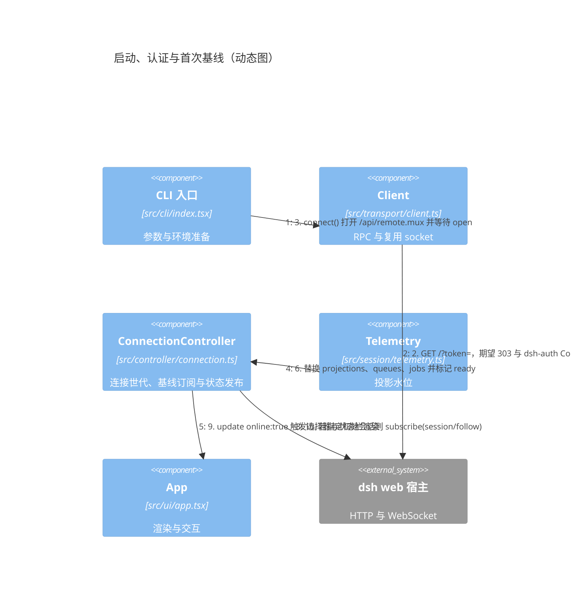

启动顺序不可交换：`$events` 的 `ready` 必须先到，`session/control` 的 `baseline` 必须先于任何控制增量，`session/follow` 的 `snapshot` 必须先于任何增量。三步各自有 `client.timeoutMs`（默认 15 秒）的超时保护。

认证回退（`login`）：先读本地 Cookie 并用 `session/list` 探测；仅当返回 `HttpError(401)` 时才使用启动令牌重新认证，成功后若服务端下发了持久 Cookie 则写盘。没有可用令牌时抛 `AuthenticationRequired`。

### 4.2 会话跟随与流式渲染

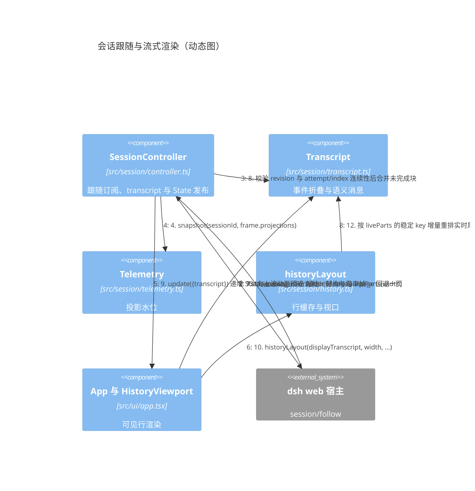

缺口即重连：`revision` 或 `index` 不连续时 `accept` 抛错，`item` 回调捕获后调用 `generationFailed`，整个连接世代重建并重新取 `snapshot`。

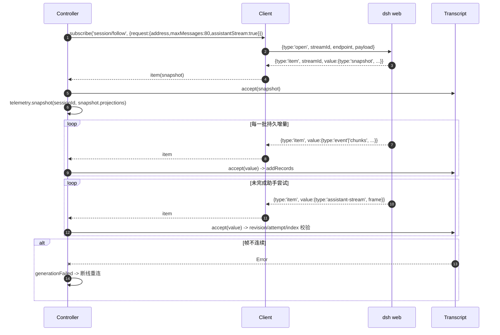

### 4.3 输入投递、审批与提问

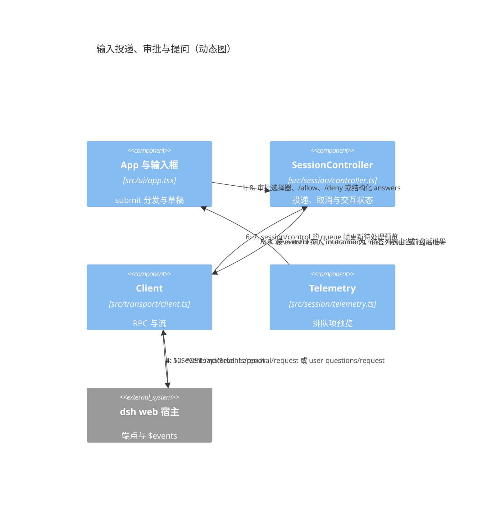

投递语义：运行时提交即 `steer`（等待当前步骤及其工具结束），空闲时提交即 `queue`（新回合）。终端**不维护第二份队列**，排队项全部来自 `session/control`；`/queue` 的删除动作调用 `session/updateQueue`，已被领取的项会收到宿主的 not-found 错误而不是被重新投递。`placement: 'context'` 的注入项不提供删除入口。

交互优先级：存在待答问题或审批时，普通提示词提交被拒绝；问题回答以 `{ id, selected, custom? }` 结构化标签在一次请求中整体提交。审批既可用 `/allow`（`allowed-once`）与 `/deny`（`rejected`）回答，也可以在选择器中作答：列出 `1. Allow once`、`2. Deny`、`3. Stop turn`，输入框为空时用 ↑/↓ 或数字键 1–3 移动选择，Enter 确认；选择 `Stop turn` 调用 `session/cancel` 而不是提交回答。列表初始不选中，从未选中状态按方向键落在第一项（不会直接落在 `Stop turn`），Esc 清除高亮；选择以 `eventId` 为键，并在请求消失或连接世代变化时清除，因此重连后重放的请求重新回到未选中。只有显式确认才提交，未确认的按键不会产生 `$events/result`；审批选择激活时数字键由选择器保留，输入框中的普通草稿不受影响。Esc 与 Ctrl+C 保留待答交互，只有 `/cancel` 或显式回答才终结它。

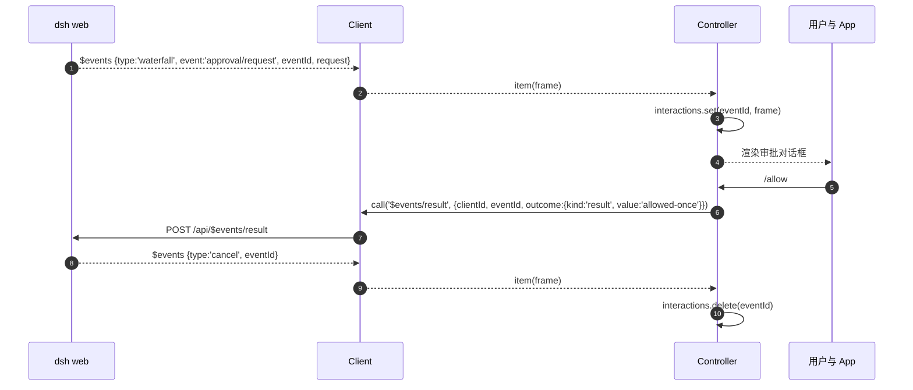

未识别的 waterfall 事件不会被保留，而是立即以 `{ kind: 'next' }` 回应，以不阻塞宿主事件链。

### 4.4 运行状态与遥测更新

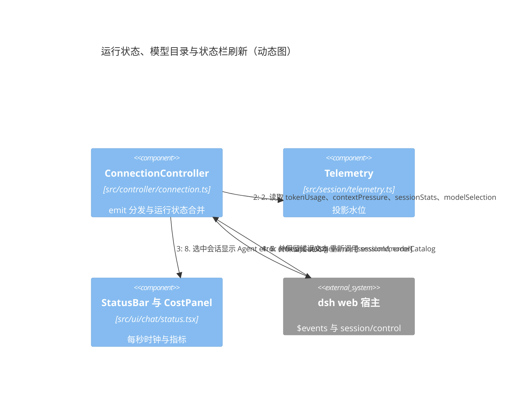

工作时钟的来源有优先级：优先使用保留窗口内 `turn/start` 的 `time`；不可用时退化为本客户端观察到 `running=true` 的时刻，并以 `~`（展开视图中为 `(observed)`）标注。`api-session/status` 覆盖的不仅是文本流，还包括模型生成、工具执行与审批等待。

状态栏阈值：上下文占用达到 80% 转黄、95% 转红（仅为视觉阈值，不触发宿主压缩）。缺测值显示 `unknown` 或 `?`，不推断。

### 4.5 成本扫描

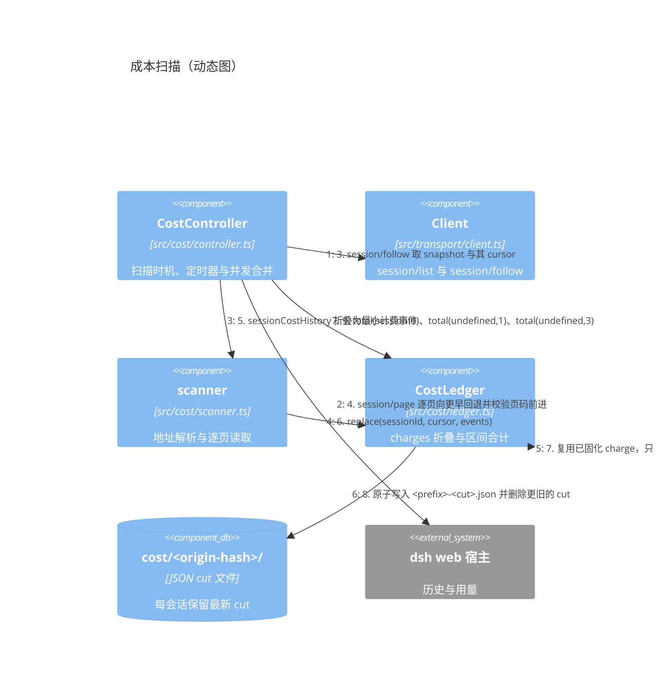

触发时机：连接建立后、每 60 秒、回合结束（`api-session/status` 变为 false）时，以及打开 `/cost` 时。`CostController` 用自身的任务句柄合并并发调用，`/cost` 的 `AbortSignal` 会传播到正在进行的扫描；单个会话失败只累加到一个失败列表，不影响其他会话。已固化的 charge 不再参与计价，只有本次新出现的样本会调用 `chargeFor`。

子代理处理：`costAddresses` 为 `origin === 'subagent'` 且带 `parentSessionId` 的行生成两种地址，先 `continuable` 后 `one-shot`，且仅当错误码为 `subagent/unauthorized` 时才重试第二种。`header.isSeeded === true` 的会话必须包含 `session/end-seed` 且 `inherited === true`，否则拒绝归属其继承用量。

### 4.6 断线重连与退出

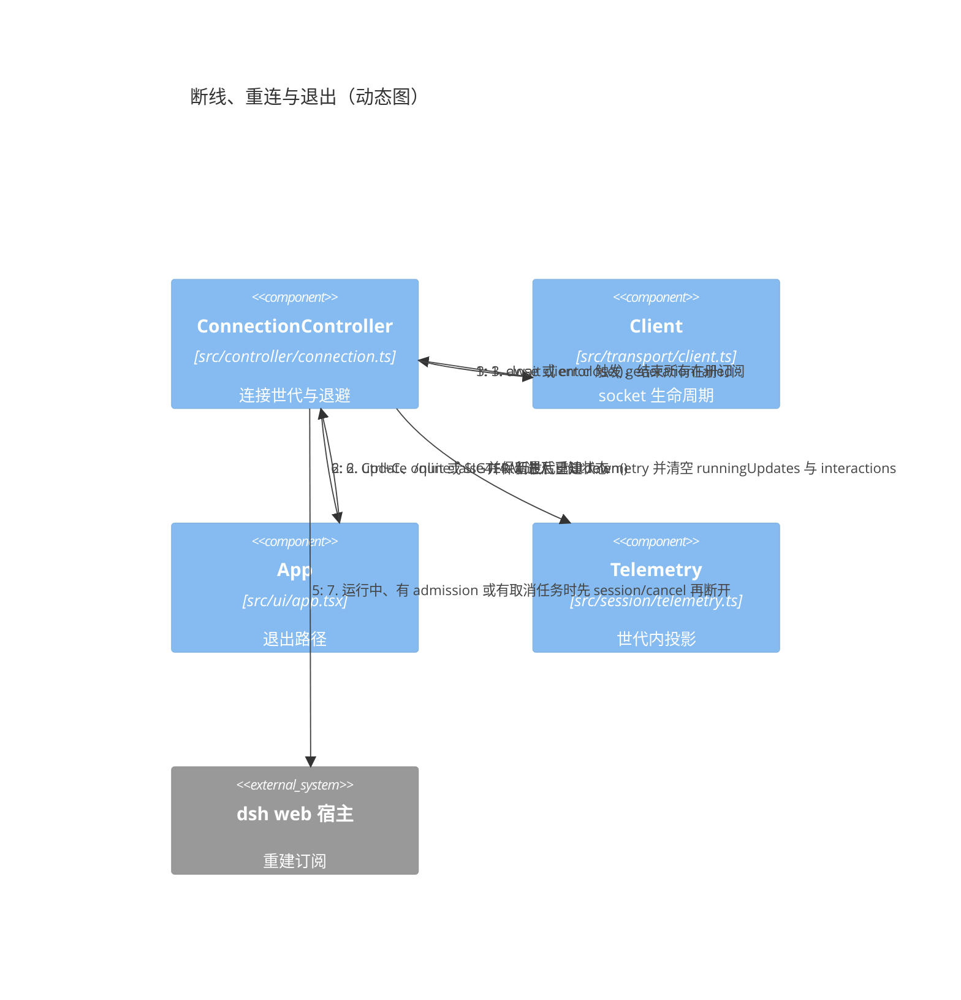

退避公式为 `Math.min(500 * 2 ** attempt++, 10_000) * (0.8 + Math.random() * 0.4)`，`attempt` 在成功连接后归零。`AuthenticationRequired`、`HttpError(401)` 与 `HttpError(403)` 直接终止重试循环并提示重新登录。

退出路径统一收敛到 `shutdown()`：`interruptTask` 存在、`running` 为真或有 `admission` 时先 `await interrupt(true)`，再 `stop()`；`stop()` 会 abort 生命周期、清理成本定时器、关闭 socket、等待 `runTask`、`interruptTask`、`catalogTasks` 与 `costTask`，最后释放 transcript 布局。空闲会话不会收到多余取消。

### 4.7 状态机与不变量汇总

| 状态 | 进入条件 | 退出条件 |
| --- | --- | --- |
| 未连接 | 进程启动或认证失败 | 认证成功并连接 socket |
| 连接中 | `start()` 或退避结束 | `$events` ready + `session/control` baseline |
| 已连接（选择器） | 基线完成 | 选择工作区或会话 |
| 已连接（对话） | `selectSession` 收到 snapshot | 断线、切换会话或退出 |
| 忙碌 | `perform()` 开始 | 操作成功或失败 |
| 待答 | 收到识别的 waterfall 且目标会话被选中 | 显式回答、`/cancel` 或连接结束 |
| 复制冻结 | `/copy`、Ctrl+S 或无修饰左键 | Esc、Ctrl+S、Ctrl+C |

必须保持的不变量：

- 任何进入模型请求的内容都是宿主持久事件的重放；客户端只在 `blocks` 中保存尚未提交的助手流，`dispose()` 后迟到帧不得回填。
- 重连以基线替换状态，**绝不重放用户写操作**；所有写操作单次尝试。
- 未识别的 waterfall 一律委托 `next`。
- 成本账本只保存会话 ID、时间、模型、token 计数、价格版本与估算，不含提示词、工具正文、凭据与 Cookie。
- 启动令牌不落盘；Cookie 文件拒绝不安全权限、非当前属主与符号链接。
- 只有 `safeText` 清洗后的远端文本才进入终端，且着色在排版之后施加。

## 5. 数据存储

`dsht` 的持久化只有一条边界：**会话的权威真相全部在宿主**，客户端只保存可重载的副本，并额外维护三处本地文件（origin Cookie、价格配置、成本缓存）、一份按需生成的导出归档以及终端鼠标标志。本节说明每类数据存放在哪一层、由谁读写、如何校验与回收，以及它对应的用户功能与访问事件流。

### 5.1 存储分层与访问路径

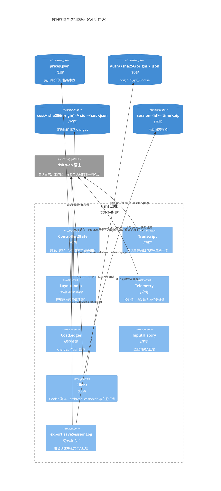

四层职责：

| 层 | 内容 | 是否持久 | 数据的权威方 |
| --- | --- | --- | --- |
| 宿主持久层 | 会话事件日志、工作区注册表、设置、凭据、投影 | 是 | 宿主；`dsht` 只经协议访问 |
| 客户端磁盘 | 认证 Cookie、`prices.json`、成本 cut 文件、导出 ZIP | 是 | `dsht`（ZIP 为用户文件） |
| 客户端内存 | `State`、`Transcript`、`LayoutIndex`、`Telemetry`、`CostLedger` 镜像、`InputHistory` | 否，可重载 | 宿主基线 + 本地视图状态 |
| 终端状态 | SGR 鼠标上报开关、Ink 渲染生命周期 | 否 | 终端；挂载启用、退出恢复 |

### 5.2 本地磁盘文件

全部文件系统调用集中在 `src/storage/`：业务域只决定路径、格式与保留策略，`storage` 负责系统调用、0600 文件与 0700 目录要求、临时文件加 `rename` 的原子替换，以及残留文件清理。下表是这些调用落到的实际文件。

| 文件 | 默认路径 | 覆盖变量 | 权限 | 何时写入 |
| --- | --- | --- | --- | --- |
| 认证 Cookie | `~/.local/state/dsht/auth/<sha256(origin)>.json` | `DSHT_AUTH_DIR`、`XDG_STATE_HOME` | 目录 0700，文件 0600 | 认证成功且服务端下发持久 Cookie 时 |
| 价格配置 | `~/.config/dsht/prices.json` | `DSHT_CONFIG_DIR`、`XDG_CONFIG_HOME` | 目录 0700，文件 0600 | 仅首次交互启动创建；之后由用户维护 |
| 成本缓存 | `~/.local/state/dsht/cost/<sha256(origin)>/<sha256(sessionId)>.json` | `DSHT_STATE_DIR`、`XDG_STATE_HOME` | 0600 | 每个会话一个文件，写入较新 cut 时替换 |
| 内存日志 | `<state>/memory.log` | `--memory-log`、`DSHT_MEMORY_LOG` | 0600，追加 | 每 30 秒一条样本（含布局与渲染缓存计数、扫描工作量；带 `--expose-gc` 时另有回收后堆），满 1,000 行重写 |
| 导出归档 | 用户指定，或 `<cwd>/session-<sanitized-id>-<Date.now()>.zip` | — | 0600，`wx` 独占 | `/export` 成功时 |

#### 5.2.1 认证 Cookie

文件内容是单行 JSON：

```json
{ "version": 1, "origin": "http://127.0.0.1:3080", "cookie": "dsh-auth-xxxx=yyyy", "expiresAt": 1790000000000 }
```

- **读取**（`CookieStore.load(origin)`）：以 `O_RDONLY | O_NOFOLLOW` 打开；`ENOENT` 返回 `undefined`；随后校验必须是普通文件、POSIX 下 `(mode & 0o077) === 0` 且属主为当前用户、JSON 可解析、`version === 1`、`origin` 完全匹配、`cookie` 为字符串、`expiresAt` 为安全整数；`expiresAt <= Date.now()` 视为过期并返回 `undefined`。
- **写入**（`CookieStore.save`）：`mkdir(directory, { recursive: true, mode: 0o700 })`，`lstat` 复检目录权限；先写 `<uuid>.tmp`（`wx`，0600），再 `rename` 原子替换目标文件；`finally` 中清理临时文件。
- **失败语义**：损坏、权限不安全或属主不符都抛出明确错误，提示用户删除该 origin 文件后重新登录；不会静默跳过。
- **访问事件流**：每次连接世代开始时 `login()` 先 `load`，再用 `session/list` 探测；仅在收到 `HttpError(401)` 时用启动令牌执行 `GET /?token=` 并重新 `save`。启动令牌本身只存在于环境变量、URL 参数或内存，**从不落盘**。

#### 5.2.2 价格配置 `prices.json`

- **首次创建**：交互模式启动时以 `flag: 'wx'`、`mode: 0o600` 写入格式化后的 `DEFAULT_PRICES`；`EEXIST` 被忽略，绝不覆盖用户文件。
- **读取**：`pricesFrom(JSON.parse(await readFile(pricePath)))` 逐字段校验：必填字符串、`id` 唯一、`currency === 'CNY'`、`until > from`、时区可被 `Intl.DateTimeFormat` 解析、四个费率桶为非负有限数、`weekdays`/`windows` 合法，以及同一 `(provider, model)` 不存在重叠区间。
- **写入**：`dsht` 不修改该文件；用户手工编辑后重启生效（无热加载）。
- **使用范围**：仅交互模式读取；`list` 子命令不读价格配置也不写状态。

#### 5.2.3 成本缓存 cut 文件

```json
{ "version": 2, "sessionId": "s1", "cut": 128, "charges": [
  { "key": "42", "time": 1789000000000, "provider": "deepseek-official", "model": "deepseek-flash",
    "usage": { "input": 1200, "output": 340, "cacheRead": 8000, "cacheWrite": 0 },
    "priceId": "deepseek-2026-09-10-flash", "amount": 0.0123 } ] }
```

- **命名与保留**：每个会话一个固定文件 `<sha256(sessionId)>.json`，`cut` 存在文件内容里，因此一个会话在磁盘上只有一份切片。旧命名 `<sha256(sessionId)>-<cut>.json` 仍可读入，并在加载时迁移到固定名字。
- **写入**（`CostLedger.replace`）：若内存中已有 `cut >=` 新值则整次跳过；否则先读现有文件，仅当其中记录的 `cut` 不高于待写值时才落盘——先写 `<uuid>.tmp`（`wx`，0600）再 `rename`——并由 `saveLedger` 返回是否写入。未写入时 `replace` 不改动内存切片，使内存与磁盘停在同一切片上。
- **读取**（`CostLedger.load`）：启动时枚举目录内 `*.json`，逐字段校验 `key`/`provider`/`model`/`usage`/`time`/`amount`/`estimated`/`reason`/`priceId`；同一会话保留 `cut` 最大者（两种命名一起比较），`ENOENT` 跳过。代数不是 2 的文件、内容读不出的文件、以及旧命名下已被取代的文件都属于"下一次扫描会重建"的残片，加载时删除；旧命名里最新的一份先按固定名字重写再删除。不属于本单元的文件名不动。
- **固化规则**：`priceId` 与 `amount` 是首次计价时写下的决定。后续扫描重放同样的样本时直接复用该决定；只有 `reason === 'missing usage'` 的样本保持开放，等待宿主报告 token。已计价、已估算与未计价的其余情况一律终局。
- **内存镜像**：`sessions: Map<sessionId, SavedCost>` 是读取路径的实际数据源，`totals: Map<cacheKey, CostTotal>` 在每次 `replace` 时清空并惰性重建；`CostController` 另外在内存中记录 `(sessionId, updatedAt)` 以跳过未变化的空闲会话。磁盘只用于跨进程存活，不参与每次查询。
- **访问事件流**：`CostController.refresh` 以 `session/list` 枚举会话，经 `scanner.sessionCostHistory` 用 `session/follow` 取 snapshot 与 `cursor`、用 `session/page` 逐页向更早回退，最后由 `ledger.replace` 落盘。跳过标记只存在内存中，因此每次重启都会重新读取全部会话，但只为其后新出现的请求决定金额。

#### 5.2.4 导出归档

`/export` 通过 `saveSessionLog` 以 `open(path, 'wx', 0o600)` 独占创建目标文件，随后把 `GET /api/session.export` 的响应体流式写入；任何失败、取消或未完成的写入都会 `unlink` 该文件。已存在的目标文件永不被替换。

#### 5.2.5 终端状态

鼠标上报在 `useMouseWheel` 挂载且 `screen === 'chat'` 时写入 `\x1b[?1006h\x1b[?1000h`（SGR 扩展 + 按键跟踪），在禁用或卸载时写入 `\x1b[?1000l\x1b[?1006l` 恢复。进入复制模式会禁用上报并释放捕获，以便终端原生选择；对话框期间仍保持上报，使滚轮与 PgUp/PgDn 可以滚动背景对话，但左键不进入复制模式，需要原生选择时按 Ctrl+S 冻结整个显示。该状态不落盘，进程异常终止时由终端自身的会话结束或下一次启动重新协商。

草稿与视口位置：输入从空变为非空、且首字符不是 `/` 时，视口回到实时末端（等价于 `setScroll(0)`），因此开始写消息不必先滚到底；以 `/` 开头的命令不改变视口，草稿已存在时继续编辑或在其中向上滚动同样保留读者当前位置。

粘贴与状态面板：终端把整段粘贴作为一次输入投递，输入框把换行与制表符折叠为空格并丢弃控制字符，因此多行片段会安全地变成单行且不会误发送。展开的 `/status` 持有行偏移而非页号：`↑`/`↓` 逐行、`PgUp`/`PgDn` 翻屏、滚轮在面板打开时滚动面板本身；页脚报出可见区间并在越界时由面板通过 `onScroll` 回报收敛后的偏移；面板通过 `onOverflow` 报告自己是否需要滚动，只有需要滚动时方向键与滚轮才归它；选择器与需要滚动的状态面板接管方向键，`/help`、`/cost` 与一屏放得下的状态面板不从输入框夺走它们，`Ctrl+P`/`Ctrl+N` 在任何界面下都能召回（`tests/ui/key-routing.test.tsx` 固定整张矩阵）。

单行状态栏按价值装填分组：状态簇（`◐ 6:18`／`● Ready`／`⏸ <原因>`／`! Offline`／`⚠ Error`）· 当前阶段（`think 28s`／`<工具名> 1:08`／`write 12s`，由 `Transcript` 记录阶段起始时刻得出，从不从静默推断）· `^C` │ 本会话费用 `S¥2.49*` · `ctx 30%` · 今日合计 `D¥113*` · 模型 · effort · 回合 · token；宽度不足时先丢价值最低者，费用只挪到第二行而不丢弃，状态簇在约二十列以下才让出阶段与停止提示。暂停的时钟会写明原因（`⏸ copy`／`dialog`／`history`），`app.tsx` 把暂停原因并入冻结标识，状态栏同时上报自身行数以便 `/status` 的每页预算相应收缩。

展开的 `/status` 面板把相关值合并成行并采用短标签（连接／活动、会话与模式、工作区、三行指标、费用与回合、排队与任务各一行），计数采用与单行状态栏相同的紧凑单位（`400.6K/1M`、`229.7M tok`），因此 46 列下常见 11 行、24 行终端一屏可显示；错误各自占行。换行与滚动仍作为小终端的兜底。

内存样本字段：除进程计数器、保留窗口与账本外，样本还记录布局行缓存（行数、记账字节、span 个数与字符数）、增量实时尾部状态、数学与图表缓存的条目/字符/命中/未命中、实时字符数、推理条目数，以及最近一次成本扫描的会话数、页数与事件数；`--expose-gc` 下额外记录一次强制回收后的堆与耗时，用于区分"真正保留"与"V8 尚未回收"。

### 5.3 进程内内存状态

以下数据在进程退出后全部丢失，重启时由宿主基线或已加载会话重建：

| 数据 | 持有者 | 读取方 | 写入方 | 回收方式 |
| --- | --- | --- | --- | --- |
| 会话事件窗口（语义消息、未完成助手流） | `Transcript` | `messagesForWidth`、`thoughts`、`searchHistory`、`liveParts` | `accept`、`addPage` | `trimHistory` 按软预算回收；`dispose` 整体释放 |
| 行缓存、偏移索引与实时尾部换行状态 | `LayoutIndex`（`WeakMap<Transcript, …>`） | `historyLayout().viewport` | 同上 | `releaseHistoryLayout` 与 `dispose`；每会话上限 2,048 行 |
| 投影值、每键水位 | `Telemetry.entries` | `view()` | `accept`、`snapshot` | 每个连接世代重建 `Telemetry` |
| 排队输入与活动任务计数 | `Telemetry.queues` / `Telemetry.jobs` | `pending()`、`view().jobs` | `accept` 的 `queue`/`jobs` 帧 | 新基线整体替换 |
| 运行状态与观察起点 | `ConnectionController` 的 `runningUpdates`、`observedRunningAt` | `SessionController.running`、`workingSince` | `api-session/status` emit | 世代开始时清空 |
| 待答交互 | `interactions` | `state.pending`（每次 `update` 由映射推导） | `$events` 的 `waterfall` / `cancel` | 显式应答、宿主取消或连接结束 |
| 工作区、会话列表与归档集 | `State.workspaces/sessions`、`Client.archivedSessionIds` | `visibleSessions`、选择器 | `showPicker`、`listWorkspaces`、`listSessions` | 每次打开选择器或重连刷新 |
| 模型目录与 preset 名单 | `State.defaultModel/presets` | `/model`、状态栏、模式标签 | `refreshCatalog`、`loadPresetNames` | 世代与 `catalogRevision` 守卫 |
| 输入回填 | `InputHistory` | `move()` | `record()`、会话加载时种子 | 200 条 / 256 KiB 淘汰；切换会话重建 |
| Cookie 与在册订阅 | `Client.cookie/expiresAt/listeners` | `call`、`subscribe` | `restoreCookie`、`authenticate`、`subscribe` | `close()` 结束全部订阅 |
| 成本 charges 镜像与合计 | `CostLedger.sessions/totals` | `total`、`hasSession`、`missing` | `load`、`replace` | `replace` 清空合计缓存 |

### 5.4 宿主持久层（只经协议访问）

以下数据由宿主拥有，`dsht` **从不直接读写宿主文件系统**，也不读取宿主配置目录：

| 宿主数据 | `dsht` 的访问方式 |
| --- | --- |
| 会话事件日志 | `session/follow` 快照与增量、`session/page` 分页、`session.export` 归档 |
| 工作区注册表 | `workspace/follow` baseline、`workspace/create`、`workspace/delete` |
| 会话归档状态 | `workspace/archiveSession` 返回新的 `archivedSessionIds` |
| 设置与凭据 | 仅消费 `settings/document-updated`、`credentials/reference-updated` 通知来刷新模型目录 |
| 命令、计划、目标、权限 | `commands/execute` 直接调用宿主命令注册表 |
| 排队输入与活动任务 | `session/control` 基线，`session/updateQueue` 删除 |
| 待答问题与审批 | `$events` 的 `waterfall`，以 `$events/result` 应答 |

### 5.5 数据、功能与访问事件流对照

| 数据 | 存储层 | 读 | 写 | 对应用户功能 | 访问事件流 |
| --- | --- | --- | --- | --- | --- |
| 启动令牌 | 环境变量 / URL / 内存 | `endpoint()` | — | 首次登录、Cookie 过期后重新登录 | `GET /?token=` |
| 认证 Cookie | 磁盘 + 内存 | `CookieStore.load` | `CookieStore.save` | 自动登录与 401 回退 | `GET /?token=`、`session/list` 探测 |
| 价格版本 | 磁盘 `prices.json` | `pricesFrom` → `CostLedger` | 首次 `wx` 创建；用户手工编辑 | `/cost`、状态栏费用、`/status` | 无（纯本地配置） |
| 定价后的 charges | 磁盘 cut 文件 | `CostLedger.load` | `CostLedger.replace` | `/cost`、状态栏 `~¥` | `session/list` → `session/follow` → `session/page` |
| 合计与覆盖度 | 内存 `totals` | `CostLedger.total`、`coverage` | `replace` 清空 | 状态栏、`/cost`、`/status` | 无（本地折叠） |
| 扫描跳过标记 | `CostController` 的内存映射 | `CostController.refresh` | `CostController.refresh` | 增量刷新 | `session/list.updatedAt` |
| 会话事件窗口 | 内存 `Transcript` | `messagesForWidth`、`thoughts`、`searchHistory` | `accept`、`addPage`、`trimHistory` | 对话阅读、`/older`、`/search`、`/history`、`/think` | `session/follow`、`session/page` |
| 布局行缓存 | 内存 `LayoutIndex` | `historyLayout` | `historyLayout` | 滚动、视口渲染、`/copy` | 无（本地排版） |
| 投影值与水位 | 内存 `Telemetry` | `view()` | `accept`、`snapshot` | 状态栏模型/上下文/token/turns、`/status` | `session/control`、`session/follow` 的 `projections` |
| 排队输入 | 内存 `Telemetry.queues` | `pending()` | `accept` 的 `queue` 帧 | 输入框预览、`/queue` 删除 | `session/control`、`session/updateQueue` |
| 活动任务计数 | 内存 `Telemetry.jobs` | `view().jobs` | `accept` 的 `jobs` 帧 | `/status` | `session/control` |
| 运行状态 | `ConnectionController.runningUpdates` | `SessionController.running` | `$events` emit | 状态栏 `◐ Working`、Ctrl+C、Esc | `api-session/status` |
| 观察起点 | 内存 `observedRunningAt` | `workingSince` | `$events` emit | 秒表与 `~` 标注 | `api-session/status` |
| 待答交互 | 内存 `interactions` | `state.pending` | `waterfall` / `cancel` | 审批与提问对话框、`/allow`、`/deny` | `$events` `waterfall`、`$events/result` |
| 工作区/会话列表 | 内存 `State` + `Client` | `visibleSessions`、选择器 | `showPicker`、`listWorkspaces` | `/ws`、`/resume`、`/new`、`/ws --delete` | `workspace/follow`、`session/list`、`workspace/create`、`workspace/delete` |
| 归档集合 | 内存 `archivedSessionIds` | `visibleSessions` 过滤 | `listWorkspaces`、`removeTarget` | 归档后从列表隐藏、`/resume ID` 重开 | `workspace/follow` baseline、`workspace/archiveSession` |
| 模型目录 | 内存 `State.defaultModel` | `/model` 选择器、状态栏、`modelCatalog()` | `refreshCatalog` | `/model`、模型与档位显示 | `session/modelCatalog`、`session/selectModel` |
| Preset 名单 | 内存 `State.presets` | `sessionMode` | `loadPresetNames` | 标题栏模式标签、`/status` | `agentPresets/list` |
| 输入回填 | 内存 `InputHistory` | `move()` | `record()`、会话种子 | ↑/↓、Ctrl+P/N 回填 | 无（种子取自已加载 `user/message`） |
| 导出归档 | 磁盘 ZIP | — | `saveSessionLog` | `/export` | `GET /api/session.export` |
| 终端鼠标标志 | 终端 | — | `useMouseWheel` | 滚轮滚动、左键复制、原生选区 | 无 |

### 5.6 生命周期、回收与隐私边界

- **回收顺序**：切会话、归档当前会话或断线时依次 `releaseHistoryLayout` → `Transcript.dispose()` → 清理行缓存与投影；`pinHistory(true)` 在阅读、搜索或展开历史期间暂停回收，`/latest` 或回到实时尾部后恢复。
- **软预算**：会话窗口默认 2,000 条或 16 MiB（`--history-records`、`--history-mb` 可调），回收目标为预算的 75%，至少保留最近 `min(32, max(1, maxRecords / 4))` 条，并保护未完成的历史流与离线历史。
- **落盘内容限制**：Cookie、价格、charges 与内存日志之外不写任何内容；内存日志只有计数与大小，不含提示词、工具或会话正文。charges 只包含会话 ID、时间、provider/model、token 桶、所选价格版本与金额；提示词、工具正文、回答文本、凭据与 Cookie 值都不进入成本文件。取消或失败的导出会删除不完整 ZIP。
- **一致性**：认证 Cookie 与成本 cut 文件都以“临时文件 + `rename`”原子替换；`prices.json` 只在首次启动以 `wx` 创建，之后由用户维护。成本 cut 文件名携带 opening cursor，使并发或陈旧的扫描无法顶替更新的结果。
- **重建代价**：内存数据可随时由宿主重建，但重建需要重新订阅 `session/follow`（新鲜快照）与重新扫描成本历史；重启后第一次成本扫描会重新读取每个会话，并只为其中新出现的请求决定金额，已固化的历史 charge 原样载入。

## 6. 成本模型

价格版本 `PriceVersion` 是一个显式的半开有效期区间，并携带命名时区内的周内峰值窗口：

- 必填字段：`id`、`provider`、`model`、`source`、`timezone`、`from`；`currency` 固定为 `CNY`。
- `until` 为可选排他上界；`pricesFrom` 拒绝无效区间、重复 `id`、无效时区、负费率、非法 `weekdays`/`windows`，以及同一 `provider`/`model` 的重叠区间。
- `weekdays` 使用 `0` 表示周日；`windows` 是 `[起始分钟, 结束分钟)`，范围 `[0, 1440]`。

内置 `DEFAULT_PRICES`（核对日期 2026-09-10，来源为官方定价页）：

| 版本 ID | 模型 | 区间 | 峰值（input / cacheRead / cacheWrite / output，元每百万 token） |
| --- | --- | --- | --- |
| `deepseek-2026-09-10-flash` | `deepseek-flash` | 2026-09-10 起 | 2 / 0.04 / 2 / 8 |
| `deepseek-2026-09-10-pro` | `deepseek-v4-pro` | 至 2026-09-14T12:00+08:00 | 9 / 0.30 / 9 / 27 |
| `deepseek-2026-09-14-pro-served-by-flash` | `deepseek-v4-pro` | 2026-09-14T12:00+08:00 起 | 2 / 0.04 / 2 / 8 |

峰谷规则：时区为 `Asia/Shanghai`，工作日（周一至周五）的 `09:00–12:00` 与 `14:00–18:00` 使用峰值费率，其余时间使用半价 `offPeak`。

选择与折叠规则：

- 精确匹配 `(provider, model)` 的版本优先；无精确匹配时，只有 `provider === 'deepseek-official'` 才回退到模型族：名称含 `pro`（不区分大小写）用 `deepseek-v4-pro`，否则用 `deepseek-flash`。未列出的 provider 一律不计价。
- 有结算时间时用 `priceAt` 按半开区间与峰谷窗口选择；无结算时间时用 `lowestPrice` 取候选版本中最低的 off-peak 费率作为**下界**，并标记 `estimated`。
- `costRecords` 只保留 `request/context`、`assistant/message`、`assistant/attempt`、`llm/retry-started`、`session/end-seed` 五类事件的最小字段。
- `foldSamples` 把最小计费事件折叠为每请求样本；`llm/retry-started` 清空同一 `(turn, step)` 的槽位使重试单独计数，同一槽位的后续样本覆盖前一样本的用量。
- `chargeFor` 只在样本首次出现时求值一次并写下 `priceId` 与 `amount`；`decide` 复用已固化的 charge，因此修改 `prices.json` 不会改变历史金额，只影响其后才出现的请求。唯一例外是 `reason === 'missing usage'` 的样本，它等待宿主报告 token 后再计价。
- 账本落盘为第 2 代格式（记录 `priceId`，不再内嵌完整价格版本）；其他代数的文件被忽略并由下一次扫描重建。
- `total(sessionId, days, now)` 的 `days` 为 `1`（当天）或 `3`（当天加前两个自然日），日期边界用 `costDay` 换算为北京时间；`unknown` 计数完全无法计价者，`estimated` 计数只有下界金额者。
- `coverage` 是账本属性而非渲染属性：已有缓存或完成过扫描为 `complete`，正在扫描为 `scanning`，空账本或扫描失败为 `partial`。`costText` 在存在 `unknown` 或 `estimated` 时追加 `*`，与覆盖度的 `!` 前缀含义不同。

## 7. 项目协作与维护

### 7.1 仓库边界

- `tui/` 是独立 git 仓库（`mushuanli/dsht`，分支 `main`），在父仓库 `deepseek-harness` 中不被跟踪，也不进入父仓库的 pnpm workspace。
- 它不导入任何 Harness 包；对应的成本是必须自行跟随预稳定 wire 协议。父仓库端点或帧结构变化时，需要同时更新 `tui/src/transport/client.ts`、`tui/src/session/telemetry.ts`、`tui/src/session/transcript.ts` 与其测试。
- 发布物只有 `dist/`、两份 README、配对记录、截图与许可证。

### 7.2 决策记录（Agent Notes）

设计决策记录在 `tui/.agents/notes/implemented/`，分为 `architecture/`（16 篇）与 `feature/`（1 篇），每篇包含 Problem / Decision / Alternatives considered / Consequences，且都提供英文、中文与 `.i18n.yaml` 配对。变更非平凡行为时应新增同目录的 note。`.gitignore` 忽略整个 `.agents/`，但已实现的 note 已被跟踪，因此新增 note 必须用 `git add -f` 显式加入，否则只留在本地工作区。

| Agent Note | 主题 |
| --- | --- |
| `feature/2026-09-10-independent-http-tui` | 独立 HTTP 终端客户端、包名与发布、输入框、状态与计费总体决策 |
| `architecture/2026-09-10-indexed-terminal-history` | 带索引的终端历史、行缓存与 `/think` 导航 |
| `architecture/2026-09-10-terminal-assistant-grouping` | 按用户消息分组助手标题 |
| `architecture/2026-09-10-terminal-display-freeze` | 复制冻结与对话框背景稳定 |
| `architecture/2026-09-10-terminal-input-recall` | 进程内输入回填 |
| `architecture/2026-09-10-terminal-interaction-replay` | 重连后恢复待答交互 |
| `architecture/2026-09-10-terminal-model-selection` | `/model` 与 agent preset 状态 |
| `architecture/2026-09-10-terminal-mouse-copy` | 鼠标左键进入冻结复制模式 |
| `architecture/2026-09-10-terminal-navigation-removal` | 工作区移除与会话归档 |
| `architecture/2026-09-10-terminal-question-options` | 提问选项的键盘选择与多选 |
| `architecture/2026-09-11-terminal-compaction` | `/compact` 与窄屏思考折叠 |
| `architecture/2026-09-11-terminal-dialog-context` | 对话框上方的对话上下文 |
| `architecture/2026-09-11-terminal-steering-commands` | 自动 steer/queue、排队项管理与宿主命令 |
| `architecture/2026-09-11-modular-boundaries-immutable-ledger` | 按业务域重组目录、拆分 Controller/App、账本改为不可重算 |
| `architecture/2026-09-11-terminal-approval-options` | 审批编号选择器、未选中起始、Esc 与重放重置 |
| `architecture/2026-09-11-terminal-storage-unit` | 文件操作统一归属 `src/storage/`，由依赖门禁强制 |
| `architecture/2026-09-11-terminal-memory-log` | 默认启用的有界运行时内存日志，区分真实保留与 V8 高水位 |

### 7.3 文档配对

`README.md` 与 `README.zh.md` 是逐行对齐的双语对：每个标题、段落、列表项、表格行与代码块在两侧占同一物理行；`README.i18n.yaml` 记录评审过的 git blob 哈希。修订任一侧都必须在同一位置改另一侧，并重新记录哈希。表格行之间不得有空行，否则 GitHub 与 npm 不再渲染为表格。

本文件（`tui/tui-design.md`）位于 `tui` 仓库根目录，与源码同仓，但不在父仓库文档门禁（翻译配对、`verify-mermaid`、`verify-md-links`、`verify-md-wrap`）的扫描范围内，也不进入 `tui` 包的发布集合（`package.json` 的 `files`）。它是单语技术文档，因此不参与 README 的双语配对。

### 7.4 提交、版本与发布

提交信息使用 Conventional 前缀：`feat`、`fix`、`docs`、`refactor`、`test`、`release`、`ci`。版本号在 `package.json` 中手工提升，发布由标签驱动。

本地校验与发布命令：

```sh
npm test                  # tsx --test tests/*/*.test.ts tests/*/*.test.tsx
npm run test:terminal     # 强制 FORCE_COLOR=1 复现终端渲染条件
npm run typecheck         # tsc --noEmit 与 tests 项目
npm run build             # 清理 dist 后 tsc（prepack 自动执行，避免残留旧布局产物）
npm run test:package      # 打包并以离线 npm-exec 运行 CLI，拒绝集合外文件
npm publish --access public
```

CI 工作流 `.github/workflows/publish.yml`：

- 由 `v*` 标签或手工 `workflow_dispatch` 触发，使用 npm trusted publishing（OIDC）与 provenance，不保存发布令牌。
- 标签必须与 `package.json` 版本一致，否则失败。
- 手工触发默认只 `npm pack` 打包，不发布。
- `prepublishOnly` 执行 typecheck 与终端条件测试；`prepack` 编译 `dist`。
- Trusted publishing 无法创建包，因此首个版本需人工 `npm publish --otp=<code>`。

### 7.5 测试与验证

`tests/` 不依赖父仓库，也不需要模型凭据：

- `tests/support/host.ts` 是环回夹具，起一个 `http.Server` 与 `WebSocketServer`，逐条断言请求方法、路径、Cookie、请求体与参数名，可注入延迟、错误、队列、重放交互、子代理与分页行为；`tests/support/no-color.ts` 固定测试渲染的颜色级别。
- 24 个 `*.test.ts(x)` 按模块组织（`transport/`、`session/`、`cost/`、`controller/`、`ui/`、`cli/`、`architecture/`），共 165 项测试，覆盖传输、认证、Cookie 存储、CLI 子进程、命令、输入编辑、回填、记忆预算、导航、引用、状态（含启动连接与三种非 chat 界面的断线重连、复制模式画面保持）、主题、审批选择（未选中起始、Esc 清除、重放重置、确认前不发结果）、transcript 折叠与录制回放、实时尾部增量换行与一次性换行逐帧一致、账本文件的固定命名与残留清理、状态面板在窄屏的换行与分页（`tests/support/tty.ts` 提供指定尺寸的终端）、Markdown 在 32/100 列的录制快照与流式增量重解析。
- `tests/architecture/dependencies.test.ts` 检查 `src/` 的依赖方向：每个单元只能导入为其列出的单元，React/Ink 只能在 `ui/` 下，`ui/` 不得直接调用传输层 client；同一文件内的合成用例证明每个禁止方向都会被拒绝。
- `tests/expected/` 保存 11 份黄金输出（费用、文件引用、历史导航、输入编辑、窄屏推理、待答输入、审批选项、状态栏两种、工作区编辑两种）；`tests/fixtures/` 提供 `legacy-packed-history.json` 与 `workspace-edit.session.jsonl`。
- `scripts/test/terminal.mjs` 在强制颜色环境下重跑套件；`scripts/test/package.mjs` 打包后在隔离的离线环境运行 CLI。
- `scripts/benchmarks/input.tsx` 与 `scripts/benchmarks/history.tsx` 是本地诊断基准，不是机器无关阈值，也不覆盖网络与模型时间。
- 未覆盖：真实模型服务端行为、移动端 SSH 的实际显示效果。

### 7.6 已知限制与后续方向

- 仅呈现纯文本、思考、工具调用与工具结果；富插件卡片、文件上传、子代理导航与排队消息文本编辑未实现；排队消息可删除但不可编辑。
- 会话删除只提供归档，没有永久删除；工作区删除只移除注册。
- `/think` 列表支持键盘选择，未实现鼠标点击选择；首屏只索引已加载历史。
- `/search` 无服务端全文索引，稀有词或缺失词需要逐页扫描全部历史；`/ssearch`、`/wsearch` 的宿主结果最多 20 条且无游标，工作区过滤发生在全局上限之后，可能漏掉匹配。
- 客户端内存预算是软限制，不是进程 RSS 上限；首次排版、终端宽度变化与展开超大块仍需处理对应全文。
- 断线重连使用有界指数退避加抖动并替换快照；`list` 子命令失败时直接报错而不重试。
- 模型选择会同时尝试保存为宿主的部署默认值，此 API 没有会话级持久化开关；preset 标签为只读。
- `@` 引用只发送路径文本，不读取本地上传字节或图片；不支持本地附件与图片预览。
- 客户端崩溃不保留未提交的部分回答；宿主重启或工具失败后，原提问只能重新发起。

### 7.7 变更检查清单

修改 `tui/` 时按以下顺序核对：

1. 是否触及 wire 协议（端点名、参数包装、帧类型）？同步更新 `transport/client.ts`、`session/telemetry.ts`、`session/transcript.ts` 与 `tests/support/host.ts` 的断言。
2. 是否改变模型可见或用户可见输出？更新 `tests/expected/` 中的对应黄金文件，并补充或调整 transcript 测试。
3. 是否新增或改变用户可见行为？在 `README.md` 与 `README.zh.md` 同一行位置同步更新，并重新记录 `README.i18n.yaml` 哈希。
4. 是否属于非平凡变更？在 `tui/.agents/notes/implemented/` 同一 PR 内新增 Agent Note（含中文与配对文件）。
5. 是否影响发布集合？核对 `package.json` 的 `files` 与 `scripts/test/package.mjs` 的允许路径。
6. 是否新增文件读写？只允许通过 `src/storage/`；`storage/` 之外出现 `node:fs` 会被 `tests/architecture/dependencies.test.ts` 拒绝。
7. 收尾运行 `npm run typecheck`、`npm test`、`npm run test:terminal`；涉及打包时再运行 `npm run test:package`。

### 7.8 重构提交序列

模块化重构拆成五个可独立校验的提交，顺序为机械移动 → 语义变更 → 状态机 → 界面 → 边界，便于 review 与 bisect；每一步都在该提交上运行 `npm run typecheck` 与 `npm test`。

| 提交 | 范围 | 该提交的验证 |
| --- | --- | --- |
| `e3a921e` `refactor: move source and tests into domain directories` | 45 个文件 `git mv` 到域目录，重写导入说明符与运行时相对路径，新增 `src/index.ts`，更新 `bin`、`exports`、scripts 与打包断言 | typecheck + 127 项测试 |
| `6cf3d97` `refactor: make the billing ledger immutable and split the cost module` | 拆分 `cost/`；账本固化 `priceId`/`amount`；落盘升到第 2 代；扫描移入 `CostController` | typecheck + 129 项测试 |
| `435d642` `refactor: split Controller into a facade over four domain controllers` | 门面加四个域控制器；新增 `HostAccess`、`ConnectionView`、`State`/`ControllerStore` 契约 | typecheck + 129 项测试 |
| `d441bf2` `refactor: split the terminal UI into command, chat, dialog and input modules` | `ui/commands/`、`ui/dialogs/`、`ui/chat/`、`ui/input/`，共享 `Frozen` 与 `CopyMode` | typecheck + 129 项测试 |
| `63cacdb` `refactor: enforce module boundaries and decouple the public API` | 域 barrel、依赖门禁测试、`ui/mount.tsx`、费用面板移入 `ui/`、构建前清理 `dist`、双语 README | typecheck + 131 项测试 + `test:terminal` |
| `483036b` `docs: record the modular boundaries and immutable ledger decision` | Agent Note 三件套（英文、中文、配对哈希） | 配对哈希一致 |
| `775d8d8` `feat: select approvals with numbers and arrows` | 审批编号选择器、未选中起始与重置规则、共享面板谓词、专项测试与黄金输出、双语 README | typecheck + 133 项测试 + `test:terminal` |
| `4599b18` `fix: refresh the connection status while a picker is open` | 状态冻结改为按界面区分，启动选择器保持连接提示实时；断线重连与复制模式保持的回归测试 | typecheck + 134 项测试 |
| `a5c7944` `refactor: confine filesystem operations to a storage unit` | 新增 `src/storage/`、`cost/storage.ts` 更名为 `cost/ledger-files.ts`、依赖门禁新增 fs 限制 | typecheck + 134 项测试 + `test:terminal` |
| `e123063` `feat: log runtime memory samples by default` | 有界内存日志、`--memory-log`／`--no-memory-log`／`DSHT_MEMORY_LOG`、存储新增追加写 | typecheck + 137 项测试 |
| `fc378de` `fix: write the memory-log header when the file is created` | 新文件首次写入即带格式表头；新增测试固定该行为 | typecheck + 137 项测试 |
| `5a60a7e` `docs: mark the memory-log commits as verified` | 在 7.8 中记录内存日志提交的验证结论 | 文档改动 |
| `e9ea13b` `perf: wrap the growing live tail incrementally` | 实时部分带稳定 `key`，布局保存已定稿行与最后一行残余来源；折叠推理同样限制输入来源 | typecheck + 140 项测试 + `test:terminal` |
| `11e04ca` `docs: refresh the source index and describe the incremental live wrap` | 附录 A 逐行重新核对行数并补上缺失文件；2.5／2.6／3.2.3／4.2／5.3／6 描述增量换行 | 14 个 Mermaid 块解析通过；附录合计 5,245 行与源码一致 |
| `0aea3aa` `test: measure whole-text and incremental live wrapping` | `bench:history` 增加长单段流的整段换行与增量布局对比 | `npm run bench:history` |
| `b634d4f` `docs: cite the wrapping benchmark in the live-wrap note` | Agent Note 引用已提交的基准数据并刷新配对哈希 | 配对哈希一致 |
| `ec22b19` `docs: record the live-wrap benchmark commits in the design baseline` | 事实基线与 7.8 记录增量换行的提交序列 | 文档改动 |
| `f22352b` `fix: keep one fixed ledger file per session` | 账本文件名固定为 `<sha256(sessionId)>.json`、cut 移入内容、写入前比较、加载时清理旧代数与旧命名残片 | typecheck + 144 项测试 + `test:terminal`；现网目录 49→46 文件、3.10→2.14 MB，切片逐字节不变 |
| `8a3f15b` `docs: record the fixed ledger file name in the design` | 5.2.3 记录固定文件名、写入前比较与加载清理；附录 A 复核 cost 域行数 | 14 个 Mermaid 块解析通过；附录合计 5,275 行与源码一致 |
| `ca18658` `fix: wrap and page the expanded status panel` | 明细行先按面板内容宽度硬换行，再按 `rows - 9` 的预算用 `PgUp`/`PgDn` 分页；页脚自身高度参与预算 | typecheck + 147 项测试 + `test:terminal`；新增 `tests/support/tty.ts` |
| `ec7c0bc` `docs: record the status panel wrapping in the design` | 3.4 记录换行与翻页，附录 A 复核两个模块行数，7.8 补三条提交 | 14 个 Mermaid 块解析通过；附录合计与源码一致 |
| `cb1132e` `feat: render markdown, diagrams and math in terminal history` | `session/markdown.ts`、`math.ts`、`export-html.ts`；表格按列宽排版、Mermaid 字符网格、MathJax Unicode 公式与离线 HTML 导出；实时尾部在出现 Markdown 语法时转为重解析 | typecheck + 156 项测试 + `test:terminal`；32/100 列快照与增量重放 |
| `1e9c182` `docs: add the Agent Notes that were missing from the history` | 补入此前未 `git add -f` 的三份 Agent Note（compaction、dialog context、steering） | 配对哈希一致 |
| `0b9772a` `docs: index the markdown modules and refresh the appendix` | 附录 A 补 `session/markdown.ts`、`math.ts`、`export-html.ts` 并逐行复核；2.5 记录 Markdown 解析位置；3.4 补 `/export-html` | 14 个 Mermaid 块解析通过；附录合计 5,697 行与源码一致 |
| `e1b115a` `fix: return to the live end when a message draft starts` | 草稿由空变为非空且首字符不是 `/` 时视口回到实时末端；斜杠命令与已有草稿下的滚动不受影响 | typecheck + 157 项测试 + `test:terminal` |
| `0b837d7` `docs: record the draft scroll rule in the design` | 5.2.5 记录草稿与视口位置规则；附录 A 复核 `ui/app.tsx`；7.8 补两条提交 | 附录合计 5,700 行与源码一致 |

`npm run test:package` 在重构后的最终状态运行并通过；提交信息使用 Conventional 前缀，正文记录范围与不变量。

本文档由紧随其后的独立提交加入 `tui` 仓库；它与源码同仓但由人工维护，改动行为时按 7.7 的清单同步更新。

## 附录 A 源码索引

`src/` 共 57 个模块、5,980 行。跨模块消费者通过每个域的 `index.ts` 导入。

| 域 / 文件 | 行数 | 关键导出 |
| --- | --- | --- |
| `index.ts`（公开门面） | 3 | `Client`、`HttpError`、`RemoteError`、`Subscription` |
| `storage/files.ts` | 102 | `readText`、`readPrivateFile`、`writePrivateFile`、`appendPrivateFile`、`createPrivateFile`、`writeExclusiveStream`、`removeFile` |
| `storage/directories.ts` | 27 | `ensureDirectory`、`ensurePrivateDirectory`、`listEntries` |
| `storage/index.ts` | 3 | 域 barrel |
| `state.ts`（共享契约） | 48 | `State`、`ControllerStore`、`initialState` |
| `transport/wire.ts` | 33 | `Json`、`ObjectValue`、`object`、`string`、`array`、`safeText`、`errorText` |
| `transport/client.ts` | 235 | `Client`、`HttpError`、`RemoteError`、`Subscription` |
| `transport/auth.ts` | 54 | `CookieStore`、`login`、`AuthenticationRequired` |
| `transport/endpoint.ts` | 23 | `Endpoint`、`endpoint` |
| `transport/host.ts` | 14 | `HostAccess` |
| `session/controller.ts` | 583 | `SessionController` |
| `session/transcript.ts` | 612 | `Transcript`、`Message`、`MessagePart`、`ThoughtEntry`、`contentText`、`toolLine` |
| `session/history.ts` | 320 | `historyLayout`、`releaseHistoryLayout`、`HistoryRow`、`Reasoning`、`RowKind` |
| `session/telemetry.ts` | 108 | `Telemetry`、`QueuedInput` |
| `session/memory.ts` | 23 | `HistoryLimits`、`DEFAULT_HISTORY_LIMITS`、`historyLimits` |
| `session/navigation.ts` | 33 | `navigationCommand`、`sessionLabel`、`resolveTarget` |
| `session/references.ts` | 41 | `FileReference`、`activeReference`、`fileMention`、`fileReferences` |
| `session/export.ts` | 30 | `saveSessionLog` |
| `session/types.ts` | 10 | `RemovalTarget`、`HistorySearch` |
| `session/connection-view.ts` | 19 | `ConnectionView` |
| `session/markdown.ts` | 245 | `hasMarkdown`、`markdownRows`、`markdownHtml`、`MarkdownRow`、`MarkdownSpan` |
| `session/math.ts` | 67 | `renderMath` |
| `session/export-html.ts` | 42 | `saveTranscriptHtml` |
| `session/index.ts` | 17 | 域 barrel |
| `cost/pricing.ts` | 129 | `DEFAULT_PRICES`、`pricesFrom`、`priceAt`、`lowestPrice`、`chargeFor`、`costDay` |
| `cost/records.ts` | 62 | `costRecords`、`foldSamples` |
| `cost/ledger-files.ts` | 107 | `loadLedgers`、`saveLedger` |
| `cost/ledger.ts` | 129 | `CostLedger`、`costText` |
| `cost/scanner.ts` | 77 | `costAddresses`、`sessionCostHistory` |
| `cost/controller.ts` | 95 | `CostController`、`CostHost` |
| `cost/types.ts` | 38 | `Charge`、`SavedCost`、`CostTotal`、`Coverage`、`PriceDecision`、`MISSING_USAGE` |
| `cost/index.ts` | 9 | 域 barrel |
| `catalog/controller.ts` | 85 | `CatalogController` |
| `catalog/index.ts` | 2 | 域 barrel |
| `controller/controller.ts` | 405 | `Controller` |
| `controller/connection.ts` | 203 | `ConnectionController`、`ConnectionListener`、`ConnectionOptions` |
| `controller/memory-log.ts` | 84 | `MemoryLog` |
| `controller/index.ts` | 5 | 域 barrel |
| `ui/app.tsx` | 600 | `App` |
| `ui/mount.tsx` | 12 | `mount` |
| `ui/frozen.tsx` | 7 | `Frozen` |
| `ui/copy-mode.ts` | 8 | `CopyMode`、`useCopyMode` |
| `ui/commands/registry.ts` | 86 | `COMMAND_HINTS`、`COMMAND_LABELS`、`COMMANDS`、`commonPrefix`、`completeCommand`、`suggestedCommands` |
| `ui/commands/parse.ts` | 131 | `Submission`、`SubmissionContext`、`classifySubmission` |
| `ui/dialogs/picker.tsx` | 42 | `Picker`、`Choice` |
| `ui/dialogs/index.tsx` | 189 | `QueueDialog`、`RemovalDialog`、`ModelDialog`、`SearchResultsDialog`、`PickerScreen`、`ThoughtsDialog`、`HistoryDialog`、`HelpPanel`、`QueuedPreview` |
| `ui/dialogs/cost.tsx` | 32 | `CostPanel` |
| `ui/chat/header.tsx` | 22 | `ChatHeader` |
| `ui/chat/viewport.tsx` | 22 | `ChatViewport` |
| `ui/chat/history-view.tsx` | 16 | `HistoryViewport` |
| `ui/chat/status.tsx` | 354 | `StatusBar`、`elapsedTime`、`metricLines`、`compactStatus` |
| `ui/input/input.tsx` | 88 | `TextInput`、`EditState`、`editInput` |
| `ui/input/history.ts` | 38 | `InputHistory` |
| `ui/input/mouse.ts` | 49 | `isMouseReport`、`wheelDirection`、`useMouseWheel` |
| `ui/input/references.tsx` | 24 | `ReferenceMenu` |
| `ui/theme/index.ts` | 27 | `Theme`、`mocha`、`ThemeContext`、`useTheme` |
| `cli/index.tsx` | 111 | 可执行入口（无导出） |

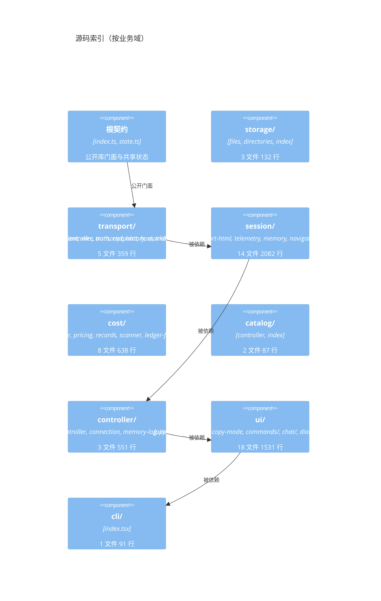

## 附录 B 术语与不变量

| 术语 | 含义 |
| --- | --- |
| 世代（generation） | 一次成功的认证、连接与基线建立；断线后整体重建 |
| 基线（baseline） | 流建立时的完整替换快照；`session/control`、`workspace/follow`、`session/follow` 各有一份 |
| 水位（watermark） | `Telemetry` 中每个投影键记录的 `seq`，用于丢弃迟到的旧值 |
| snapshot | `session/follow` 的起始帧，替换全部本地会话状态 |
| event / chunks | 持久历史记录；`chunks` 是旧宿主的打包包装 |
| assistant-stream | 未完成助手尝试的增量帧，带 `revision`、`attemptId`、`index` |
| waterfall | 需要客户端回应的宿主事件；未识别者必须回 `next` |
| cut | 成本缓存的落盘代号，等于扫描时的 `session/follow` cursor |
| 覆盖度（coverage） | 账本能否完整描述当前合计：`complete` / `scanning` / `partial` |
| 冻结（freeze） | 复制模式或对话框打开时暂停显示重绘，后台接收继续 |
| 域控制器（domain controller） | `ConnectionController`、`SessionController`、`CatalogController`、`CostController`，各自拥有一个业务域的状态与行为 |
| 门面（facade） | `Controller` 自身只发布状态、持有选择器世代与生命周期，其余方法委托给域控制器 |
| 固化 charge（sealed charge） | 已写下 `priceId` 与 `amount` 的账本条目；后续扫描只复用，不重新计价 |
| 开放样本（open sample） | `reason === 'missing usage'` 的条目；宿主尚未报告 token，下一次扫描可以补计价 |
| 域边界（domain boundary） | 目录与其允许导入集合；由 `tests/architecture/dependencies.test.ts` 机械检查 |
