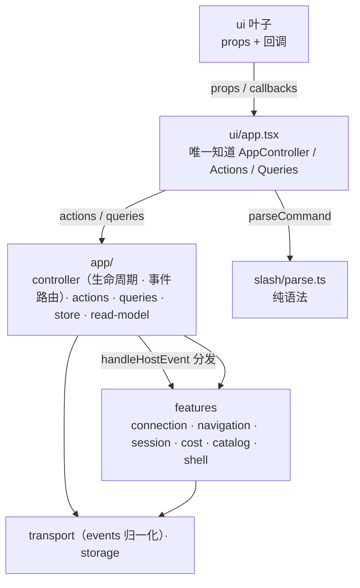
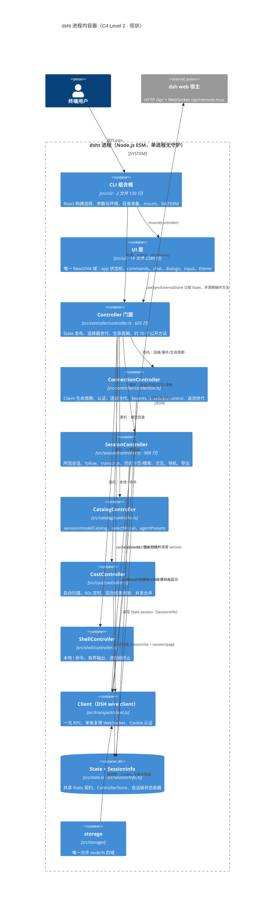
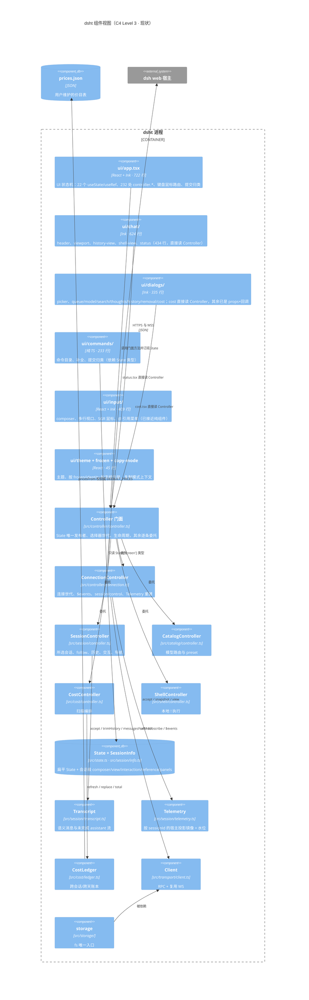
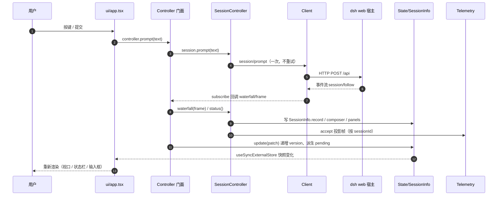
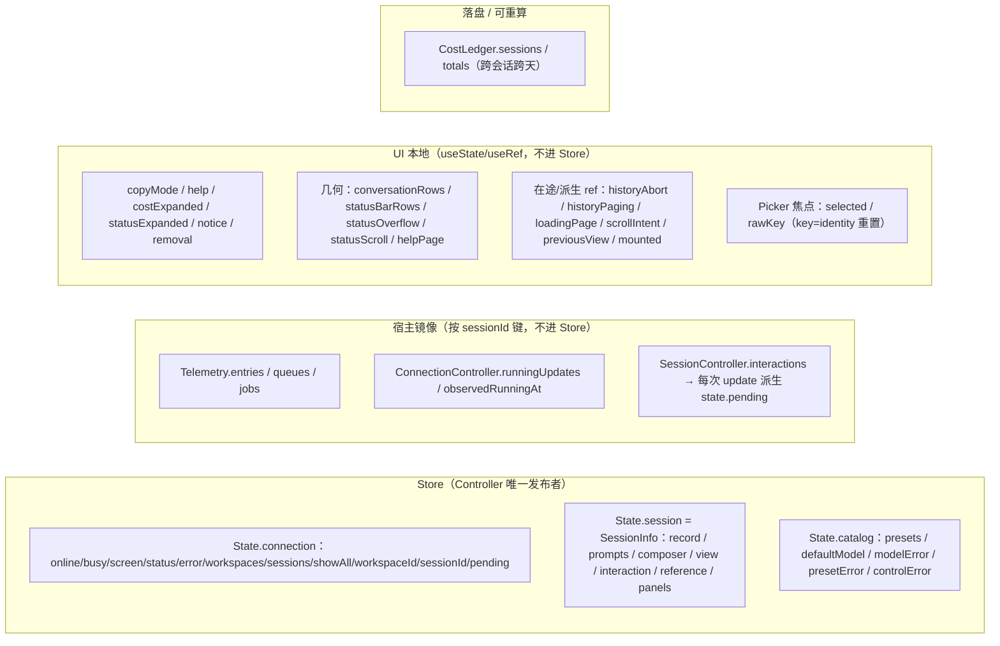

# dsht 分层重构方案 v2.3（边界清扫版）

Status: implemented（实施期方案与状态记录）。架构结论以 `.agents/notes/implemented/architecture/2026-09-15-layered-boundaries-and-plain-ui-contract` 与 `tui-design.md` 为准；本文件保留逐阶段范围、文件映射与验证记录。

Status: proposed（方案评审稿，尚未实施）

范围：`src/` 的状态归属、依赖方向与边界数据形态；不改 wire 协议、CLI 参数、命令语义、终端输出与成本模型。

本文取代 v2.2。**v2.3 不再增加模块或架构模式，只做边界清扫**：删 UI 的整包 Actions/Queries、删 UI→wire、删 `ObjectValue` 边界、修 `busy` 归属、修跨域类型归属、补 Shell 状态归属。`slash/` 沿用 v2.1/v2.2 结论，不重评。

相关：`tui-design.md`（现行设计基线）、`.agents/notes/implemented/**`（历史决策，本方案会消化其中 UI 相关条目）。

---

## 0. 审查标准

### 0.1 四条原则

> **① 一个模块只因一种原因而变化。**
> `connection` 不因为 session UI 改变而改，`session` 不因为 wire 格式改变而改。
>
> **② Feature 不横向依赖 Feature。**
> 跨 Feature 行为由 Application 编排；**类型依赖也算依赖**。
>
> **③ 边界只传递最小、plain、语义化的数据。**
> 不跨边界暴露 `Controller / Actions / Queries / Telemetry / CostLedger / Transcript / ObjectValue / Json`。
> **Raw wire 只由 `transport/events.ts` 或 feature 边界 mapper 解释；raw 不进入任何语义事件、state 或 UI。**
>
> **④ 状态尽可能靠近使用者。**
> 能在组件里的不进 Store，能在 Feature 里的不进 App，能派生的不重复存储。

### 0.2 每层边界自检问题

```text
UI：            "我是不是知道了应用不需要我知道的能力？"
Application：   "我是不是在做单一 Feature 自己就能完成的事情？"
Feature：       "我是不是 import 了另一个 Feature？"
Infrastructure："我是不是开始知道 workspace / session / cost 这些上层语义？"
Boundary：      "我是不是传了一个对象，而其实只需要三个字段？"
```

---

## 1. 结论摘要

### 1.1 边界问题与逐版处理

v2.2 → v2.3：

| # | 问题 | 处理 |
| --- | --- | --- |
| 1 | B7 只禁"runtime 实现或 state"，留下 `session → navigation/types` 后门 | **B6 收紧为 `feature A X→ feature B`，含 type-only** |
| 2 | `SessionScreen` 直接收整个 `actions: Actions; queries: Queries` | **只有 `ui/app.tsx` 知道 AppController/Actions/Queries**；其余 UI 只收 UI-local props + 回调 |
| 3 | `start/stop/shutdown` 混在 Actions；`exportLog/exportHtml` 有副作用却叫 Query | 拆成 **生命周期 / Actions / Queries** |
| 4 | `archived: ReadonlySet`、`render(folds: ReadonlySet)`、`runtime.accept(frame: ObjectValue)` 不是 plain | snapshot 出 `readonly string[]`；render 入参 `readonly number[]`；**transport 归一化成 `HostEvent`** |
| 5 | UI 仍可 import `transport/wire` 的类型/文本工具 | **`ui/` X→ `transport/*`，无例外**；`safeText` 移到根 `src/text.ts` |
| 6 | `ConnectionState` 已无 `busy`，`perform()` 却读 `state.connection.busy` | `busy/error` 归 **Application** 的 `OperationState` |
| 7 | `RemovalTarget` 在 `session/types.ts`，语义跨 workspace + session | 移到 **`app/types.ts`** |
| 8 | `PendingInteraction.request: unknown` 把协议解释推给 UI | 改为**判别联合**（`approval` / `question`，语义字段） |
| 9 | `app/read-model` 有变成必经层的趋势 | **跨 feature 语义组合**走 read-model；**单组件格式化**走 `ui/<component>/model.ts` |
| 10 | `shell` 没有 snapshot，UI 仍靠 Controller 内部对象读 | 新增 **`ShellSnapshot` 进 `AppState`** |

v2.3 → v2.4（收尾，之后停止设计）：

| # | 问题 | 处理 |
| --- | --- | --- |
| 11 | **`HostEvent` 的流向断了**：B6 禁 `connection → session`，那 connection 收到事件后谁交给 session？ | **Application 路由**：`onEvent: e => app.handleHostEvent(e)`，app 再分发到 `session.accept(e)` 等（见 §3.4） |
| 12 | `HostEvent.unknown.raw: Json` 把 `Json` 又送过边界 | 删除该变体；`hostEvent(frame): HostEvent \| undefined`，识别不了返回 `undefined`（raw 止于 transport） |
| 13 | 允许表写 `ui → slash`（仅 type），但 UI 必须 runtime `parseCommand` | 允许 **`ui/app.tsx` runtime import `slash/parse.ts`**；其余 UI 只能 type import `slash/types.ts` |
| 14 | DoD 说"transport 唯一认识 DSH 字段名"，又与 `navigation/mapper.ts` 矛盾 | 放宽为：**raw wire 只由 `transport/events.ts` 或 feature 边界 mapper 解释**；state/service/UI 不解释 wire。不为此再加 DTO 层 |
| 15 | `app/contracts.ts` 变成 feature type 总 barrel | **只放真正的 UI 边界契约**（`StatusSource`/`PickerSource`/`AnswerInput`/`CommandOutcome`…）；`AppState` 类型由 `ui/app.tsx` 从 `controller.snapshot()` 取得 |
| 16 | `AppController` 同时公开 `state` 与 `snapshot()` | **删除公开 `state`**，只留 `snapshot()`；内部 `private state`。另：不创建 `Feature< >` 接口，保持 duck typing；`OperationState.error` 明确为"上一次 Action 的短暂错误" |

### 1.2 目标结构



```text
Feature A  X──────────────→ Feature B        （含 type-only）
Feature    X──────────────→ ui
UI leaf    X→ AppController / Actions / Queries
ui/        X→ transport/*
Raw wire   only transport/events.ts · feature boundary mapper
```

---

## 2. 现状（as-is）

### 2.1 规模（本次 checkout 实测）

| 域 | 文件 | 行数 | 备注 |
| --- | --- | --- | --- |
| `storage/` | 4 | 177 | 唯一 `node:fs` 入口 |
| `transport/` | 5 | 359 | **已等同于目标中的 DSH Client 层** |
| `session/` | 15 | 3216 | `SessionController` 968 行、`SessionInfo` 372 行 |
| `cost/` | 9 | 853 | **已是独立于 session 的成本域** |
| `catalog/` | 2 | 87 | 模型路由 / preset |
| `controller/` | 5 | 977 | 门面 605 行（约 70 个公开方法） |
| `shell/` | 3 | 267 | 本地 `!` |
| `ui/` | 19 | 2380 | `app`(722) `chat`(624) `dialogs`(335) `input`(409) `commands`(233) `theme`(30) |
| `cli/` | 2 | 130 | 组合根 |
| 根文件 | 2 | 52 | `index.ts`、`state.ts` |

### 2.2 C4Container（现状）



### 2.3 C4Component（现状 · UI 与控制器细节）



### 2.4 运行时数据流（现状）



### 2.5 状态所有权（现状）



### 2.6 目标要消除的具体耦合

| 位置 | 问题 |
| --- | --- |
| `src/ui/chat/status.tsx:9`、`src/ui/dialogs/cost.tsx:5` | `import type { Controller }`，并读 `telemetry.view()/costs/running/sessionMode` |
| `src/ui/app.tsx:22` | 232 处 `controller.*`、22 处 `useState/useRef`、巨型 `useInput` 与 `submit()` switch |
| `src/ui/commands/parse.ts:3` | `import type { State }`，命令归类依赖 UI 模式与 store 结构 |
| `src/session/controller.ts:139` | `waterfall(frame: ObjectValue)` —— **session 直接解析 wire**（`string(frame.event)`、`frame.request`） |
| `src/transport/wire.ts` 的 `safeText` | 被 `session/`、`ui/`、`cli/` 共用，却是 transport 导出，逼 UI 依赖 wire |
| `src/session/info.ts` | `SessionInfo.panels` 承载模态可见性；`composer.cursor` / `reference` 承载组件状态 |
| `src/controller/controller.ts` | 605 行、约 70 个公开方法；public `perform()`；暴露 `Json` / `Transcript` |
| `src/state.ts` | 扁平 `State`；`busy` 挂在 connection 名下，实际是 Application 的互斥状态 |
| `src/controller/connection.ts` | 同时承担连接、认证、列表、选择、running、遥测 |

---

## 3. 目标架构

### 3.1 顶层目录

```text
src/
├── text.ts               通用文本卫生（safeText 等），无任何依赖；session / ui / cli 都可用
│
├── app/                  应用编排
│   ├── controller.ts     生命周期 + 组合 actions / queries / store（UI 唯一入口）
│   ├── actions.ts        改状态（含 exportLog / exportHtml 等副作用）
│   ├── queries.ts        纯读取，无副作用
│   ├── store.ts          AppState 组合 + 发布 + 选择器世代
│   ├── read-model.ts     跨 feature 的 plain 语义组合
│   ├── contracts.ts      只含类型：UI 可见的 plain 契约
│   └── types.ts          RemovalTarget、CommandOutcome 等跨 feature 应用类型
│
├── slash/                纯叶子：line → Command（沿用 v2.2）
│
├── connection/           service.ts · state.ts          # 只连接本身
├── navigation/           service.ts · state.ts · types.ts · mapper.ts
├── session/              service.ts · runtime.ts · state.ts · snapshot.ts · types.ts · transcript.ts · history.ts · ...
├── cost/                 service.ts · state.ts · snapshot.ts · ledger.ts · pricing.ts · records.ts · scanner.ts · config.ts
├── catalog/              service.ts · state.ts · types.ts · mapper.ts
├── shell/                service.ts · snapshot.ts · runner.ts
│
├── transport/            client.ts · wire.ts · auth.ts · endpoint.ts · host.ts · events.ts（wire → HostEvent 归一化）
├── storage/              唯一允许 node:fs 的域
│
├── ui/                   表现：组件 + 组件自持状态
│   ├── app.tsx           组合根：唯一知道 AppController / Actions / Queries 的 UI 文件
│   ├── routing.ts        Enter 此刻意味着什么
│   ├── session-screen.tsx  dialogs / history search（key={sessionId}）
│   ├── mount.tsx · frozen.tsx · copy-mode.ts · theme/
│   ├── input/            Composer：draft / cursor / parked / reference
│   ├── chat/             scroll / folds / liveReasoning / 视口
│   ├── status/           status.tsx · model.ts
│   └── dialogs/          picker · queue · model · search · thoughts · history · approval · question · removal
│
└── cli/                  组合根
```

新增根文件 `src/text.ts`（原 `transport/wire.ts` 的 `safeText`）。其余与 v2.2 一致，无新模块。

### 3.2 依赖规则

**允许**：

| 域 | 允许导入 |
| --- | --- |
| `text.ts` | 无 |
| `transport/ storage/` | 自身 + `wire` |
| feature | `transport`、`storage`、`text.ts`、自身 |
| `slash/` | 仅 `slash` |
| `app/` | feature、`transport`、`storage`、`slash`、`text.ts`、`app` |
| `ui/` | `app/contracts.ts`（**仅 type**）、`slash/types.ts`（仅 type）、自身、`ui`；`ui/app.tsx` 额外可 import `app/controller` 与 `slash/parse.ts`（runtime） |
| `cli/` | 全部 |

**禁止边（硬 DoD，9 条）**：

| # | 禁止 | 理由 |
| --- | --- | --- |
| B1 | `ui/` 除 `app.tsx` 外 → `app/controller`、`app/actions`、`app/queries` | UI 叶子不得知道应用能力，只收 props + 回调 |
| B2 | `ui/` 任何文件 → `transport/*` | 无例外；文本工具走 `src/text.ts` |
| B3 | `ui/` 除 `app.tsx` 外 → 任何 feature | 类型只从 `app/contracts.ts` 取 |
| B4 | 任何 feature → `ui/` | 业务域不认识 UI |
| B5 | `app/` → `ui/` | 编排不认识 UI（无 `UiControl`） |
| B6 | **feature A → feature B（runtime 与 type-only 都禁）** | 跨 Feature 由 Application 编排 |
| B7 | 任何 feature → `app/` | 业务域不依赖编排 |
| B8 | `transport/ storage/` → 任何上层 | 基础设施不反向依赖 |
| B9 | `slash/` → 自身以外任何单元 | 纯叶子 |

> `dependencies.test.ts` 已按正则抓取全部 import 说明符，**`import type` 同样被覆盖**，所以 B6 的 type-only 收紧无需改解析逻辑，只需在规则表里把 feature→feature 全部标红。

**B6 的实测基线（本次 checkout 机械统计）**：

```text
catalog → transport   1     cost → storage     2     session → storage  2
cost    → transport   5     session → transport 10    transport → storage 1
同层 feature → feature（含 type-only）：0 处
```

**所以 B6 不需要迁移任何调用**，它锁定的是一个已经成立的性质；加门禁即可。

### 3.3 `connection` 与 `session/runtime` 的边界

| 归属 | 内容 | 变化原因 |
| --- | --- | --- |
| `connection/` | Client 生命周期、认证、连接世代、重连退避、`$events` 与 `session/control` 订阅 | 网络与协议 |
| `session/runtime.ts` | `running`、`workingSince`、`queues`、`jobs`、`Telemetry` 投影与水位 | agent 运行过程 |

```ts
interface ConnectionState { online: boolean; status: string; error: string }
```

`begin`/`end` 世代时由 app 通知 `connection` 与 `session.runtime` 各自重置——app 编排，不是 feature 互相调用。

### 3.4 wire 只在 transport 被解释，事件由 Application 路由

现状 `session` 直接读 `frame.event` / `frame.request`，违反"session 不因 wire 改变而改"。插入归一化层，**并明确谁来转交**：

```text
raw DSH wire frame
      ↓  transport/events.ts        （唯一解释字段名的地方之一）
HostEvent（语义化判别联合）
      ↓  connection 的订阅回调
Application.handleHostEvent(event)   ← 路由点：connection 不认识 session
      ↓  按 kind 分发
session.accept(event) / connection 状态 / catalog 刷新
```

**关键路径不能写成 `connection.onEvent(e => session.accept(e))`**——那会立刻违反 B6（`connection → session`）。正确做法是组合时由 Application 提供回调：

```ts
// app/controller.ts 组合时
const connection = new ConnectionService({
  onEvent: event => this.handleHostEvent(event),   // 只回调给 Application
});

handleHostEvent(event: HostEvent): void {
  switch (event.kind) {
    case 'approval-request':
    case 'question-request':
    case 'agent-status':
    case 'projection':
    case 'queue':
    case 'jobs':
      this.session.accept(event);      // app → feature，允许
      break;
    case 'settings-changed':
      this.catalog.refresh();
      break;
    // hostEvent 已过滤未知类型，这里没有 default 分支
  }
}
```

```ts
// transport/events.ts —— 解释字段名的边界之一
export type HostEvent =
  | { kind: 'approval-request'; sessionId: string; eventId: string; id: string; description: string }
  | { kind: 'question-request'; sessionId: string; eventId: string; id: string; header?: string;
      question: string; detail?: string; multiSelect: boolean; options: readonly QuestionOption[] }
  | { kind: 'agent-status'; sessionId: string; running: boolean; at: number }
  | { kind: 'projection'; sessionId: string; key: string; seq: number; value: ProjectionValue }
  | { kind: 'queue'; sessionId: string; items: readonly QueuedItem[] }
  | { kind: 'jobs'; sessionId: string; count: number }
  | { kind: 'settings-changed' };

/** 无法识别的水位事件返回 undefined；raw 只在 transport 内记录，绝不外带。 */
export function hostEvent(frame: ObjectValue): HostEvent | undefined;
export function projectionValue(raw: ObjectValue): ProjectionValue;
```

**没有 `{ kind: 'unknown'; raw }` 变体**：`Json` / `ObjectValue` 从此只存在于 `transport/` 内部，语义事件里连一个 raw 字段都不留。未知事件由 transport 内部记 debug 日志，或直接丢弃。

**同一个 feature 的边界 mapper 也允许解释 wire**（见 §3.6）：`navigation/mapper.ts`、`catalog/mapper.ts` 与 `transport/events.ts` 是仅有的三处。state / service / UI 都不解释。

### 3.5 feature 自己出 plain snapshot

```ts
// 不创建 Feature< > 接口：各 service 行为差异很大，共同点只有 snapshot()，不值得做基类。
connection.snapshot(): ConnectionSnapshot;   // { online, status, error }
navigation.snapshot(): NavigationSnapshot;   // { workspaces, sessions, activeWorkspaceId, archived: readonly string[] }
session.snapshot(): SessionSnapshot;         // { sessionId, running, workingSince, pending, hasOlder, detached, model?, context?, usage?, turns? }
cost.snapshot(): CostSnapshot;               // { session: string, today: string, coverage, scanning, scannedAt?, customPrices, error? }
catalog.snapshot(): CatalogSnapshot;         // { presets, defaultModel, modelError?, presetError? }
shell.snapshot(): ShellSnapshot;             // { running, blocks: readonly ShellBlockSnapshot[] }
```

所有集合出参都是 `readonly T[]`，不出 `Set` / `Map`；`Telemetry` 与 `CostLedger` 在各自 feature 内被折平。

### 3.6 `*Summary` 归属 feature

| 类型 | 归属 |
| --- | --- |
| `WorkspaceSummary` / `SessionSummary` | `navigation/types.ts` + `navigation/mapper.ts` |
| `PresetSummary` / `ModelRoute` | `catalog/types.ts` + `catalog/mapper.ts` |
| `AnswerValue` / `HistoryPage` / `PendingInteraction` | `session/types.ts` |
| `RemovalTarget` / `CommandOutcome` | `app/types.ts`（跨 workspace + session 的应用语义） |

`transport/summary.ts` 不创建；`transport` 不定义上层模型。

### 3.7 `slash/`（沿用）

纯叶子：`types.ts` / `parse.ts` / `registry.ts` / `index.ts`。三段分工：`slash/` 定"有哪些命令、怎么解析" → `app/actions.dispatch()` 定"每个命令做什么" → 被调用的服务留各自 feature。`catalog/`、`shell/` 不迁入。

---

## 4. 状态归属

### 4.1 `AppState`

```ts
interface AppState {
  version: number;
  operation: OperationState;      // app 自己的互斥状态：{ busy, error }
  connection: ConnectionSnapshot;
  navigation: NavigationSnapshot;
  session: SessionSnapshot;
  cost: CostSnapshot;
  catalog: CatalogSnapshot;
  shell: ShellSnapshot;
}
```

`busy` 从 connection 移到 `operation`：它表示"当前有一个互斥 Action 在跑"，与网络无关。`perform()` 读 `state.operation.busy`（见 §5.4）。

`OperationState.error` 的语义是**上一次 Action 的短暂错误**（`lastActionError`）：`select model failed` / `remove session failed` / `export failed` 写这里。connection error、cost scan error、catalog error **继续留在各自 feature 的 snapshot**，不往 App 汇聚——避免形成"所有错误都塞 App"的新中心。

`shell` 进入 `AppState`（而不是让 UI 读 Controller 内部对象）：shell 输出是流式的、需要响应式渲染，`ShellSnapshot.blocks` 是 plain 数据；`shell-view` 只做 `blocks → rows` 的排版。

### 4.2 Store 不做过度抽象

不做 `SessionStore` / `CostStore` 等六七个同形接口。feature 构造只拿最小发布能力：

```ts
type Publish = () => void;
class SessionService { constructor(private readonly publish: Publish, /* ... */) {} }
```

只有语义真的不同才建独立 port（`HostAccess`、`LedgerFiles`）。

### 4.3 `SessionState` 只剩业务数据

```ts
interface SessionState {
  sessionId: string;
  record: Transcript;                 // 内部强引用，不出 feature
  prompts: PromptIndex;               // 内部
  interaction: InteractionState;      // answers / option? / approval?
  window?: Transcript;                // 独立历史窗口，内部强引用
}
```

`pinned` 的处理：不是"存进 domain 的 UI 状态"，而是 session 回收策略的输入。UI 只发意图：

```ts
app.actions.holdHistory(held: boolean);   // session service 内部布尔，不进 SessionState
```

### 4.4 UI 状态就近持有（无 `ui/control.ts`）

| 状态 | 持有者 |
| --- | --- |
| `help` / `copyMode` / global `notice` | `ui/app.tsx` |
| dialogs（thoughts/queue/model/history/search/removal） | `ui/session-screen.tsx`（`key={sessionId}`） |
| `draft` / `cursor` / `parked` / reference 高亮 | `ui/input` Composer |
| `scroll` / `folds` / `liveReasoning` | `ui/chat` |
| picker 选中项 / 滚动 | `ui/dialogs/Picker`（`key={identity}`） |
| 几何 | `useStdout()` 现读 |
| 在途 ref | 对应组件 `useRef` |

### 4.5 `pending` 派生不存储

```ts
snapshot(): SessionSnapshot {
  return { ..., pending: [...this.interactions.values()].filter(f => f.agentId === this.sessionId), ... };
}
```

避免 `interactions = A` 与 `pending = B` 两份事实源分叉。

### 4.6 `SessionInfo` 重构前后结构对比

**之前**（`src/session/info.ts`，一个类混三类生命周期）：

```ts
class SessionInfo {
  sessionId: string = '';
  record: Transcript;
  readonly prompts = new PromptIndex();
  readonly composer: ComposerState = { draft: '', cursor: 0, parked: '' };
  readonly view: ViewState = { scroll: 0, pinned: false, folds: new Set(), liveReasoning: 'row' };
  readonly interaction: InteractionState = { answers: {} };
  readonly reference: ReferenceState = { index: 0 };
  readonly panels: PanelState = { thoughts: false, queue: false };
  reset(sessionId = ''): void;
  closeWindow(): void;
}
```

**之后**（`src/session/state.ts`）：

```ts
interface SessionState {
  sessionId: string;
  record: Transcript;
  prompts: PromptIndex;
  interaction: InteractionState;      // answers / option? / approval?
  window?: Transcript;                // 独立历史窗口
}
```

**逐字段去向**：

| `SessionInfo` 字段 | 之后归属 | 切换会话行为 |
| --- | --- | --- |
| `sessionId` | `SessionState.sessionId` | 更新 |
| `record` | `SessionState.record` | 释放 + 新建（不变） |
| `prompts` | `SessionState.prompts` | 重置（不变） |
| `interaction.answers/option/approval` | `SessionState.interaction` | 重置（不变） |
| `view.window` | `SessionState.window` | `closeWindow()` 释放（不变） |
| **`view.folds`** | **`ui/chat` 组件状态** | `key={sessionId}` 重挂载 |
| **`view.liveReasoning`** | **`ui/chat` 组件状态** | 同上 |
| **`view.scroll`** | **`ui/chat` 组件状态** | 同上 |
| **`view.pinned`** | **`ui/chat` 计算 → `actions.holdHistory()`** | service 内部标志，不进 state |
| **`composer.draft/cursor/parked`** | **`ui/input` Composer** | `key={sessionId}` 复现现状 |
| **`reference.index/dismissed`** | **`ui/input` Composer** | 同上 |
| **`panels.{thoughts,queue,model,history,search}`** | **`ui/session-screen.tsx` / `ui/dialogs`** | 同上 |

`SessionController` 原本暴露的 `setComposer` / `setComposerCursor` / `parkComposer` / `restoreComposer` / `setReferenceIndex` / `setReferenceDismissed` / `openThoughts` / `openQueue` / `setModelPanel` / `setHistoryPanel` / `setSearchPanel` / `setScroll` / `setFolds` / `setLiveReasoning` **14 个方法全部消失**。

---

## 5. 应用接口：生命周期 / Actions / Queries

### 5.1 三个 contract

```ts
export class AppController {
  readonly actions: Actions;           // 改可观察状态（含副作用）
  readonly queries: Queries;           // 只读操作：可有 I/O，但不改可观察状态
  start(): void;                       // 生命周期
  stop(): Promise<void>;
  shutdown(): Promise<void>;
  subscribe(listener: () => void): () => void;
  snapshot(): AppState;                // 唯一的状态读取入口
  // private state: AppState            ← 不再公开，避免绕过 snapshot 契约
}
```

**删除公开 `state`**：React 用 `useSyncExternalStore(controller.subscribe, controller.snapshot)`；公开 `state` 只会让 `controller.state.session` 这类绕过契约的写法扩散。

`exportLog` / `exportHtml` 有文件副作用，因此进 **Actions**。**Query 的定义是"不改变应用可观察状态，但允许 I/O"**——`searchHistory` / `searchSessions` / `references` 会发 HTTP、会等待、会失败、带 `AbortSignal`，不是函数式意义上的 pure。

### 5.2 Actions

```ts
export interface Actions {
  // 会话
  submitPrompt(text: string): Promise<void>;
  cancelTurn(): Promise<void>;
  interrupt(force?: boolean): Promise<boolean>;
  approve(allowed: boolean): Promise<void>;
  answer(value: AnswerValue): Promise<void>;
  dismissQuestion(): Promise<void>;
  loadOlder(): Promise<void>;
  openHistoryAt(seq: number): Promise<void>;
  closeHistory(): void;
  holdHistory(held: boolean): void;

  // 导航（不含 picker）
  switchWorkspace(workspaceId?: string): Promise<void>;
  switchSession(sessionId: string): Promise<void>;
  createWorkspace(path: string): Promise<void>;
  createSession(): Promise<void>;
  removeWorkspace(id: string): Promise<void>;      // 不传跨域 RemovalTarget
  removeSession(id: string): Promise<void>;

  // 模型 / 成本 / 导出
  selectModel(provider: string, model: string, effort?: string): Promise<void>;
  refreshCosts(): Promise<void>;
  exportLog(path: string | undefined, signal: AbortSignal): Promise<string>;
  exportHtml(path: string | undefined, signal: AbortSignal): Promise<string>;

  // 命令
  dispatch(command: Command): Promise<CommandOutcome | undefined>;
}
```

**删除 `removeTarget(RemovalTarget)`**：`RemovalTarget` 把 workspace 与 session 两种语义装进一个类型，本身就是跨 feature 语义（见 §5.5）。拆成两个意图，确认数据由 app 组装后交给 UI 模态。

### 5.3 Queries

```ts
export interface Queries {
  /** 当前记录按终端宽度与折叠设置投影成 plain 行；Transcript 不出 feature。 */
  render(input: { width: number; folds: readonly number[]; liveReasoning: Reasoning }): SessionRender;

  searchHistory(query: string, signal: AbortSignal): Promise<HistoryPage>;
  searchSessions(query: string, workspaceOnly: boolean, signal: AbortSignal): Promise<SessionSearchPage>;
  references(query: string, signal: AbortSignal): Promise<FileReference[]>;
}
```

**Queries 不改变应用可观察状态，但允许 I/O**（HTTP、等待、失败、`AbortSignal`）。`folds` 走 `readonly number[]`，`Set` 只留在 `ui/chat` 内部。

### 5.4 `perform()` 私有

```ts
// ❌ 删除 public perform()
// ✅ 内部实现，读 operation 而不再是 connection
private async perform<T>(operation: () => Promise<T>): Promise<T | undefined> {
  if (this.state.operation.busy || !this.state.connection.online) return undefined;
  this.setOperation({ busy: true, error: '' });
  try { return await operation(); }
  catch (error) { this.setOperation({ busy: false, error: errorText(error) }); return undefined; }
  finally { this.setOperation({ busy: false }); }
}
```

每个 Action 内部自行包 `perform`；Application 保留编排控制权。

### 5.5 边界契约：语义化，而非 plain JSON

```ts
// session/types.ts
export interface AnswerValue { answers: { id: string; selected: string[]; custom?: string }[] }
export interface HistoryPage { rows: HistoryRow[]; hasOlder: boolean; matches?: HistorySearch }
export interface SessionSearchPage { items: SessionSummary[]; hasMore: boolean }

/** 判别联合：UI 按 kind 渲染，不需要知道宿主原始 request。 */
export type PendingInteraction =
  | { kind: 'approval'; eventId: string; id: string; description: string }
  | { kind: 'question'; eventId: string; id: string; header?: string; question: string; detail?: string;
      multiSelect: boolean; options: readonly { label: string; description?: string }[] };

// app/types.ts —— 跨 feature 的应用语义
export interface RemovalTarget { kind: 'workspace' | 'session'; id: string; name: string; path?: string; empty?: boolean }
export type CommandOutcome = { kind: 'notice'; text: string } | { kind: 'error'; message: string }
  | { kind: 'quit' } | { kind: 'confirm-removal'; target: RemovalTarget };
```

**边界不再出现**：`Json`、`ObjectValue`、`Transcript`、`Telemetry`、`CostLedger`、`Controller`、`Actions`、`Queries`、`Set` / `Map`。

### 5.6 `app/contracts.ts`：真正的 UI 边界契约

**不做 feature type 总 barrel。** 只定义 `ui/app.tsx` 装配叶子组件时真正需要的那几个 plain 契约；`AppState` 的类型由 `ui/app.tsx` 从 `controller.snapshot()` 直接取得（它本来就是唯一知道 AppController 的文件）。

```ts
// app/contracts.ts —— 只含类型，禁止 runtime 导出
export interface StatusSource { /* 跨 feature 组合，见 §5.7 */ }
export interface PickerSource { /* ... */ }
export interface HistorySource { /* ... */ }
export interface CostSource { /* ... */ }
export type AnswerInput = AnswerValue;                 // UI 调用 actions.answer 的入参
export type { CommandOutcome } from './types.ts';
export type { RemovalTarget } from './types.ts';
```

不在这里重新导出 `ConnectionSnapshot` / `NavigationSnapshot` / `SessionSnapshot` / `ShellSnapshot` 等 feature 内部类型——那只是把路径藏起来的"类型转口贸易"，长期会变成新的 `common/types.ts`。

门禁：`app/contracts.ts` 只能有 `export type` / `export interface`，出现 `const` / `function` / `class` 即失败；且只允许引用 `./types.ts` 与 `slash/types.ts`。

### 5.7 `app/read-model` 不是必经层

| 场景 | 归属 |
| --- | --- |
| 跨多个 feature 的语义组合（`session.running` + `cost.session` + `catalog.model` → `StatusSource`） | `app/read-model.ts` |
| 单组件的换名 / 格式 / 颜色 / 布局（`session title → "Session: xxx"`） | `ui/<component>/model.ts` |

`ui/status/model.ts` 只做 `StatusSource → StatusModel`（紧凑数字、百分比、分组、着色）。

---

## 6. `ui/` 对外接口

**只有 `ui/app.tsx` 知道 AppController / Actions / Queries。** 其余 UI 文件只收 UI-local props + 回调：

```tsx
// ui/app.tsx —— 组合根，唯一做能力绑定的地方
const app = useSyncExternalStore(controller.subscribe, controller.snapshot);
<SessionScreen
  session={app.session}
  render={render}                         // 来自 controller.queries.render(...)
  width={width}
  onPrompt={text => controller.actions.submitPrompt(text)}
  onCancel={() => controller.actions.cancelTurn()}
  onApprove={allowed => controller.actions.approve(allowed)}
  onAnswer={value => controller.actions.answer(value)}
  onLoadOlder={() => controller.actions.loadOlder()}
  onOpenHistoryAt={seq => controller.actions.openHistoryAt(seq)}
  onSelectModel={(p, m, e) => controller.actions.selectModel(p, m, e)}
/>
```

```ts
// ui/mount.tsx —— cli 的唯一入口
export function mount(app: AppController): ReturnType<typeof render>;
export function App(props: { app: AppController; theme?: Theme; panelLifetimeMs?: number }): ReactNode;

// ui/routing.ts
export function routeEnter(input: { line: string; referenceOpen: boolean;
  questionOpen: boolean; copyMode: boolean }): Intent;

// 叶子组件：props + 回调，不知道任何应用能力
export function Composer(props: ComposerProps): ReactNode;
export function ReferenceMenu(props: ReferenceMenuProps): ReactNode;
export function ChatHeader(props: ChatHeaderProps): ReactNode;
export function HistoryPanel(props: HistoryPanelProps): ReactNode;
export function StatusBar(props: { model: StatusModel; width: number; expanded: boolean;
  scroll: number; pageSize: number; onScroll?(n: number): void }): ReactNode;
export function Picker(props: PickerProps): ReactNode;
export function SessionScreen(props: SessionScreenProps): ReactNode;   // 全是数据 + 回调
```

`ShellSnapshot.blocks` 交给 `ui/chat/shell-view.ts` 做 `blocks → rows`（纯排版），不再读 Controller。

---

## 7. 文件映射

| 现状 | 目标 | 动作 |
| --- | --- | --- |
| `transport/wire.ts` 的 `safeText` | `src/text.ts` | 移出；UI 不再依赖 transport |
| `src/session/controller.ts:139` `waterfall(frame)` | `transport/events.ts` + `session/runtime.accept(HostEvent)` | 插入归一化层 |
| `src/state.ts` | `app/store.ts`（AppState = snapshots + operation） | 删除根契约 |
| `src/controller/controller.ts` | `app/{controller,actions,queries}.ts` + `app/{read-model,contracts,types}.ts` | 拆分；删 public `perform`；去 getter/透传 |
| `src/controller/connection.ts` | `connection/{service,state}.ts` + `session/runtime.ts` | 拆分；running/Telemetry 归 session |
| `src/session/info.ts` | `session/{state,types}.ts` | 删 `PanelState`、`composer`、`reference`、`view.*` |
| `src/session/controller.ts` | `session/{service,snapshot}.ts` | 拆；删 14 个表现状态写入方法 |
| `src/cost/controller.ts` | `cost/{service,state,snapshot}.ts` | 拆分 |
| `src/catalog/controller.ts` | `catalog/{service,state,types,mapper}.ts` | 拆分；`PresetSummary` 归此 |
| `src/shell/controller.ts` | `shell/{service,snapshot}.ts` | 重命名；加 `snapshot()` |
| `src/ui/commands/` | `slash/` | `git mv` + 去 UI context |
| `src/ui/app.tsx` 的 `submit()` | `app/actions.dispatch` + UI 本地命令 | 抽出 |
| `src/ui/app.tsx` 的 `useInput` | `ui/routing.ts` + 各组件 keymap + 全局路由 | 拆分 |
| `src/ui/chat/status.tsx` | `ui/status/{status.tsx,model.ts}` | 移动 + UI model |
| `src/ui/dialogs/cost.tsx` | `ui/status/cost.tsx` | 移动，改收 `CostSource` |
| `RemovalTarget`（`session/types.ts`） | `app/types.ts` | 归属修正 |
| `PendingInteraction.request: unknown` | 判别联合 | 语义化 |
| `navigation` 的 picker 职责 | `ui/dialogs/Picker` | 迁出 |
| `SessionInfo.*` 表现状态 | 删除 | 回组件状态 |
| `ui/control.ts`（v2.2 设想） | 不创建 | 状态就近 |

---

## 8. 分阶段执行计划

**实施状态**：Phase 1 ✅；Phase 2 ✅；Phase 3 ✅；Phase 4 ✅；**Phase 5 ✅** —— 文档已消化：新增 architecture note `2026-09-15-layered-boundaries-and-plain-ui-contract`（英/中/`.i18n.yaml` 三件套，`git add -f` 入库），五篇 `feature/2026-09-14-terminal-session-*` note 各加一行"部分被取代"横幅并重算配对哈希，`architecture/2026-09-11-modular-boundaries-immutable-ledger` 补上 `ui/commands → slash/` 的下场与九条禁边（含配对哈希）；`tui-design.md` 更新 §2.4 依赖表（新增 `json.ts`/`text.ts`/`contracts.ts`/`session-title.ts`/`references.ts`/`slash/`，并列九条禁止边）、§2.5 状态与渲染模型（事件单一路由点、状态就近持有、朴素 UI 契约）、§3.2.2 Controller 接口（生命周期/Actions/Queries，`perform` 删除）、§5.7 收窄说明、§7.2 note 索引与附录 A 源码索引（脚本重算：77 模块 8,918 行 + 组件计数）；README 双语同一物理行更新模块布局段并重算 `README.i18n.yaml`（两侧均 474 行）。

验证：`typecheck` ✅ · `npm test` **265/265** ✅ · `npm run test:terminal` ✅ · `npm run test:package` ✅（`Packed itookit-dsht-0.3.8.tgz; isolated npx entry passed.`，需在工作区外写 `~/.npm/_cacache` 故以 wider access 运行一次）· 两份文档 14/5 个 mermaid 块结构校验通过。

**代码层面唯一遗留**（已在方案与 note 中记录，不影响已锁定的 import 边界）：UI 仍把 `Transcript` 当值传递（`Queries.render` 入参、`older(signal, transcript)`、`historyAt → Transcript`、`setViewWindow`），方案 §5.2 的 `SessionSnapshot`/`HistoryPage` 未落地；`*Summary`（`State.workspaces/sessions` 仍是 `ObjectValue[]`）；`operation.error` 仍三类失败共写。

**本次边界语义变化（已在测试中固化）**：action 不再向调用方抛错，而是返回 `false`/`undefined` 并把文本写进 `operation.error`；UI 因此在 dialog 确认、回答提交、命令执行失败时保留草稿与本地状态（原先是靠异常中断后续语句）。原先断言 `assert.rejects(controller.actions.x)` 的 8 处测试改为断言返回值与 `operation.error`。

### Phase 0 · 文档基线

- 把 §0 四条原则与每层自检问题、§2 as-is C4 图写回 `tui-design.md`；新增 architecture note 记录 v2.3。
- **验证**：mermaid 全解析；配对哈希一致。

### Phase 1 · 基础设施归一化 + 事件路由 + 文本工具

- `safeText` → `src/text.ts`。
- `transport/events.ts` 落地：`hostEvent(frame): HostEvent | undefined`，**无 raw 字段**。
- `connection` 只把 `HostEvent` 回调给 Application；**`Application.handleHostEvent(event)` 再分发到 `session.accept(event)`**（本阶段先由现有 Controller 承担路由点，Phase 2 搬到 `app/`）。
- `session` 的 `waterfall(frame)` 改为 `accept(event: HostEvent)`，不再读 `frame.event` / `frame.request`。
- **验证**：typecheck + test；新增事件归一化单测（wire 字段改名只影响 `events.ts`）；门禁断言不存在 `connection → session` 边。
- **回退**：单 revert。

### Phase 2 · feature snapshot + 依赖收紧

- 各 feature 建 `state.ts` / `snapshot.ts`；`connection` 拆出 `session/runtime`；删 navigation picker。
- `AppState` 加 `operation` 与 `shell`；`busy` 从 connection 移出。
- `*Summary` 归 `navigation`/`catalog`；`RemovalTarget` 归 `app/types.ts`。
- 门禁：B1–B9 全量。
- **验证**：typecheck + test。
- **回退**：单 revert。

### Phase 3 · SessionState 收窄 + 接口分层

- `SessionState` 去 `folds/liveReasoning/pinned/scroll/draft/cursor/reference/panels`。
- Controller 拆生命周期 / Actions / Queries；删 public `perform`；`AnswerValue` / `HistoryPage` / `PendingInteraction` 判别联合替换 `Json` / `unknown`。
- `ui/commands/` → `slash/`。
- **验证**：`tests/ui/{key-routing,app,commands}.test.tsx` 更新；`npm test`。
- **回退**：单 revert。

### Phase 4 · UI 边界清扫

- `app/contracts.ts` + 门禁"只含类型"；`ui/app.tsx` 成为唯一能力绑定点。
- `StatusBar` / `CostPanel` / `ShellView` 改收 plain source；`ui/` 彻底不 import transport / feature。
- **验证**：`tests/expected/*` 逐字节一致；`npm run test:terminal`。
- **回退**：单 revert。

### Phase 5 · 文档消化

- 消化 `.agents/` UI spec；更新 `tui-design.md` §2.4–2.6、§3.2、§5.3、§5.7、附录 A；README 双语 + 哈希。
- **验证**：typecheck + test + test:terminal + test:package。

---

## 9. 门禁、文档与测试

### 9.1 门禁（`tests/architecture/dependencies.test.ts`）

- unit 表补 `slash`、`text.ts`。
- B1–B9 各一个合成用例；B6 枚举 feature 配对并显式覆盖 `import type`。
- 新增 `app/contracts.ts` 只含类型的检查（无 `const`/`function`/`class`）。
- 保留：`storage` 独占 `node:fs`、`shell` 独占 `node:child_process`、React/Ink 只在 `ui/`。

### 9.2 `.agents/` UI spec 消化

| 现有 note | 处置 |
| --- | --- |
| `feature/2026-09-14-terminal-session-panels` | **改写**：面板可见性回组件；切换用 `key` |
| `feature/2026-09-14-terminal-session-composer` | **改写**：draft/cursor 回 `ui/input` |
| `feature/2026-09-14-terminal-session-interaction` | **收窄**：保留 answers；`reference` 回 `ui/input` |
| `feature/2026-09-14-terminal-session-view` | **收窄**：`scroll/folds/liveReasoning/pinned` 回 UI；`window` 属会话 |
| `feature/2026-09-14-terminal-session-record` | 改写路径为 `session/state.ts` |
| `architecture/2026-09-11-modular-boundaries-immutable-ledger` | **改写**：补 runtime 拆分、B6 横向禁边、HostEvent 归一化、snapshot 出参 |
| 所有引用 `ui/commands/` 的 note | 更新为 `slash/` |

### 9.3 文档同步

`tui-design.md`：§0 四条原则 + 自检问题置顶；§2.1–2.3、§2.4 依赖表、§2.5 状态与渲染模型、§2.6 决策表、§3.2 接口、§5.3 内存状态、§5.7 SessionInfo、附录 A、§7.8 提交序列；README 双语 + `README.i18n.yaml`。

---

## 10. 风险与完成定义

| 风险 | 影响 | 缓解 |
| --- | --- | --- |
| `transport/events.ts` 归一化面大 | 投影值仍是半结构化 | 先归一化审批/提问/状态/队列四类高频事件，投影值保留 `ProjectionValue` 增量迁移 |
| `folds/liveReasoning` 移到 UI 后仍需参与排版 | `render()` 需 UI 传入 | 布局参数作为 `render(input)` 入参，`history.ts` 仍留 session（纯投影） |
| `HistoryPage` 替换 `Transcript` | UI 不能自己跳任意页 | 跳转改 `actions.openHistoryAt(seq)`，窗口归 session |
| `removeTarget` 拆两方法 | 确认模态需要重接 | app 组装 `RemovalTarget` 通过 `CommandOutcome.confirm-removal` 返回 |
| `src/text.ts` 成为新共享点 | 可能被塞入协议知识 | 门禁：`text.ts` 无任何 import；只放字符串卫生 |
| 快照回归 | 终端输出变化 | 每阶段跑 `tests/expected/*` 与 `test:terminal`，逐字节一致 |

**完成定义（DoD）**

硬性（门禁强制）：

1. B1–B9 全部为 0（B6 含 `import type`）。
2. `ui/` 除 `app.tsx` 外不 import 任何 `app/*` 能力、feature、`transport/*`；`ui/app.tsx` 是唯一 runtime 调 `slash/parse` 的 UI 文件。
3. `app/contracts.ts` 只含类型，且不做 feature type 总 barrel。
4. `AppState` 含 `operation` 与 `shell`；`busy` 不在 connection。
5. `SessionState` 不含表现状态；`pending` 派生。
6. Controller 只有生命周期 / Actions / Queries；无 public `perform`、无公开 `state`；Query 不改变可观察状态（允许 I/O）。
7. 边界无 `Json` / `ObjectValue` / `Transcript` / `Telemetry` / `CostLedger` / `Set`。
8. **raw wire 只由 `transport/events.ts` 或 feature 边界 mapper（`navigation/mapper.ts`、`catalog/mapper.ts`）解释**；`HostEvent` 不含 raw 字段；state / service / UI 不解释 wire。
9. **`HostEvent` 经 `Application.handleHostEvent` 路由到 session**，不存在 `connection → session` 直连。
10. `typecheck` / `test` / `test:terminal` / `test:package` 全绿，终端输出逐字节一致。
11. `tui-design.md`、`.agents/` note、README 双语与哈希已消化。

软性（观察）：`app.tsx` 行数明显下降；Controller 方法数明显下降；目录数量不设目标。

---

## 附录 A · 建议提交序列

| # | 提交 | 验证 |
| --- | --- | --- |
| 1 | `docs: record the boundary rules and the v2.3 cleanup plan` | mermaid + 哈希 |
| 2 | `refactor: normalize host wire into events and move text hygiene to src/text.ts` | typecheck + test |
| 3 | `refactor: give every feature a plain snapshot and forbid feature-to-feature imports` | typecheck + test |
| 4 | `refactor: shrink session state and split lifecycle, actions and queries` | typecheck + test |
| 5 | `refactor: bind application capabilities only in ui/app.tsx` | typecheck + test + test:terminal |
| 6 | `docs: digest the ui notes and refresh the design baseline` | 配对哈希 |
| 7 | `release: 0.4.0` | `test:package` |

## 附录 B · v1 → v2 → v2.1 → v2.2 → v2.3 演进

| 主题 | v1 | v2 | v2.1 | v2.2 | v2.3 |
| --- | --- | --- | --- | --- | --- |
| 状态 | `stat/` 大杂烩 | `domain/*/state.ts` | + connection 缩窄 | + snapshot 出边界 | + `operation` / `shell` 切片；集合出参数组化 |
| feature 横向依赖 | 未约束 | 未约束 | 未约束 | B7 禁 runtime | **B6 禁到 type-only** |
| wire 解释 | session 解析 | session 解析 | session 解析 | `accept(ObjectValue)` | **transport `HostEvent` 归一化** |
| UI 能力 | Controller 直连 | UiControl 归 controller | plain source | 整包 Actions/Queries | **只有 `ui/app.tsx` 绑定能力** |
| UI → transport | 禁 client | 禁 client | 允许 wire | 允许 wire | **全禁** |
| 跨域类型 | `core/types.ts` | 同 v1 | `transport/summary.ts` | 归 navigation/catalog | + `RemovalTarget`→`app/types.ts`，`PendingInteraction` 判别联合 |
| Controller | 6 namespace | 扁平 | 去 getter | Actions/Queries | **+ 生命周期三分，`perform` 私有，`busy` 归 operation** |
| DoD | 目录数、LOC | LOC/switch | 7 条禁边 | 9 条禁边 | **9 条边界 + contracts 类型限制** |
